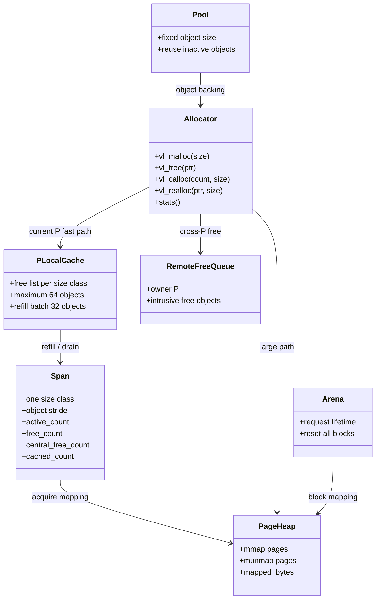

# valloc: P-Local Memory Architecture

Task 7 extends the Task 3 explicit-free allocator with a TCMalloc-like
multi-worker topology. It remains separate from fiber stacks, which need
guarded lazy mappings. A central mutex protects spans, page accounting, and
statistics; each P has a local cache per size class and a remote-free queue.

## Ownership model



`vl_malloc`, `vl_free`, and statistics are safe across M threads. Runtime
binds each worker to a P through a private TLS slot. An allocation records its
owner P in the object header. A free on another P enters the owner's remote
queue and increments `cross_p_frees`; the owner drains remote entries before
central refill. Arena and pool handles remain non-copyable and must not be
used concurrently through the same handle.

## Size classes

The sorted table rounds a request to the first capacity that fits. Requests
above 32 KiB bypass the table and use a page-aligned large mapping.

```text
8, 16, 24, 32, 48, 64, 80, 96, 112, 128,
160, 192, 224, 256, 320, 384, 448, 512,
640, 768, 896, 1024, 1280, 1536, 1792, 2048,
2560, 3072, 3584, 4096, 5120, 6144, 7168, 8192,
10240, 12288, 14336, 16384, 20480, 24576, 28672, 32768
```

For small objects, a span reserves one metadata page followed by enough pages
for at least 64 KiB of object storage, or two objects for the largest classes.
The span metadata is outside the object area. Each object has a fixed header
before the user pointer containing its magic, state, requested size, capacity,
kind, and owning span. `vl_free` can therefore recover the class without a
global pointer-size map.

```text
span mapping
+-----------------------------+  mapping base
| span object metadata page   |  not user-addressable
+-----------------------------+
| object header | user bytes  |
| object header | user bytes  |
| ...                         |
+-----------------------------+
```

## Free-list accounting

`free_count` is the total number of free objects in a span, regardless of
whether they are in the central list or the local cache. The following
invariant is checked by the tests:

```text
object_count = active_count + free_count
free_count   = central_free_count + cached_count
```

An allocation from cache decrements `cached_count` and `free_count`, then
increments `active_count`. A free does the reverse. Refill moves objects from
the span central list into the cache without changing total free count. A
cache over 64 objects drains 32 entries back to central. An empty span is
returned to the page heap only when it has no active or cached objects.

## Large objects, arenas, and pools

Large objects have the same object header but are backed directly by a
page-aligned mapping and linked into the allocator's large-allocation list.
`vl_free` removes and unmaps them, so `mapped_bytes` returns to its previous
value.

An arena maps blocks with one metadata page and releases every block at
`vl_arena_reset`; pointers returned before reset become invalid immediately.
A pool allocates backing objects through valloc, records their fixed size, and
reuses inactive objects without changing that size. A pool-free object remains
an active valloc backing allocation in allocator statistics until pool
destruction releases both active and inactive backing objects.
Arena and pool pointers remain owned by their handle: callers must not pass
them directly to `vl_free`, and pool objects are returned with `vl_pool_free`.

## Debug checks

When configured with `-DVELOCO_MEMORY_DEBUG=ON`, each object gets an 8-byte
prefix canary immediately before the user pointer and an 8-byte suffix canary
at the end of the requested payload. Freed payload bytes are poisoned with
`0xa5`, and an object state marker detects double free. The suffix canary is
read and written with `memcpy`, so odd-sized allocations do not make an
unaligned integer access. Release builds omit these checks from the hot path.

## Statistics

`active_bytes` and `active_objects` describe currently allocated valloc
objects. `cache_hits` counts allocations served from a non-empty local cache;
`central_refills` counts refill batches; `mapped_bytes` includes spans, large
objects, and arena blocks; `cross_p_frees` counts frees performed by a P
different from the allocation owner P; `mmap_calls` counts page heap
acquisitions. `cache_hits` includes local cache and pending remote-cache
service.

## Benchmark evidence

`bench_alloc` performs 1,000,000 allocate/replace operations with 4,096 live
slots and compares libc and Veloco in the `--threads 1` configuration. The
following numbers are Docker correctness measurements on Docker Desktop, not
native performance claims.

| Date | Architecture | Allocator | Operations/s | Cache hits | Refills | Mapped bytes |
| --- | --- | --- | ---: | ---: | ---: | ---: |
| 2026-08-15 | aarch64 | libc | 50,353,525 | 0 | 0 | 0 |
| 2026-08-15 | aarch64 | veloco | 44,395,938 | 999,833 | 167 | 2,506,752 |
| 2026-08-15 | x86_64 | libc | 46,461,385 | 0 | 0 | 0 |
| 2026-08-15 | x86_64 | veloco | 32,419,421 | 999,833 | 167 | 2,506,752 |

Native Linux runs are required before drawing performance conclusions. The
benchmark is primarily evidence that the cache/refill counters and lifecycle
paths are observable and repeatable.

## Verification

The final Task 3 implementation passes `epoll`, `memory-debug`, ASan, and
UBSan builds on Docker arm64 and amd64, plus TSan on Docker arm64. Clang static
analysis reports no findings for `src/memory`, and Valgrind reports zero
errors and no memory left allocated after the non-debug memory test group.
Docker Desktop cannot reserve TSan's shadow-memory layout for an emulated
amd64 process, so native amd64 TSan is delegated to the GitHub CI runner.

Task 7 evidence adds concurrent P-local cache allocation and cross-P free
tests. Linux arm64 epoll and TSan memory groups pass; native amd64 and the
full io_uring matrix remain release-gate work.
