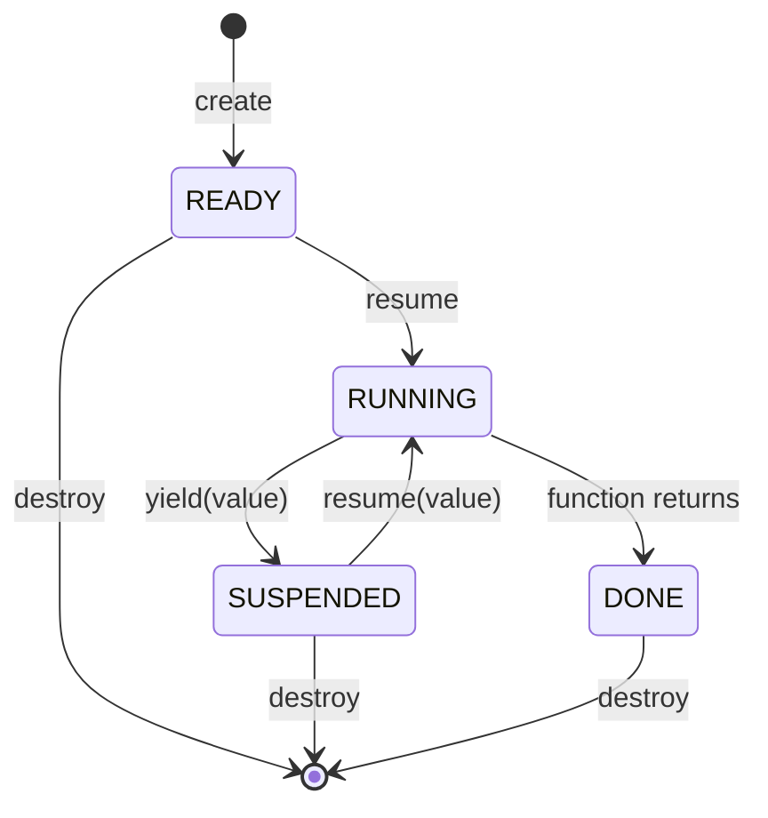
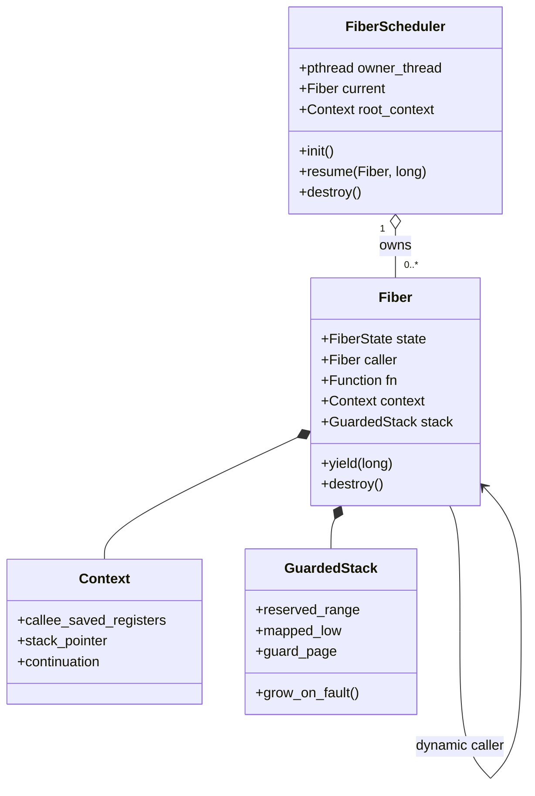
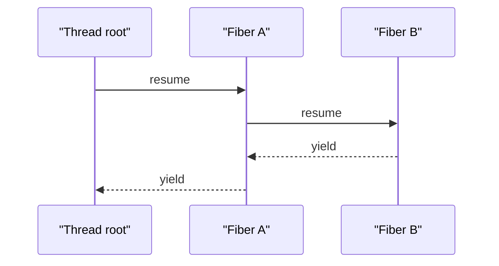

# Fiber Context Switching

Fiber is the Runtime context's lowest execution primitive. It owns a CPU
context and stack, but it does not own scheduling policy, cancellation, I/O
state, or queue membership. Those belong to the future Task/G abstraction.
The implementation is independent work; `ef/` is not a source dependency.

## Public contract

- A `vl_fiber_sched_t` and every fiber created from it are bound to the
  pthread that called `vl_fiber_sched_init`.
- One scheduler may be active per thread. Cross-thread resume and resume of a
  RUNNING or DONE fiber return `VL_ERROR_INVALID_STATE`.
- `stack_size` is usable stack space rounded to Linux page size. The permanent
  guard page is additional space.
- `vl_fiber_resume` writes either the latest yielded value or the final fiber
  function result to `return_value`. The state distinguishes the two cases.
- The caller destroys every fiber before destroying its scheduler. Destroying
  a RUNNING fiber or a scheduler with live fibers is rejected as a no-op.

## State model



## Runtime object relationships



The scheduler owns fibers and the thread root context. A fiber owns its
context and mapping, while the `caller` link is temporary control-flow state:
it is set by `resume` and cleared when that resume returns. The future Task/G
will own a fiber handle, but it will not own the raw register layout.

A resume records the dynamic caller. Therefore B, resumed by A, yields back to
A rather than to the thread root:



The tested event order is exactly `main -> fiber-a -> fiber-b -> fiber-a ->
main`.

## Stack mapping and growth

The requested usable range is reserved with `mmap(PROT_NONE)`. The highest
page is changed to read/write before first entry. The lowest page remains
`PROT_NONE` permanently as the guard.

```text
low address
+----------------------+  mapping base
| permanent guard page |  PROT_NONE
+----------------------+  stack_low
| reserved pages       |  PROT_NONE, mapped on demand
|          ...         |
+----------------------+  mapped_low
| mapped pages         |  PROT_READ | PROT_WRITE
+----------------------+  stack_top, 16-byte aligned
high address
```

The process SIGSEGV handler runs on a 64 KiB `sigaltstack`. It expands only the
currently RUNNING fiber recorded in thread-local storage. A fault between
`stack_low` and `mapped_low` maps every skipped page down to the faulting page,
which handles large compiler stack adjustments. A guard-page or unrelated
fault is forwarded to the previously installed SIGSEGV action. `mprotect`
from a signal handler is a deliberate Linux-specific implementation choice;
this runtime does not claim POSIX portability.

## x86_64 System V context

The assembly preserves every integer callee-saved register. System V x86_64
has no callee-saved XMM registers.

| Offset | Register |
| ---: | --- |
| 0 | `rbx` |
| 8 | `rbp` |
| 16..40 | `r12`..`r15` |
| 48 | `rsp` |
| 56 | continuation `rip` |

On first entry, `stack_top` is aligned to 16 bytes, then a synthetic return
address is pushed. The trampoline therefore observes the ABI-required
`rsp % 16 == 8`. Later switches save a local resume label as `rip`; that label
returns through the original C call frame when the context is restored.

## AArch64 PCS context

The implementation preserves the non-volatile integer registers and the low
64 bits of the non-volatile SIMD/FP registers required by AAPCS64.

| Offset | Register |
| ---: | --- |
| 0..72 | `x19`..`x28` |
| 80 | `x29` frame pointer |
| 88 | `x30` link register / continuation |
| 96 | `sp` |
| 104..160 | `d8`..`d15` |

The initial `sp` is 16-byte aligned and `x30` points to the C trampoline. The
assembly restores the target context and branches to `x30`. C and assembly use
`src/fiber/fiber_context.h` as the shared offset contract, with compile-time
layout assertions.

## Return trampoline and tooling

The first-entry trampoline obtains the current fiber from scheduler TLS, calls
the user function, stores its result, marks the fiber DONE, and transfers to
its immediate caller. A DONE fiber cannot be resumed.

ASan builds call `__sanitizer_start_switch_fiber` and
`__sanitizer_finish_switch_fiber` around every stack change. TSan builds use
its fiber identity API, so logical fibers are not conflated on one pthread.
The ABI test loads all supported non-volatile registers with known values,
yields, resumes, and verifies every value after the switch.

The native Linux amd64 CI matrix passed GCC epoll/io_uring, GCC ASan/UBSan,
Clang epoll, and Clang TSan in
[run 31811776734](https://github.com/nobody0726/veloco/actions/runs/31811776734).

## Benchmark

`veloco_bench_fiber` performs a 10,000-pair warm-up followed by 1,000,000
timed yield/resume pairs using `CLOCK_MONOTONIC`. One pair is two context
switches. Fiber creation and final teardown are outside the timed interval.

Docker Desktop and cross-architecture emulation are correctness environments,
not performance evidence. Record native Linux numbers separately by
architecture using a release-style build:

```bash
VELOCO_BUILD_PROCESSOR="$(uname -m)" cmake --preset epoll
cmake --build --preset epoll --target veloco_bench_fiber --parallel
./build/"$(uname -m)"/epoll/veloco_bench_fiber
```

| Date | Architecture | Environment | Pairs | Result |
| --- | --- | --- | ---: | --- |
| 2026-08-14 | aarch64 | Docker Desktop, correctness-only | 1,000,000 | 19,142,500 ns; 104,479,561 switches/s |
| 2026-08-14 | x86_64 | Docker Desktop emulation, correctness-only | 1,000,000 | 12,819,209 ns; 156,015,867 switches/s |

Native Linux benchmark results remain required before making a resume or
release performance claim.
