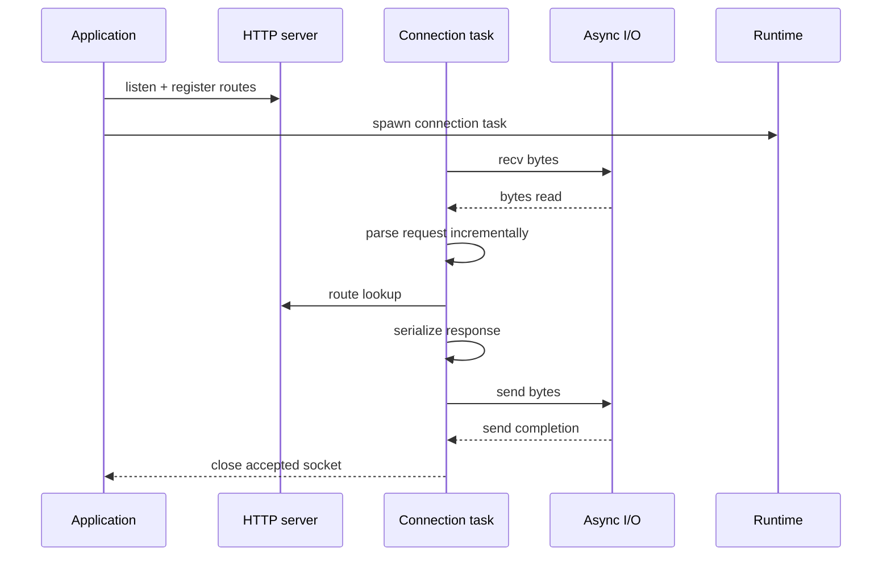
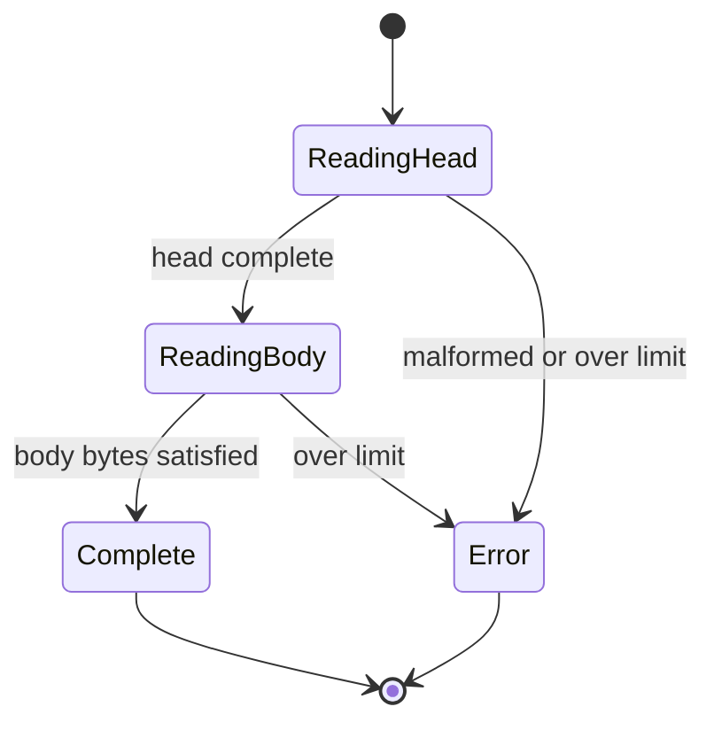

# HTTP Architecture

HTTP is the protocol boundary on top of Runtime and Async I/O. It owns
request parsing, route dispatch, response serialization, connection
lifetime, and cooperative server shutdown. It never reaches into epoll or
io_uring directly.

## Public contract

- `vl_http_config_t` bounds request line size, header bytes, body bytes,
  connection count, and timeout values.
- `vl_http_parser_t` is incremental and accepts fragmented input.
- `vl_http_server_t` stores routes, connection limits, and shutdown state.
- `vl_http_response_t` supports fixed-length bodies and chunked bodies.

## Request flow

## Parser states

The parser is intentionally small:

1. Accumulate bytes in a bounded buffer.
2. Search for `\r\n\r\n`.
3. Parse the request line.
4. Parse headers.
5. Validate `Content-Length`, header count, and body size.
6. Return `NEED_MORE`, `COMPLETE`, or `ERROR`.

Supported request methods are `GET`, `POST`, and `HEAD`. `Connection:
close` and `Connection: keep-alive` override the default HTTP/1.1 keep-alive
behavior.

## Connection ownership

The accepted socket belongs to the connection task. The task owns:

- the parser storage
- the parsed request object
- the response object
- the accepted fd lifecycle

That task closes the socket when it exits. Tests should not close the same
fd a second time.

## Response writing

The writer emits one HTTP/1.1 response per request.

- Fixed-length responses send `Content-Length`.
- Chunked responses send `Transfer-Encoding: chunked` and serialize the
  current body as one chunk followed by the terminating chunk.
- The writer uses the async send path and retries until the whole payload
  is written.

## Shutdown behavior

Shutdown is cooperative:

- `vl_http_server_request_shutdown()` flips the server into a stopping
  state.
- New routes are still queryable, but new connection tasks are rejected.
- The application is responsible for ending the accept loop and then
  letting running connection tasks drain before destroying the server.

## Verification notes

Task 8 HTTP tests cover:

- fragmented parser input
- duplicate `Content-Length`
- body and line limits
- malformed headers
- fixed-length responses
- chunked responses
- malformed-request error responses

