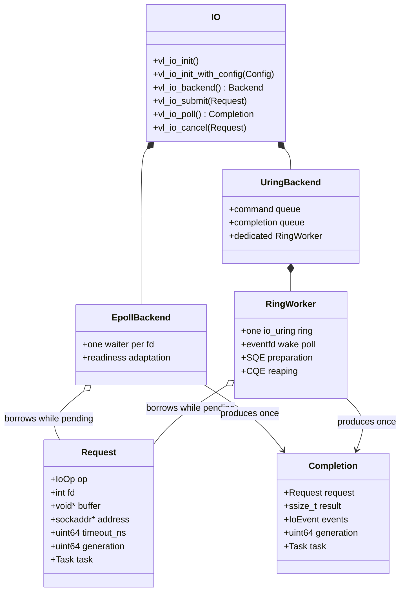
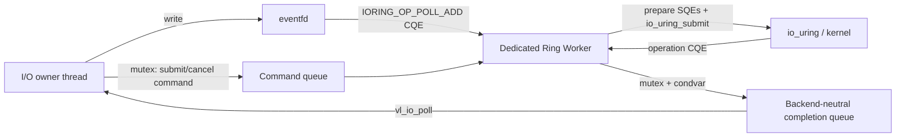

# Backend-Neutral Asynchronous I/O

The Async I/O bounded context exposes requests, completions, descriptor
generations, and backend-neutral event flags. Task 5 established the epoll
baseline; Task 6 adds a real liburing backend without exposing `io_uring`,
SQE, CQE, or epoll types in public headers.

`vl_io_init` prefers io_uring when it is compiled in and ring creation
succeeds. It falls back to epoll only when the kernel reports io_uring as
unsupported. An explicit `vl_io_init_with_config` selection never falls back,
and `vl_io_backend` reports the backend that actually owns the handle.

## Request ownership

The caller owns the Request, its buffer, and connect address. They remain
valid from successful submit until `vl_io_poll` returns the matching
Completion, or until the caller destroys the I/O handle and abandons pending
work. The backend borrows these objects and never frees them.

With a null Task pointer, submit returns immediately and the owner obtains the
Completion through `vl_io_poll`. With `request.task = vl_task_current()`,
submit parks the Task in WAITING. Runtime polls at a scheduler boundary,
writes result/event/completed fields back to the Request, changes the Task to
RUNNABLE, and resumes it through the FIFO queue. The Completion preserves the
exact Request pointer, Task pointer, and generation.

One Runtime may drive one I/O handle while it has waiting Tasks. Shutdown does
not silently abandon backend ownership: the I/O handle must be destroyed
before Runtime teardown reclaims suspended Task stacks.

## Epoll readiness adapter

The process-wide descriptor registry permits one pending operation per fd
across all handles. ACCEPT and RECV wait for readable readiness; SEND and
CONNECT wait for writable readiness. After readiness, the adapter performs
exactly one nonblocking operation:

| Operation | Completion result |
| --- | --- |
| ACCEPT | accepted, tracked fd, or negative errno |
| RECV | bytes read, zero for EOF, or negative errno |
| SEND | bytes written, possibly less than requested, or negative errno |
| CONNECT | zero or negative `SO_ERROR` |

An operation that still returns `EAGAIN` remains pending. Raw epoll flags are
translated to `VL_IO_EVENT_READABLE`, `WRITABLE`, `EOF`, and `ERROR` before
crossing the private backend boundary. Epoll cancellation removes its waiter
and queues one `-ECANCELED` Completion.

## io_uring worker

One dedicated pthread owns one `struct io_uring` for the lifetime of an
io_uring handle. The handle owner validates and claims a Request, appends a
submit/cancel command under a mutex, then writes an `eventfd`. The worker keeps
`IORING_OP_POLL_ADD` armed on that eventfd, drains commands, prepares SQEs
with `io_uring_prep_accept`, `io_uring_prep_recv`, `io_uring_prep_send`,
`io_uring_prep_connect`, or `io_uring_prep_timeout`, submits batches, and
blocks in `io_uring_wait_cqe`. No other thread mutates the ring.

SQE `user_data` identifies an internal operation object that retains the
exact caller Request until the original CQE is consumed. The worker maps
`cqe->res` to the signed Completion result, tracks a successful accepted fd,
releases the process-wide fd claim exactly once, and signals the owner-side
condition. TIMEOUT normally completes with `-ETIME` and has no fd claim.

Cancellation queues `IORING_OP_ASYNC_CANCEL` against the original
`user_data`. Its CQE is internal bookkeeping. Only the original operation CQE
creates a user-visible Completion: if the operation wins, its real result is
preserved; if cancellation wins, it carries `-ECANCELED`. The internal
operation stays alive across both CQEs, so the Task is woken at most once and
the caller cannot release its buffer early.

## Descriptor generations

Every descriptor must be tracked before submission. Socket helpers do this
automatically; external sockets call `vl_socket_track`. The mutex-protected
registry stores `{fd, generation, active, pending_generation}` for every fd
integer observed. `vl_socket_close` clears active state and advances the
generation, so reuse of the same integer cannot satisfy an older Request.

A zero request generation captures the current value on submit; a nonzero
mismatch is rejected. Epoll scans pending waiters before blocking. The
io_uring owner checks again when consuming the CQE-derived Completion. Either
path returns `-ESTALE` after close/reuse. If a stale ACCEPT had already
created an accepted socket, that socket is closed before replacing its result
so the stale path cannot leak an fd.

## Capability and build contract

`VELOCO_ENABLE_URING=OFF` builds without liburing. When it is `ON`, CMake
requires liburing development files and compiles the backend and worker.
Explicit ring initialization maps `EPERM`, `ENOSYS`, and `EOPNOTSUPP` to
`VL_ERROR_UNSUPPORTED`. The dedicated CTest returns skip code 77 for that
condition and never silently exercises epoll.

Docker Desktop may reject ring creation under its default security policy.
A privileged container or suitable Linux host runs the complete CQE suite.
Both Linux amd64 and arm64 remain supported build targets.

## Current constraints

- Each `vl_io_t` is bound to its initializing thread. Public submit, cancel,
  poll, and destroy from other threads are rejected. The private Ring Worker
  communicates only through synchronized queues.
- One operation may be pending per fd; simultaneous read and write slots are
  deferred.
- Requests cover sockets and timeouts, not regular-file asynchronous I/O.
- Runtime Task wakeup is consumed by the owner scheduler thread. Cross-P wake
  queues arrive with G/P/M scheduling in Task 7.
- Registered files/buffers, multishot operations, buffer rings, SQPOLL, and
  per-P rings remain deferred. Epoll is the correctness fallback and
  benchmark comparison path.

## Task 9 I/O counters

`vl_io_get_stats()` reports three backend-neutral counters:

- `submissions`
- `completions`
- `cancellations`

The Task 9 HTTP benchmark records those counts so the workload can prove it
is driving the real async path rather than a stub. In the 500-request HTTP
sample, both x86_64 and aarch64 runs reported:

- `io_submissions=1500`
- `io_completions=1500`
- `io_cancellations=0`

That reflects one accept, one request read, and one response write per
request in the current benchmark shape.
