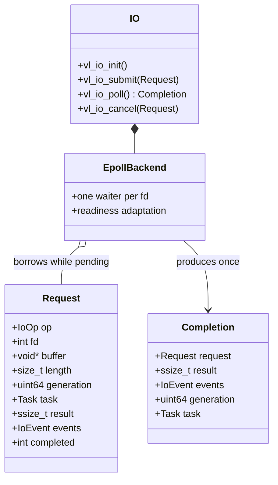

# Backend-Neutral Asynchronous I/O

Task 5 establishes the Async I/O bounded context with an epoll baseline. The
public contract describes operations, requests, completions, generations,
and backend-neutral event flags. Linux `epoll_event` and readiness masks stay
inside `src/net/epoll_backend.c`. Task 6 will implement io_uring behind the
same ownership and completion model.

## Request ownership

The caller owns both the Request and its buffer. They must remain valid from
successful submit until `vl_io_poll` returns the matching Completion, or
until the caller destroys the owning I/O handle and explicitly abandons its
pending work. The backend borrows these objects and never frees them.
Cancellation removes the waiter and queues one completion with
`result = -ECANCELED`; request memory must remain valid until that completion
is consumed or the handle is destroyed.

With a null Task pointer, submit is host-driven: it returns immediately and
the owner obtains the Completion through `vl_io_poll`. With
`request.task = vl_task_current()`, submit parks the current Task in WAITING.
The single-thread Runtime polls the attached I/O handle when it reaches a
scheduler boundary, writes `result`, `events`, and `completed` back to the
Request, changes the Task to RUNNABLE, and resumes it through the FIFO queue.
The Completion preserves the exact Task pointer and generation supplied by
the Request.

One Runtime may drive one I/O handle while it has waiting Tasks. A different
handle can be attached after those waits complete. Shutdown cancels waiting
Task state but does not silently abandon backend ownership: the I/O handle
must be destroyed before Runtime teardown can reclaim suspended Task stacks.

## Readiness adaptation

The process-wide descriptor registry permits one pending waiter per fd across
all I/O handles. ACCEPT and RECV wait for readable readiness; SEND and
CONNECT wait for writable readiness. When epoll reports readiness, the
adapter performs exactly one nonblocking operation:

| Operation | Completion result |
| --- | --- |
| ACCEPT | accepted, tracked fd, or negative errno |
| RECV | bytes read, zero for EOF, or negative errno |
| SEND | bytes written, possibly less than requested, or negative errno |
| CONNECT | zero or negative `SO_ERROR` |

An operation that still returns `EAGAIN` remains pending. The public event
mask uses `VL_IO_EVENT_READABLE`, `WRITABLE`, `EOF`, and `ERROR`; raw epoll
flags never cross the private backend boundary. TIMEOUT and kernel-backed
CANCEL operations are reserved for Task 6; Task 5 cancellation is an
immediate backend ownership transition.

## Descriptor generations

Every descriptor must be tracked before submission. Veloco socket helpers do
this automatically; an external socket must call `vl_socket_track`. The
registry stores `{fd, generation, active, pending_generation}` metadata for
each distinct fd integer observed during the process lifetime. Closing must
use `vl_socket_close`, which clears active state and advances the generation
after the kernel fd is closed. Reuse of the same integer fd therefore cannot
satisfy a request created for an older socket.

The request captures the current generation on submit if its generation is
zero. A nonzero mismatched generation is rejected. Poll scans pending waiters
before blocking; if close advanced a generation, it completes the old request
with `-ESTALE` even though Linux already removed the closed fd from epoll.

## Current constraints

- Each `vl_io_t` is bound to the thread that initialized it. Descriptor
  tracking is also single-thread-owned in Task 5; cross-thread submit,
  cancel, and poll are rejected.
- One operation may wait per fd, so simultaneous read and write waiters are
  deferred until the backend has explicit direction slots.
- Requests support sockets, not regular-file asynchronous I/O.
- Task 5 uses cooperative Runtime polling. A dedicated I/O worker and
  cross-thread P wakeup are Task 6/7 responsibilities.
- io_uring remains the primary planned backend. Epoll is the correctness
  fallback and benchmark comparison path.
