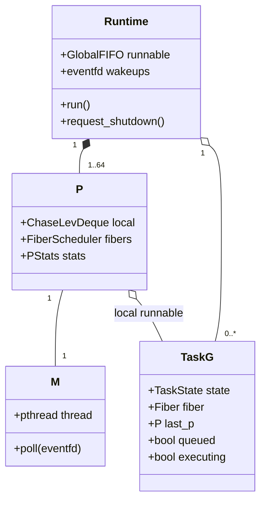
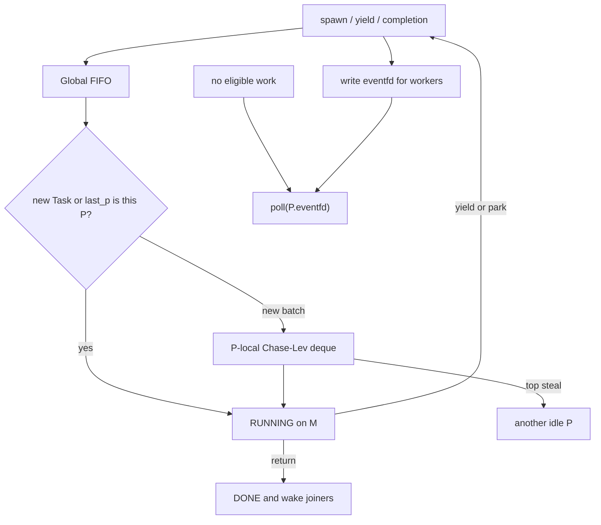

# Fixed G/P/M Scheduler

Task 7 replaces the single FIFO scheduler with a fixed G/P/M runtime. A
Runtime creates one logical processor (P) per configured worker (M). P0 runs
on the thread that owns `vl_runtime_run`; P1..Pn run on persistent pthreads.
The default remains one worker and preserves the Task 4 FIFO behavior.

## Ownership model

Each P has exactly one owner M, so only that M pushes or pops the bottom of
its Chase-Lev deque. Other P instances may steal from the top. The Runtime
mutex protects the global FIFO, Task state transitions, waiter lists,
aggregate counters, and worker lifecycle counters. `queued` is an atomic
single-membership guard.

New Tasks enter the global FIFO. A worker takes one Task to execute and may
move a small batch of unstarted Tasks to its P-local deque. Idle workers check
local, global, then other P deques. A successful batch steal executes one Task
and retains the remainder locally.

## Fiber affinity

An unstarted Task may execute on any P. Once its stackful Fiber is created,
the Task is pinned to that P. Yielded and woken Tasks re-enter the protected
global FIFO with `last_p`; only that P may select them. This constraint is
intentional: migrating a suspended native C stack between pthread root
contexts is not yet a supported Fiber operation. Work stealing therefore
balances new Tasks, while cooperative continuations retain Fiber ownership.

## Scheduling and wake flow

The owner pop and thief steal use the Chase-Lev single-item `seq_cst` race;
slot publication uses release on `bottom` and thieves acquire it before
reading the slot. The global FIFO and all non-queue scheduler fields use the
Runtime mutex. `running`, `stop_workers`, Task `state`, and `queued` are
atomic because they are observed at thread or queue handoff boundaries.

An M parks only after finding no eligible local, global, stolen, or I/O work.
Every enqueue source writes nonblocking eventfds. Deadlock is reported only
when all M instances are idle, every runnable queue is empty, Tasks remain,
and there is no I/O or timer wake source.

## Task state protocol

A Task is marked RUNNING and `executing=true` under the Runtime mutex before
its Fiber is resumed. A waiter marks itself WAITING before yielding. If a
wakeup arrives while the Fiber is still executing, the waker sets
`wake_pending`; the owning scheduler enqueues it only after control has
returned to the M root. This prevents both lost wakeups and simultaneous
execution on two M threads.

Shutdown publishes `running=false`, wakes all eventfds, waits for executing
Fibers to return to their roots, joins P1..Pn, cancels remaining Tasks, and
destroys each Fiber on its owning P. Task handles remain valid until Runtime
shutdown.

## Verification

`tests/test_queue.c` covers empty and batch steals, the owner/thief one-item
race, and 512-token exactly-once stress. `tests/test_task.c` covers default
FIFO behavior, multi-worker exactly-once execution, deterministic stealing,
spawn from a Task, concurrent join wakeups, shutdown quiescence, and per-P
statistics. The queue and Task groups pass under ThreadSanitizer on Linux
arm64.

## Task 9 runtime counters

`vl_runtime_get_stats()` now exposes `task_switches` alongside the
existing spawn, completion, cancellation, runnable, steal, and park
counters. The Task 9 HTTP benchmark uses those counters as its runtime
evidence.

On the 500-request HTTP sample recorded in
[docs/benchmarks/veloco.md](../benchmarks/veloco.md), both x86_64 and
aarch64 runs reported:

- `task_switches=3500`
- `steals=0`
- `parks=1500`
- `runnable=0`

That matches the current owner-thread HTTP benchmark shape: worker count 1,
no work stealing, and one runnable queue draining to zero at the end of each
batch.
