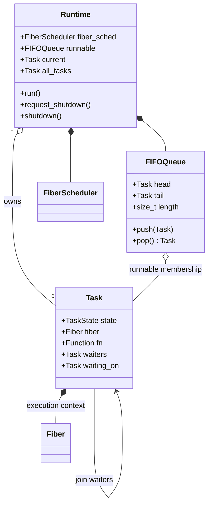

# Single-Thread Task Scheduler

Task 4 establishes the first Runtime milestone: one Runtime owns one
thread-affine Fiber scheduler and one FIFO runnable queue. It deliberately
does not implement P/M workers, stealing, atomics, or cross-thread wakeups.
Those concerns are added only after this deterministic state machine is
stable.

## Runtime objects



The queue is single-owner and intrusive: `queue_next` is part of the Task,
so enqueueing does not allocate. `queued` prevents duplicate membership. A
Task is either in the queue, running, waiting on another Task, or terminal;
it cannot be in two of those locations at once.

## State and ownership rules

`vl_spawn` allocates Task metadata through `vl_malloc`, creates its Fiber,
then changes NEW to RUNNABLE and appends it to the queue. The scheduler pops
one Task, changes it to RUNNING, and resumes its Fiber from the Runtime root.

`vl_yield` changes RUNNING to RUNNABLE, appends the Task, and yields its
Fiber. When the scheduler selects it again, the scheduler changes it back to
RUNNING before resuming the Fiber.

`vl_join` changes the current Task to WAITING and links it to the target wait
list. A target completion changes the waiters to RUNNABLE and appends them. A
join called from the Runtime root is valid only for an already terminal Task;
this avoids blocking the host thread inside the cooperative runtime.

Task metadata and Fibers remain owned by Runtime until
`vl_runtime_shutdown`. This keeps a completed Task handle valid for
`vl_task_state` and repeated `vl_join` calls. Shutdown cancels non-terminal
Tasks, destroys every Fiber exactly once, releases Task metadata, then tears
down the Fiber scheduler and allocator.

## Scheduler loop

```text
while runnable Tasks or I/O waits remain:
    poll attached I/O without blocking
    task = pop FIFO
    if no task and I/O waits remain: block in I/O poll
    if shutdown requested: mark task CANCELLED
    else:
        task = RUNNING
        resume task Fiber
        if Fiber is DONE: task = DONE and wake joiners
        if Fiber is suspended: keep state chosen by yield/join
```

Task 5 extends the loop with one attached I/O handle while Tasks are waiting.
A completion changes its Task from WAITING to RUNNABLE and appends it to this
same queue. Running out of both runnable Tasks and I/O waits while another
non-terminal Task remains is still a deterministic cooperative deadlock
signal. Timer and synchronization contexts remain future wakeup sources.

If shutdown cancels a Task while its Request remains pending, backend
ownership must be torn down before Runtime shutdown can reclaim the suspended
Fiber. This ordering prevents a later completion from retaining a dangling
Task pointer.

## Deliberate next boundary

The FIFO queue API is private to Runtime. Task code does not know whether a
future P-local queue, global queue, or work-stealing queue implements the
enqueue/pop operations. Task 4 therefore proves scheduling semantics without
prematurely coupling the public API to the eventual G/P/M topology.
