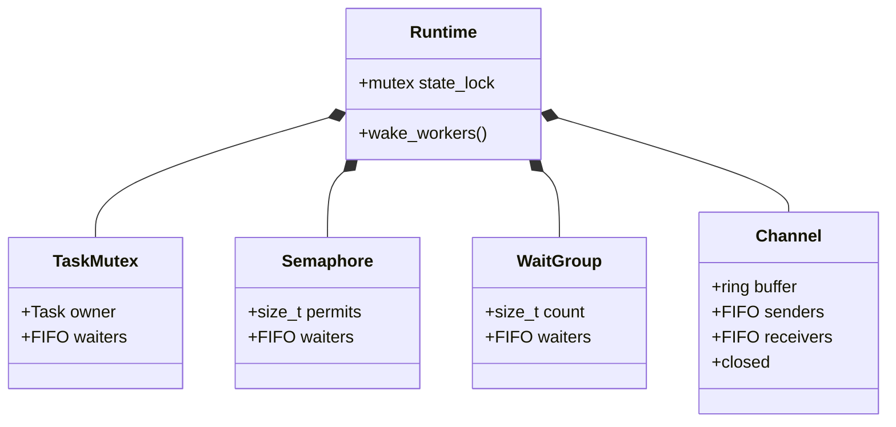

# Task Synchronization

Veloco synchronization primitives are Runtime-owned objects bound to one
`vl_runtime_t`. Their wait queues are FIFO intrusive lists of Task/G handles.
Contended operations transition the current Task to WAITING and yield its
Fiber; they never block an M in a pthread wait.

All object fields and waiter-list operations are protected by the Runtime
mutex. A wake changes WAITING to RUNNABLE through `vl_task_wake_locked`, then
writes every worker eventfd. If a wake races with the Fiber returning from the
API, `wake_pending` records the wake and the scheduler enqueues the Task only
after it has returned to the M root.

## Semantics

- Task mutexes are non-recursive and transfer ownership to the oldest waiter.
- Semaphores consume a permit immediately or queue the Task; `post` wakes the
  oldest waiter before increasing the permit count.
- Wait groups reject positive `add` after a waiter has started waiting. A
  zero transition wakes all waiters. Negative updates cannot underflow.
- Channels support capacity zero (rendezvous) and bounded FIFO buffers. A
  send matches the oldest receiver, otherwise it buffers or parks. A receive
  matches a sender before parking. Closing wakes both queues with
  `VL_ERROR_CLOSED`; buffered values remain receivable before close is seen.

Destroy returns `VL_ERROR_INVALID_STATE` while owners or waiters remain.

## Verification

`tests/test_sync.c` covers yielding critical sections, permit limits, wait
group fan-in with multiple waiters, buffered channel ordering, and close
wakeup. The sync group passes in Linux arm64 epoll and ThreadSanitizer builds.
