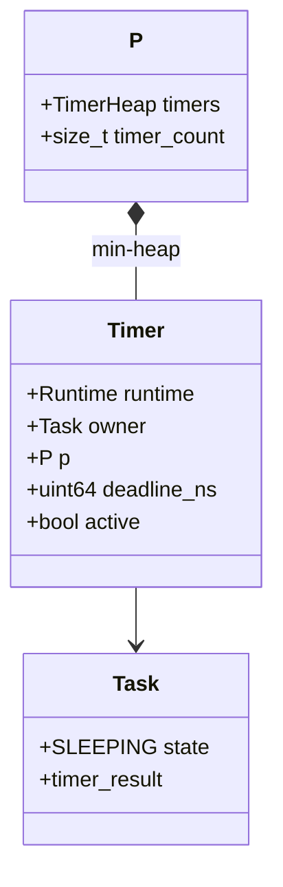
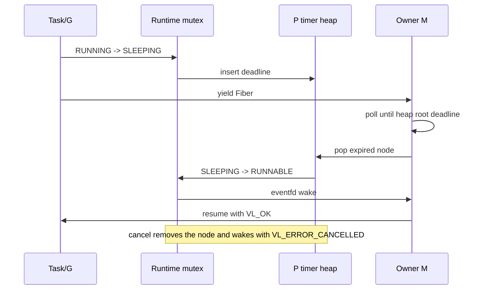

# Per-P Timers

Timers use a monotonic nanosecond deadline and a binary min-heap on the P
that owns the sleeping Task. The Runtime mutex protects heap mutation because
`vl_timer_cancel` may be called by another Task while the owner M is polling.

## Lifecycle

An expired or cancelled node is removed before its Task is woken, so one
timer can produce at most one wake. A zero-delay timer still yields once and
is expired at the next scheduler boundary. `vl_sleep_ns` uses a temporary
timer handle; explicit handles allow another Task to cancel a wait.

Timer heap tests cover ordering and arbitrary removal. Runtime tests cover a
monotonic deadline, cross-Task cancellation, and exactly-once wake behavior.
