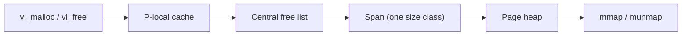
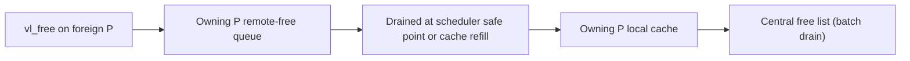

# Allocator Ownership and Flow

The allocator is named `valloc` internally. The fast path is the
P-local cache; misses refill from the central free list, which is
backed by spans from the page heap. The page heap acquires and releases
page ranges through `mmap`/`munmap`.

The cache belongs to P, not M. When a Task frees an object on a
different P than the one that owns the cache, the free is remote:

Ownership and sizing rules:

- Small objects are rounded up to a fixed SizeClass table entry; the
  table covers common runtime and HTTP objects without optimizing every
  possible size.
- A span contains objects of exactly one size class and stores its
  metadata outside the user object area so `vl_free` needs no global
  size lookup.
- Refills and drains move between P-local caches and the central free
  list in batches to amortize locking.
- Large allocations bypass the size-class path and come directly from
  the page heap.
- Fiber stacks are allocated separately through guarded `mmap` and are
  not serviced by the normal allocator.
- Arenas (`vl_arena_alloc`) are request-lifetime regions reset by HTTP
  at request teardown; object pools (`vl_pool_alloc`) reuse fixed-size
  objects without changing size.
- Debug builds add canaries, poison patterns, metadata, and double-free
  detection. Allocation is explicit-free only; there is no GC.

Implementation references: `include/veloco/memory.h`, `src/memory/size_class.c`,
`src/memory/span.c`, `src/memory/page_heap.c`, `src/memory/valloc.c`,
and `src/memory/arena.c` (Task 3). Remote-free support is implemented
with the scheduler in Task 3 and Task 4 milestones.
