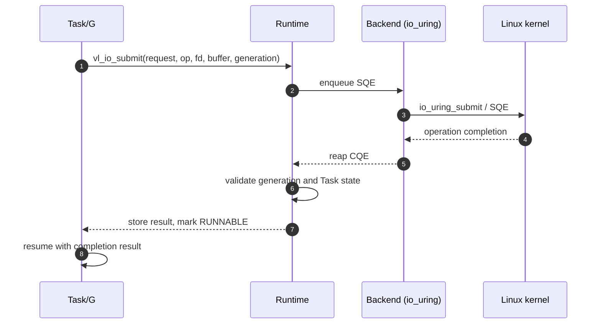
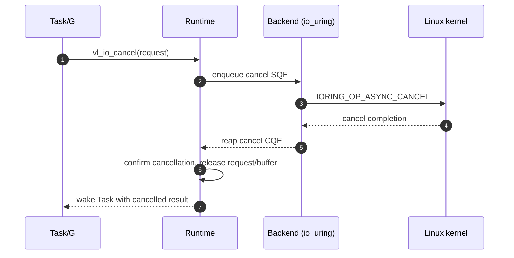

# I/O Completion

The primary path submits one operation per I/O Request, parks the
owning Task, and reaps the kernel completion. A Generation token and a
Task-state check prevent a stale CQE from waking a reused fd or Task.
The first backend is a single io_uring ring with one dedicated I/O
worker; epoll uses the same completion result contract through the
Backend interface.

Cancellation is cooperative and buffer-safe: the runtime submits a
cancel SQE and only releases the request and buffer after the matching
completion has been discarded or matched.

Invariants carried by these paths:

1. The request and its buffer stay valid until completion or confirmed
   cancellation.
2. A completion is dropped only when it belongs to a confirmed
   cancellation; otherwise it must be matched to its Task.
3. Wakeup always transitions `WAITING -> RUNNABLE`, never directly to
   `RUNNING`.

Implementation references: `include/veloco/io.h`, `src/net/backend.c`,
`src/net/epoll_backend.c`, and `src/net/uring_backend.c` (Tasks 5-6).
The epoll fallback implements the same Backend contract with readiness
events instead of SQE/CQE.
