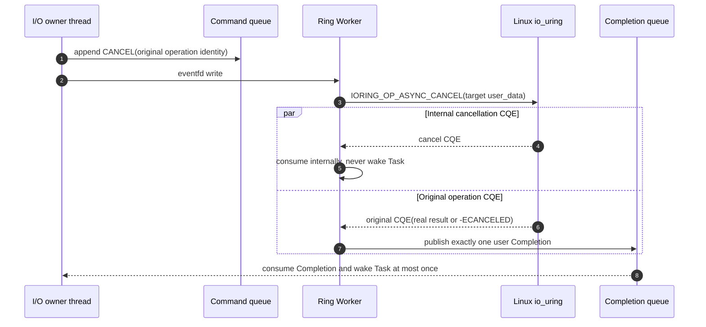
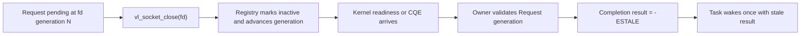

# I/O Completion

Both backends preserve the exact Request, Task identity, and fd generation.
The Runtime owns Task state; a backend only publishes a Completion for the
owner thread to consume.

## io_uring submit and completion

```mermaid
sequenceDiagram
    autonumber
    participant G as Task/G or host
    participant O as I/O owner thread
    participant Q as Synchronized queues
    participant W as Ring Worker
    participant K as Linux io_uring

    G->>O: vl_io_submit(Request, generation, Task)
    O->>O: validate request and claim fd generation
    O->>Q: append SUBMIT(operation identity)
    O->>W: eventfd write
    opt Task-bound request
        O-->>G: park Task in WAITING
    end
    W->>K: eventfd POLL_ADD CQE
    W->>Q: drain commands
    W->>K: prepare SQE(user_data = operation) and submit batch
    K-->>W: original operation CQE(res, user_data)
    W->>W: track accepted fd and release fd claim
    W->>Q: publish Completion(Request, res, generation, Task)
    Q-->>O: condvar signal / vl_io_poll
    O->>O: validate current fd generation
    alt generation changed
        O->>O: result = -ESTALE
    end
    opt Task-bound completion
        O->>O: WAITING -> RUNNABLE and enqueue
        O-->>G: resume; submit returns
    end
```

The Request buffer, connect address, and metadata remain caller-owned and
valid until the original CQE has produced a consumed Completion or the I/O
handle is destroyed.

## io_uring cancellation race



If the operation wins, its real result is preserved and the cancel CQE may
report that no target remained. If cancellation wins, the original CQE is
`-ECANCELED`. The internal operation object stays alive until command,
original CQE, and Completion ownership are all resolved.

## Epoll comparison path

```mermaid
sequenceDiagram
    autonumber
    participant G as Task/G or host
    participant O as I/O owner thread
    participant E as Epoll adapter
    participant K as Linux socket API

    G->>O: submit(Request, Task, fd generation)
    O->>E: epoll_ctl ADD one waiter for fd
    opt Task-bound request
        O-->>G: park Task in WAITING
    end
    O->>E: epoll_wait at scheduler boundary
    K-->>E: readable / writable / hangup / error
    E->>E: validate current fd generation
    E->>K: one accept / recv / send / SO_ERROR
    K-->>E: operation result
    E-->>O: Completion(Request, result, generation, Task)
    opt Task-bound completion
        O->>O: WAITING -> RUNNABLE and enqueue
        O-->>G: resume; submit returns
    end
```

Readiness is not completion. If the nonblocking operation still returns
`EAGAIN`, the waiter remains registered. Raw epoll flags never cross the
backend boundary.

## Stale generation flow



Implementation references: `include/veloco/io.h`, `src/net/backend.c`,
`src/net/epoll_backend.c`, `src/net/uring_backend.c`, and
`src/net/io_worker.c`.
