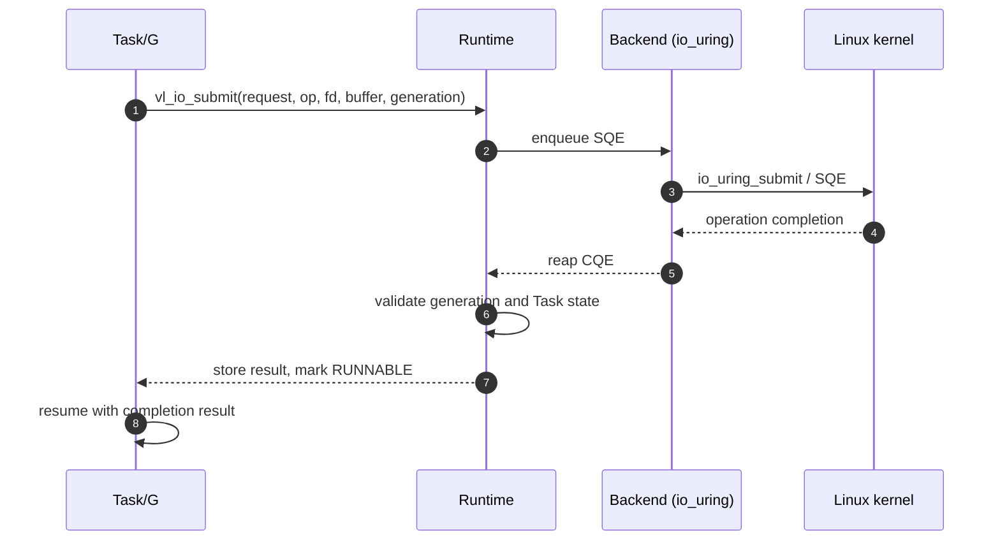
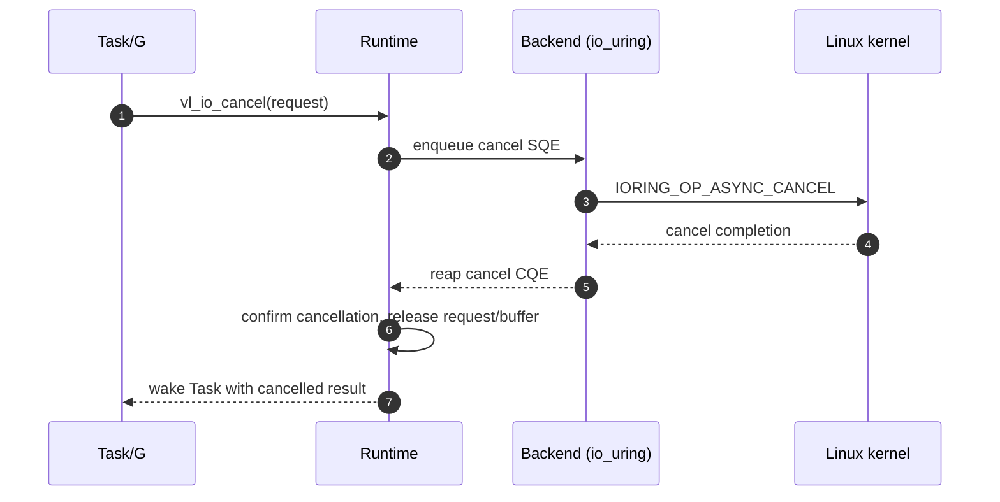
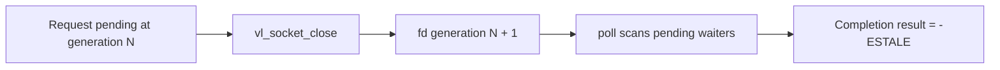

# I/O Completion

The target primary path submits one operation per I/O Request, parks the
owning Task, and reaps the kernel completion. A Generation token and a
Task-state check prevent a stale CQE from waking a reused fd or Task.
Task 6 will implement a single io_uring ring with one dedicated I/O worker.
Task 5 first establishes the same completion contract through an epoll
baseline and integrates it with the single-thread Runtime. Host requests can
also drive polling directly by leaving their Task pointer null.



Cancellation is cooperative and buffer-safe: the runtime submits a
cancel SQE and only releases the request and buffer after the matching
completion has been discarded or matched.



Invariants carried by these paths:

1. The request and its buffer stay valid until completion or confirmed
   cancellation.
2. A completion is dropped only when it belongs to a confirmed
   cancellation; otherwise it must be matched to its Task.
3. Wakeup always transitions `WAITING -> RUNNABLE`, never directly to
   `RUNNING`.

Implementation references: `include/veloco/io.h`, `src/net/backend.c`,
`src/net/epoll_backend.c`, and `src/net/uring_backend.c` (Tasks 5-6).
The epoll fallback implements the same Backend contract with readiness
events instead of SQE/CQE.

## Task 5 epoll path

```mermaid
sequenceDiagram
    autonumber
    participant G as Task/G
    participant R as Runtime
    participant B as Backend interface
    participant E as epoll adapter
    participant K as Linux socket API

    G->>B: submit(Request, Task, fd generation)
    B->>E: register one waiter for fd
    E->>K: epoll_ctl(ADD, readiness)
    B-->>R: park Task WAITING
    R->>B: poll(timeout at scheduler boundary)
    B->>E: epoll_wait
    K-->>E: readable / writable / hangup / error
    E->>E: validate current fd generation
    E->>K: one accept / recv / send / SO_ERROR
    K-->>E: operation result
    E-->>B: Completion(request, result, generation, Task)
    B->>R: WAITING -> RUNNABLE, enqueue
    R-->>G: resume; submit returns
```

Readiness is not itself completion. The adapter executes one nonblocking
operation after readiness and returns that operation result. If it still
observes `EAGAIN`, the waiter remains registered. Raw epoll event bits are
translated to `VL_IO_EVENT_*` before crossing the Backend boundary.

Close-before-wakeup follows a separate stale path:


