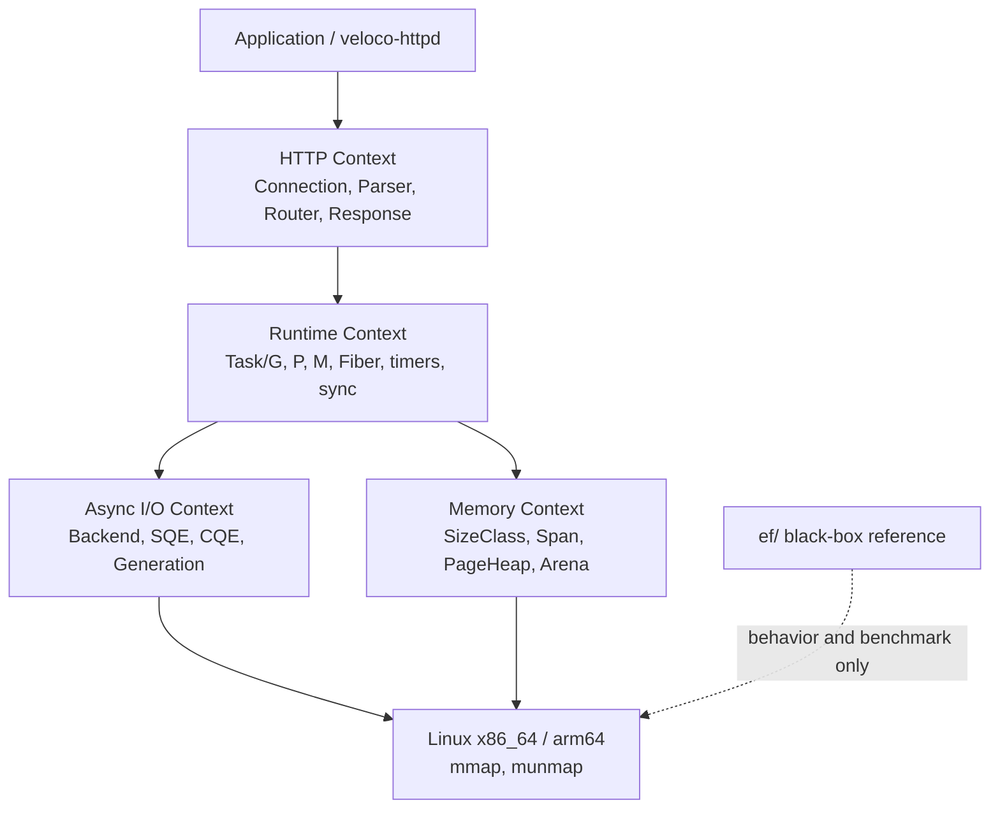

# Veloco System Context

The system context shows the runtime layers and their only external
dependency, native Linux on x86_64 or arm64. `ef/` is outside the Veloco
boundary and is used only as a black-box behavior and benchmark
reference.

Layer responsibilities:

- Application (`veloco-httpd`, binary expected from Task 8) talks to the
  HTTP context through `include/veloco/http.h`.
- HTTP uses the public Runtime and Async I/O APIs from
  `include/veloco/runtime.h`, `include/veloco/task.h`, and
  `include/veloco/io.h`; it never touches Linux primitives directly.
- Runtime schedules Tasks and owns P/M execution.
- Async I/O submits operations through the Backend interface and maps
  completions back to Tasks; epoll remains a fallback and comparison
  backend behind the same interface.
- Memory acquires and releases pages through `mmap`/`munmap`.
- `ef/` is a black-box reference only: its source, headers, assembly,
  and tests are never reused, and no Veloco component depends on it.

Module files referenced by this diagram: `include/veloco/http.h`,
`include/veloco/io.h`, `include/veloco/runtime.h`,
`include/veloco/memory.h`, and the `src/` modules listed in
[docs/domain/ubiquitous-language.md](../domain/ubiquitous-language.md).
