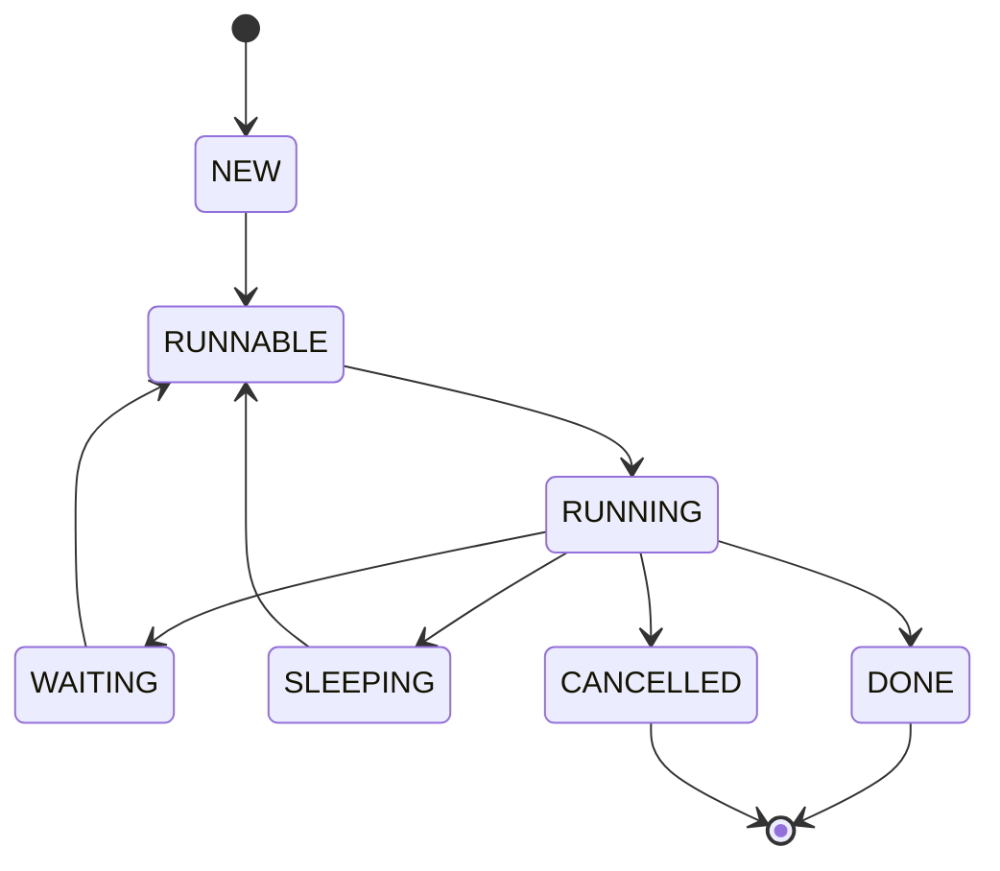

# Task Lifecycle

Runtime owns all transitions below. A Task is created NEW, becomes
RUNNABLE when spawned or woken, RUNNING while an M executes it, and
WAITING or SLEEPING while it is parked on I/O/synchronization or a
timer. I/O completion, timer expiry, or another Task's wakeup returns it
to RUNNABLE.

State semantics:

- `NEW`: task function and arguments assigned, not yet placed in a queue.
- `RUNNABLE`: queued on a P-local queue, the global queue, or stolen by
  another P.
- `RUNNING`: executing on exactly one M; this is the only state where a
  fiber context switch can occur.
- `WAITING`: parked on an I/O Request or synchronization primitive;
  ownership of the wait remains with Runtime.
- `SLEEPING`: parked on a per-P timer heap entry until deadline.
- `DONE`: function returned; Runtime reclaims the fiber and stack.
- `CANCELLED`: cancellation observed cooperatively through runtime calls
  and I/O waits; cleanup runs before the state becomes terminal.

Wakeups never move a Task directly to RUNNING; they always go through
`WAITING`/`SLEEPING` to `RUNNABLE` so the scheduler picks the next P
execution. The I/O completion path is documented in
[docs/diagrams/io-completion.md](io-completion.md). Implementation
references: `include/veloco/task.h` and `src/runtime/task.c`.
