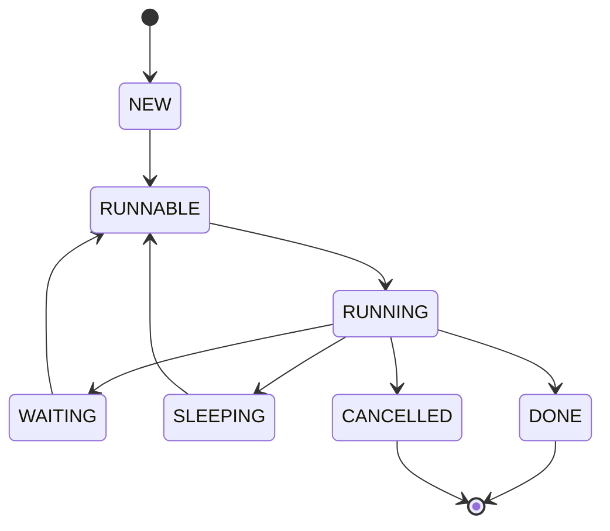
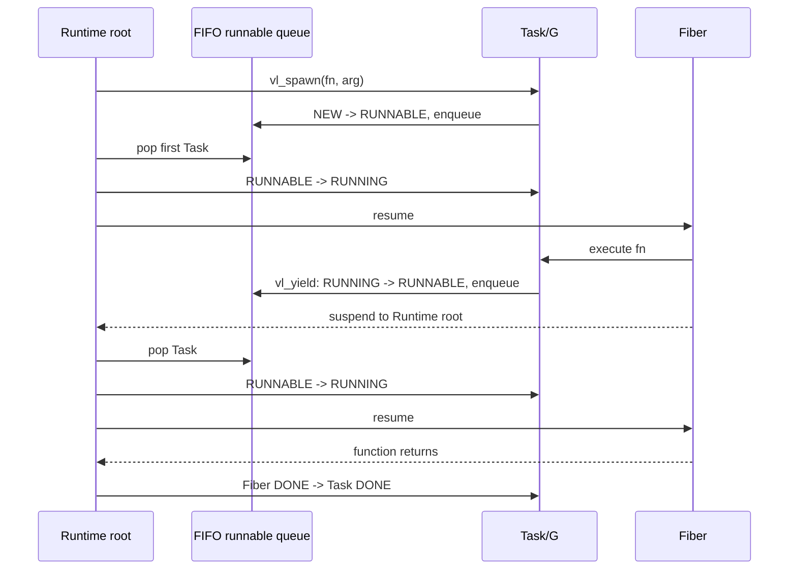
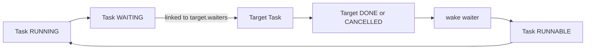
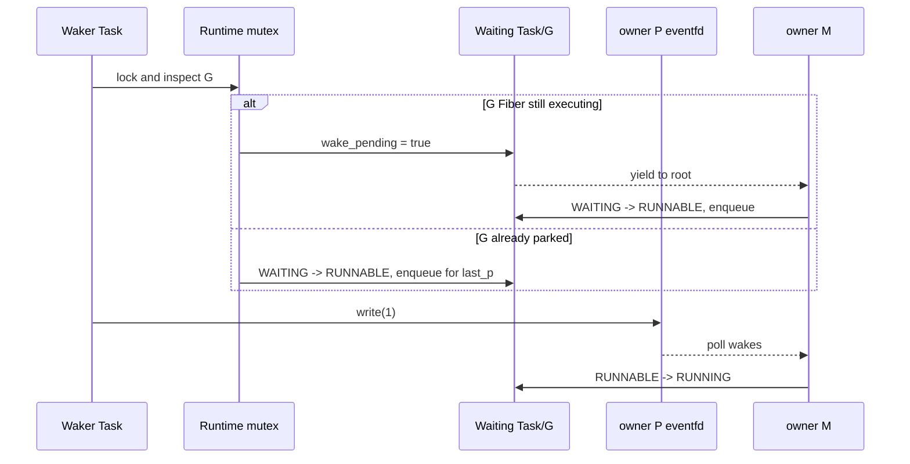
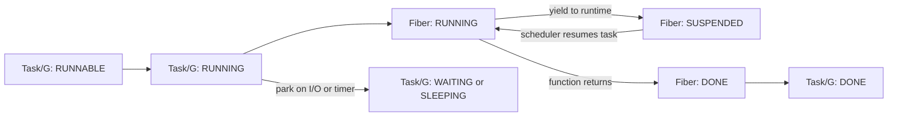

# Task Lifecycle

Runtime owns all transitions below. A Task is created NEW, becomes
RUNNABLE when spawned or woken, RUNNING while an M executes it, and
WAITING or SLEEPING while it is parked on I/O/synchronization or a
timer. I/O completion, timer expiry, or another Task's wakeup returns it
to RUNNABLE.

State semantics:

- `NEW`: task function and arguments assigned, not yet placed in a queue.
- `RUNNABLE`: queued on a P-local queue, the global queue, or stolen by
  another P.
- `RUNNING`: executing on exactly one M; this is the only state where a
  fiber context switch can occur.
- `WAITING`: parked on an I/O Request or synchronization primitive;
  ownership of the wait remains with Runtime.
- `SLEEPING`: parked on a per-P timer heap entry until deadline.
- `DONE`: function returned; the Task handle remains queryable until Runtime
  shutdown, when Runtime reclaims the Fiber and stack.
- `CANCELLED`: cancellation observed cooperatively through runtime calls
  and I/O waits; cleanup runs before the state becomes terminal.

Wakeups never move a Task directly to RUNNING; they always go through
`WAITING`/`SLEEPING` to `RUNNABLE` so the scheduler picks the next P
execution. The I/O completion path is documented in
[docs/diagrams/io-completion.md](io-completion.md). Implementation
references: `include/veloco/task.h` and `src/runtime/task.c`.

Task 4 execution sequence:

Join adds a wait edge instead of queue membership:

Task 7 invariants are: a Task has at most one queue membership, executes on
at most one M, and a terminal Task is never enqueued again. Each M enters
only its P's Fiber scheduler. An unstarted Task may be stolen; after Fiber
creation it returns only to its owning P. Completed handles remain queryable
until Runtime shutdown, when all Task and Fiber resources are reclaimed once.

Task 5 implements the I/O branch: a Task-bound `vl_io_submit` changes
RUNNING to WAITING and suspends its Fiber. Runtime polls epoll at a scheduler
boundary; the matching Completion writes the Request result, changes WAITING
to RUNNABLE, and appends the Task to the same FIFO queue.

## Task-to-Fiber boundary

Task state describes scheduler eligibility; Fiber state describes whether a
saved CPU context can be entered. They are related but deliberately not the
same state machine.

Task 2 implements the Fiber side and its explicit scheduler handle. Task 4
owns the Task/G transitions and maps a parked Task to its suspended Fiber. A
fiber yield alone does not choose a P, enqueue a Task, or represent an I/O
wait.
