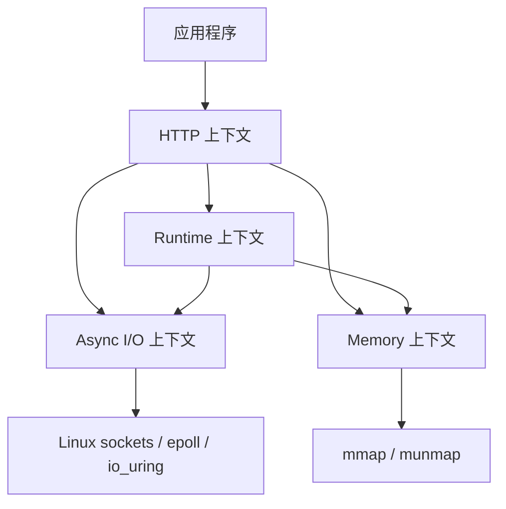

# 用 Veloco 学习领域驱动设计

本文不是把 Veloco 的实现硬套成一个传统订单系统，而是回放这个工程
从问题理解到代码落地的设计过程。Veloco 是 C 语言运行时和 HTTP/1.1
服务器，领域行为主要表现为并发调度、资源所有权、异步完成、协议解析和
生命周期管理。因此，DDD 在这里最有价值的部分是：建立共同语言，划分
一致性边界，明确谁拥有状态，保护不变量，再让代码结构反映这些决策。

本文对应的现有设计资料是：

- [统一语言](ubiquitous-language.md)
- [限界上下文](bounded-contexts.md)
- [运行时设计规格](../superpowers/specs/2026-08-09-veloco-runtime-design.md)
- [Task 生命周期](../diagrams/task-lifecycle.md)

## 1. 先理解问题，而不是先建类

### 1.1 业务问题的技术化表达

如果只说“实现一个协程库和 HTTP 服务器”，实现很容易退化为一组函数：

```text
创建线程 -> 创建协程 -> 等待 socket -> 解析请求 -> 写回响应
```

这句话没有说明最容易出错的决策：

- 等待 I/O 时，哪个线程可以继续执行其他 Task？
- 一个 Task 能否同时被两个 worker 执行？
- 一个 fd 被关闭并复用后，旧的完成通知能否唤醒新的请求？
- 跨 P 释放的内存由谁回收？
- HTTP 连接关闭时，正在等待的 Task、缓冲区和响应由谁释放？
- shutdown 开始以后，哪些新动作必须被拒绝，哪些旧动作必须排空？

所以设计的第一个产物不是 `struct`，而是问题清单和约束。Veloco 的
核心问题可以概括为：

> 在 Linux 上，用固定 worker 执行可迁移的未启动 Task 和固定 P 上的
> Fiber，安全地完成异步网络操作、内存管理和 HTTP 请求生命周期。

### 1.2 领域事件和用例

把系统中有意义的动作写成动词，得到比模块名更好的切入点：

| 用例 | 主要参与对象 | 必须保持的结果 |
| --- | --- | --- |
| 提交 Task | Runtime、Task、P/M | Task 进入一次可执行队列 |
| 执行并让出 Task | Task、Fiber、Scheduler | 同一 Task 不会并发执行 |
| 等待并完成 I/O | Task、Request、Backend、Completion | Request 只产生一次用户可见完成 |
| 关闭并复用 fd | Socket registry、Generation、Request | 旧完成不能作用于新 fd |
| 跨 P 释放内存 | Allocation、P cache、Remote-free queue | 内存最终回到正确的所有权链路 |
| 处理 HTTP 请求 | Connection、Parser、Router、Response | 协议错误有界，连接资源最终释放 |
| Runtime shutdown | Runtime、Task、I/O、Worker | 先停止新工作，再唤醒/排空/回收旧工作 |

这里的“领域事件”不一定要实现成消息总线。它首先是分析工具：当一个
动作会改变多个对象的状态时，就要问清楚事务边界、所有权和失败路径。

## 2. 战略设计：从问题空间到边界

### 2.1 领域、子域和优先级

整个 Veloco 领域是“协作式并发网络运行时”。按业务能力拆成四个子域：

| 子域 | 类型 | 价值判断 | 责任 |
| --- | --- | --- | --- |
| Runtime | 核心支撑域 | 最能体现项目差异和风险 | Task/G、Fiber、P/M、调度、等待、Timer、Sync、shutdown |
| Memory | 关键技术子域 | 为 Runtime 和 HTTP 提供性能与所有权能力 | size class、Span、Cache、PageHeap、Arena、Pool |
| Async I/O | 关键技术子域 | 隔离 Linux 后端差异并保证完成语义 | Request、Completion、Generation、epoll、io_uring |
| HTTP | 产品子域 | 用户直接看到的能力 | Connection、Parser、Router、Response、连接限制 |

“核心”“支撑”“产品”不是价值高低的排名，而是设计投入的分配方式：
Runtime 的并发不变量要优先精确建模；Memory 和 I/O 要把操作系统细节
隔离起来；HTTP 要围绕可观察的协议行为组织代码和测试。

`ef/` 不属于任何一个限界上下文。它是外部黑盒基线，只提供行为和基准
观察，不能反向污染 Veloco 的模型。这是反腐层（anti-corruption layer）
的一种实际用法：参考外部系统，但不把它的实现、命名和耦合带进新模型。

### 2.2 限界上下文

限界上下文不是目录名，而是“一个词在一个边界内只有一种含义，并由一个
模块负责其不变量”。当前工程的边界如下：



上下文之间只通过窄接口协作：

- HTTP 只调用 `include/veloco/*.h` 中的公共 API，不认识 epoll、io_uring
  或 Runtime 内部队列。
- Async I/O 返回 `Request` 和 `Completion`，不把 readiness 类型泄漏给
  HTTP 或 Runtime 的公共接口。
- Runtime 独占 Task 状态迁移；I/O 和 HTTP 可以持有 Task 指针，但不能
  直接修改 Task 生命周期。
- Memory 提供显式分配、Arena 和 Pool；HTTP 使用它们，却不能把 Arena
  指针带过 request 生命周期。

这就是上下文映射（context map）。它比“每个目录一个模块”更严格，因为
它规定了依赖方向和谁拥有决策权。

### 2.3 统一语言

统一语言的建立顺序是：从用例中提取名词和动词，删除同义词，给每个词
指定唯一 owner，再把词落实到代码和测试。例如：

- `Task` 和 `G` 是同一个概念，不在不同模块中各自发明一个“协程对象”。
- `Fiber` 是执行上下文，不是调度策略；`Task` 才是用户可见的可调度对象。
- `Completion` 是后端无关的完成结果；`CQE` 只在 io_uring 适配器内部存在。
- `Generation` 是 fd 生命周期令牌，不是普通的计数器。
- `Arena` 是 request-lifetime 区域，不是可以传给 `vl_free` 的普通堆内存。

完整词汇表在 [ubiquitous-language.md](ubiquitous-language.md)。它还记录
了 owner、代码位置、不变量和明确延期的概念。后续修改如果需要引入一个
新名词，应先回答三个问题：它属于哪个上下文？谁拥有它的状态？什么测试
证明它的语义？

### 2.4 遇到子领域交互问题时如何设计

原有的四个上下文划分只能回答“谁负责”，不能自动回答“两个上下文如何
协作”。遇到新的子领域交互时，按下面的顺序设计。完整流程手册见
[领域模型与业务流程](domain-model-and-flows.md)。

#### 第一步：先写跨边界用例和结果

不要从“Runtime 要调用 I/O”开始，而要写成可验收的用例：

> 当前 Task 提交一个 recv，Task 暂停；数据到达后，Request 得到结果，
> 原 Task 恢复，并且旧 fd 的完成不能唤醒新 Task。

用例必须包含成功、失败、取消、超时、关闭和重复触发结果。没有结果定义
的“交互”通常只是技术耦合，还不是领域协作。

#### 第二步：给交互两端分别指定 owner

对交互中出现的每个字段标注 owner：

| 交互内容 | Runtime owner | Async I/O owner |
| --- | --- | --- |
| Task state、Fiber、队列、waiter | 写入和迁移 | 只能持有关联引用 |
| Request buffer、operation、completion queue | 只能等待结果 | 借用、完成、释放 backend 记录 |
| fd claim、generation | 不解释内核细节 | 校验、推进和释放 |
| “Task 何时可继续” | 决定 WAITING -> RUNNABLE | 只报告已有 Completion |
| eventfd、条件变量 | 使用通知唤醒 worker | 使用通知唤醒 Ring Worker/owner |

一个字段只能有一个写 owner。共享读取、指针引用和状态共同拥有是三种
不同关系，不能因为结构体里存在指针就把所有权算作共享。

#### 第三步：选择跨上下文关系类型

逐个关系做分类：

1. **值传递**：传递不可变配置、状态码、事件标志；例如 `vl_io_event_t`。
2. **引用关联**：传递身份用于回查；例如 `Request.task -> Task`。
3. **借用**：临时使用，明确起止时间；例如 Backend 借用 Request 和 buffer。
4. **转移所有权**：接收方负责释放；当前 I/O Request 不采用这种方式。
5. **通知**：只说明“有事发生”，不携带可修改的领域状态；例如 eventfd。
6. **反腐翻译**：把一个上下文的概念翻译成另一个上下文能理解的概念；
   例如 epoll readiness -> backend-neutral Completion。

如果交互图里只写“调用”，但没有标注属于哪一类，设计还不够具体。

#### 第四步：定义最窄的端口和协议对象

端口应包含四类信息：

```text
输入：谁提交什么
结果：成功、失败、取消、超时、过期如何表达
生命周期：调用前、pending 中、完成后谁持有对象
并发：哪个线程可以调用，哪个锁/队列保护状态
```

Veloco 的 I/O 端口就是 `vl_io_submit`、`vl_io_poll`、`vl_io_cancel`，
协议对象是 `vl_io_request_t` 和 `vl_io_completion_t`。它没有把 epoll
或 io_uring 类型放进端口，因为那会把适配器概念泄漏给所有调用方。

#### 第五步：决定推送、拉取还是恢复执行

跨上下文通知通常有三种模式：

| 模式 | 适用场景 | Veloco 选择 |
| --- | --- | --- |
| 业务 callback 推送 | 调用方确实需要注册多个独立业务处理器 | HTTP handler 使用这一模式 |
| poll/queue 拉取 | 结果需要由 owner 线程按顺序消费 | I/O Completion 使用这一模式 |
| continuation 恢复 | 原操作属于一个可暂停的 Task | Task-bound I/O 使用 Fiber resume |

不要为了“异步”默认增加 callback。当前 I/O 先把 Completion 放入队列，
Runtime owner 调用 poll，再通过 `vl_task_complete_io` 恢复 Task；这个模式
把 Task 状态修改集中在 Runtime，也更容易保证 exactly-once。

#### 第六步：画静态所有权图和动态时序图

每个跨上下文交互至少画两张图：

1. **静态所有权图**：对象属于谁、谁借用谁、谁负责释放。
2. **动态时序图**：提交、等待、完成、失败、取消、销毁的时间顺序。

时序图必须标出锁、队列、线程和状态变化。例如 I/O 的关键顺序不是
`submit -> callback`，而是：

```text
Request submit -> fd claim -> Task WAITING -> backend pending
  -> Completion queued -> Request write-back -> Task RUNNABLE
  -> Fiber resume
```

#### 第七步：区分同步一致性和最终通知

问清楚哪些字段必须在同一个临界区内变化，哪些只是之后通知：

- Runtime 的 `Task state`、`waiting_for_io`、`io_waiting`、队列 membership
  必须由 Runtime 协调；这是同步一致性边界。
- Completion 队列、eventfd 和条件变量只是让消费者尽快运行；这是通知
  机制，不能代替状态校验。
- generation 校验必须发生在 I/O Completion 被消费时，即使 backend 之前
  已经认为操作完成。

#### 第八步：设计失败协议和销毁顺序

跨子域问题最常在失败路径暴露。至少逐项回答：submit 成功但 park 失败、
completion 到达时 Task 已 terminal、fd 已 close/reuse、cancel 与原始
completion 竞争、Runtime shutdown 与 backend destroy 的先后，以及 buffer、
Request、operation、Task、Fiber 各自何时释放。

当前设计的结论是：I/O handle 要先停止并处理 backend operation，Runtime
再回收等待中的 Task/Fiber；取消 CQE 不生成第二次公开 Completion；stale
结果转成 `-ESTALE`；所有权未确认归还前不能释放 buffer。

#### 第九步：用契约测试验证交互

每个跨上下文用例至少需要合约测试、组件测试、交互测试、竞争测试和销毁
测试。Runtime/I/O 对应的现有证据是 `tests/test_io.c`、
`tests/test_uring.c` 和 `tests/test_task.c` 中的 completion、cancel、
close-before-wakeup、owner-thread、pending-teardown、join 和 shutdown
测试。这样设计新交互时，不需要先猜“该加 callback 还是共享锁”，而是先
把所有权、状态、结果和证据写清楚。

## 3. 战术设计：把行为和不变量落到代码

DDD 的实体、值对象、聚合等术语在基础设施领域需要按“身份、生命周期、
一致性边界”理解，而不是按 ORM 的形式理解。

### 3.1 实体（Entity）

实体在生命周期中有稳定身份，即使其状态发生变化仍然是同一个对象。当前
工程中最清晰的实体是：

| 实体 | 身份和生命周期 | 代码落点 |
| --- | --- | --- |
| Task/G | 指针身份；NEW 到 DONE/CANCELLED；Runtime shutdown 前可查询 | `struct vl_task`，`src/runtime/task.c` |
| Fiber | 指针身份；拥有 native stack 和 ABI 上下文；由创建它的 P 回收 | `struct vl_fiber`，`src/fiber/fiber.c` |
| P/M | Runtime 内的固定身份；P 和 owner M 一一对应 | `struct vl_p`，`src/runtime/runtime_internal.h` |
| I/O Request | 调用者拥有的请求身份；submit 到一次 completion/cancel | `vl_io_request_t`，`include/veloco/io.h` |
| Connection | 一个 fd 加上连接 Task、Parser、request 资源的生命周期 | `vl_http_connection_task_t`，`src/http/http_connection.c` |
| Timer | Runtime 绑定的等待身份；arm、expire/cancel、destroy | `vl_timer_impl`，`src/time/timer.c` |
| Arena/Pool handle | 外部可持有的资源句柄；handle 控制内部资源释放 | `vl_arena_t`、`vl_pool_t` |

实体的关键不是“有一个 struct”，而是状态只能通过 owner 的行为改变。
例如，I/O completion 可以携带 `vl_task_t *`，但只能调用 Runtime 提供的
完成入口；它不能自行把 Task 写成 RUNNABLE。

### 3.2 值对象（Value Object）

值对象由值和约束定义，没有独立身份；相同值通常可以替换。C 代码中它们
往往是 enum、配置结构或一组一起验证的字段：

| 值对象/概念 | 约束 | 代码落点 |
| --- | --- | --- |
| TaskState | `NEW/RUNNABLE/RUNNING/WAITING/SLEEPING/DONE/CANCELLED` | `include/veloco/task.h` |
| FiberState | Fiber 的 READY/RUNNING/SUSPENDED/DONE 语义 | `include/veloco/fiber.h` |
| Generation | fd 复用时必须与 Request 匹配 | `include/veloco/io.h`、`src/net/socket.c` |
| Deadline | 单调时钟上的纳秒截止时间 | `include/veloco/timer.h` |
| I/O operation/event | `ACCEPT/RECV/SEND/CONNECT/TIMEOUT` 及后端无关事件 | `include/veloco/io.h` |
| Runtime/HTTP/I/O config | 初始化时的边界、容量和策略 | `runtime.h`、`http.h`、`io.h` |
| SizeClass | 固定排序的容量桶，决定 Span 和 Cache 路径 | `src/memory/memory_internal.h` |

值对象的设计动作是集中校验，而不是让每个调用点自行解释。例如 HTTP
Parser 在初始化时归一化请求行、header、body 上限；I/O submit 校验
generation；Timer 使用 monotonic clock。这些规则如果散落在调用方，就会
出现同一个词有多个含义。

### 3.3 聚合（Aggregate）和聚合根

聚合是一个一致性边界：外部只能通过聚合根执行会影响内部不变量的操作。
它不等于“最大的 struct”，也不等于“所有对象都要嵌套”。Veloco 的聚合
可以这样理解：

#### Runtime 聚合

`vl_runtime_impl` 是 Runtime 聚合根，管理：

- 全局 runnable 队列和 `all_tasks`；
- P/M 集合及 worker 生命周期；
- Task 状态、waiter 列表、live counter；
- timer 和 I/O wakeup 的协调；
- shutdown 状态和最终资源回收。

核心不变量在 `src/runtime/task.c` 和 `src/runtime/scheduler.c` 中通过
Runtime mutex、原子字段和专用入口保护：

1. 一个 Task 至多属于一个 runnable 队列。
2. 一个 Task 至多在一个 M 上执行。
3. terminal Task 不会再次入队。
4. Fiber 创建后回到它的 owner P。
5. WAITING/SLEEPING 只能经由 wake 过程回到 RUNNABLE。

`vl_spawn`、`vl_join`、`vl_yield`、`vl_runtime_run` 是面向聚合的命令；
`vl_task_wake_locked`、`vl_task_complete_locked` 是内部领域操作。外部
代码拿到 Task 句柄，但不能直接改 `state`。

#### Async I/O 聚合

`vl_io_t` 是 I/O handle 的根。它协调 pending request、backend、completion
queue 和 fd generation。Backend 是策略对象：EpollBackend 和 UringBackend
实现不同，但对根暴露同一套 Request/Completion 语义。

聚合不变量包括：

- 一个 fd 当前最多一个 pending operation；
- Request 及其 buffer 在完成或确认取消前仍由调用者持有；
- 一次原始操作最多产生一个用户可见 Completion；
- completion 必须匹配 generation；
- async-cancel 的内部 CQE 不能变成第二次用户完成。

#### HTTP Server 聚合

`vl_http_server_t` 是服务器聚合根，拥有配置、路由表、活动连接计数和
shutdown 标志。`Connection` 是服务器处理单元，但不应该绕过 Server 根
修改路由或连接上限。

Parser 和 Response 更接近 Server/Connection 内部的协议对象：Parser
积累输入并产生一个请求，Response 聚合状态码、headers、body encoding。
它们的协议约束由 HTTP 上下文自己保护，不交给 Runtime 判断。

#### Memory 聚合的边界

Allocator、Span、P-local Cache、PageHeap 构成资源所有权聚合。这里没有一
个暴露给用户的“业务聚合根”；`vl_malloc/vl_free`、`vl_arena_*`、
`vl_pool_*` 是受控命令入口。

重要的是不要把所有内存对象纳入同一个锁保护的大聚合：小对象快路径由 P
Cache 负责，跨 P 释放通过 Remote-free queue 交给 owner P，Span/central
层负责批量补给，PageHeap 负责 mmap 生命周期。分层本身就是一致性边界和
性能边界。

### 3.4 领域服务（Domain Service）

当一个行为属于领域规则，但不自然属于某个实体时，用领域服务表达。当前
工程中的典型服务是：

- Scheduler：按照 local、global、steal、park 顺序选择 Task，并协调
  Task/Fiber/P/M。
- Completion dispatcher：验证 Request、generation、Task 状态，然后把
  完成结果交给 Runtime 唤醒流程。
- Backend adapter：把 epoll readiness 或 io_uring CQE 转换成统一
  Completion。
- Allocator policy：依据 SizeClass 选择 cache、central、page heap 或
  large mapping。
- HTTP connection runner：编排 recv -> parse -> route -> response write，
  但不拥有 Runtime 的 Task 状态机。

这些服务主要表现为 C 函数，而不是必须有 `Service` struct。判断标准是：
它是否在协调多个实体，并且是否有可独立描述、可测试的不变量。若只是
`memcpy`、系统调用包装或纯数据访问，则留在基础设施实现中，不必提升为
领域服务。

### 3.5 仓储（Repository）的对应物

仓储的本质是“以领域语言获取和保存聚合”，不是一定要连接数据库。Veloco
没有持久化业务数据，因此不应虚构 `TaskRepository` 或
`ConnectionRepository`。对应关系是：

| DDD 概念 | Veloco 中的实际替代物 |
| --- | --- |
| Runtime 聚合的集合 | `all_tasks`、global/local runnable queues |
| I/O pending repository | fd registry、pending waiter、completion queue |
| Timer repository | P-local `vl_timer_heap_t` |
| Memory resource registry | Span lists、large allocation list、Arena blocks |
| HTTP route repository | `vl_http_server_t.routes[]` 和 `vl_http_find_route` |

它们都是内存中的集合/索引，生命周期由聚合根或上下文 owner 控制。只有
出现持久化、远程查询或可替换存储需求时，才值得定义仓储接口。

### 3.6 应用服务、领域事件和其他战术模式

还需要把几个经常被遗漏的 DDD 要素放回当前工程：

- **应用服务（Application Service）**：负责把一个外部用例编排成多个
  领域操作，不持有核心业务规则。`vl_http_spawn_connection`、
  `vl_http_server_listen_loopback`、`vl_runtime_run` 和
  `vl_io_submit` 都承担应用服务式入口的部分职责：校验输入、调用内部
  服务、连接生命周期并返回错误码。它们是 C API 函数，不需要被包装成
  `ApplicationService` 结构体。
- **领域事件（Domain Event）**：表示一个已经发生、可能触发其他上下文
  反应的状态变化。当前实现中的 `Task completion`、`I/O Completion`、
  `Timer expiry`、`Connection shutdown` 和 `Runtime shutdown` 都可以
  作为事件来分析；目前它们通过受控函数调用、队列和 eventfd 传递，而
  不是通用事件总线。这个选择避免为单进程运行时引入没有实际需求的消息
  基础设施，同时保留了事件发生点和消费者边界。
- **工厂（Factory）**：负责创建需要组合多个资源或选择策略的对象。
  `vl_runtime_init_with_config`、`vl_io_init_with_config`、
  `vl_http_server_init` 和 `vl_arena_init` 具有工厂式职责：它们验证配置、
  建立内部资源，并在部分失败时清理已创建资源。
- **策略（Policy/Strategy）**：把可替换的决策封装起来。I/O Backend
  选择 epoll 或 io_uring、Memory 根据 SizeClass 选择 cache/central/page
  heap、Scheduler 选择 local/global/steal，都是策略；公共契约保持稳定，
  具体策略藏在 `src/net`、`src/memory` 和 `src/runtime` 内部。
- **规格（Specification）**：把可组合的判断表达出来。当前代码中 HTTP
  的请求限制、fd generation 匹配、Task 是否允许 park、以及 shutdown
  后是否允许新工作，主要以验证函数和条件实现；它们还没有独立的
  `Specification` 类型，因为规则数量和组合需求尚未达到值得抽象的程度。
- **基础设施（Infrastructure）**：提供操作系统和运行库能力，但不决定
  领域语义。pthread/eventfd、epoll、io_uring、socket、mmap/munmap、
  x86_64/arm64 汇编分别位于 Runtime、Async I/O、Memory 和 Fiber 的私有
  适配层。公共头文件中的 `vl_*` 类型是稳定端口，Linux 类型不越界。

一个实用判断是：应用服务描述“从外部请求到结果”的流程，领域服务描述
“多个领域对象之间的规则”，基础设施描述“如何调用操作系统”。把三者混
在一个函数里，通常就是下一轮重构或测试困难的信号。

## 4. 从设计到代码的完整步骤

以下是这类工程可以重复使用的方法论，也是 Veloco 的实际推进顺序。

### 步骤 1：定义目标和非目标

先固定平台、性能目标、正确性目标和明确延期项。Veloco 选择 Linux
x86_64/arm64、C11/GNU11、协作式调度、epoll fallback 和 io_uring 主路径；
把 HTTP/2、TLS、GC、NUMA、动态 M 和抢占式调度列为非目标。

非目标很重要：它防止“设计完整性”诱使我们提前引入未验证的抽象，也让
每个领域对象有清楚的边界。

### 步骤 2：观察基线，提取外部行为

`ef/` 作为黑盒，先记录构建、协程、poller、HTTP 和 benchmark 行为，再
写出自己的验收条件。不能从旧实现复制结构，因为那会把旧的混合所有权
模型原样带进来。

产物：基线记录、行为测试、风险列表。对应资料：设计规格第 3 节和
`docs/benchmarks/`。

### 步骤 3：用名词/动词风暴建立候选模型

从“spawn、yield、park、complete、close、parse、route、allocate、free、
shutdown”中提取 Task、Fiber、Request、Completion、Connection、Span、
Arena 等名词；把“谁能改变什么”写成动词。

然后消除同义词和越界词：Task/G 合并，Fiber 与 Task 分开，CQE 留在
io_uring 上下文，HTTP 不直接拥有 Task 状态。结果就是统一语言表，而不
是一个未经验证的类图。

### 步骤 4：画上下文地图，决定依赖方向

先画 HTTP、Runtime、Memory、Async I/O 和 Linux 的关系，再决定公共接口。
这个阶段的关键问题是：

- 哪些类型可以出现在 `include/veloco/*.h`？
- 哪些类型只能在 `*_internal.h` 中出现？
- Backend 如何替换而不改变 HTTP 代码？
- 谁是 Task 状态的唯一写入者？

这一步产生了现在的四个公共上下文和反腐边界。目录结构随后才被创建。

### 步骤 5：为每个实体画状态机

先写状态和合法迁移，再写字段。Task 状态机是：

```text
NEW -> RUNNABLE -> RUNNING -> DONE
                       |-> WAITING -> RUNNABLE
                       |-> SLEEPING -> RUNNABLE
                       |-> CANCELLED
```

Fiber 状态机和 Task 状态机刻意分开。Fiber yield 只保存 CPU 上下文，不能
自行决定 Task 是否等待 I/O；这是一个很关键的边界修复。

同样的做法用于 Request：submitted -> pending -> completed/cancelled/stale；
用于 Connection：accepted -> reading -> parsed -> writing -> closed；用于
Arena：active -> reset -> reusable/destroyed。

### 步骤 6：把不变量写成聚合规则

状态机说明“能去哪”，不变量说明“任何时候都不能坏什么”。例如：

- Task 的 `state`、waiter list、queue membership 由 Runtime 统一协调。
- Request 的 buffer 所有权在完成前不转移。
- fd close 必须推进 generation。
- Span 中 `object_count = active_count + free_count`。
- HTTP body/header/request-line 不能超过配置上限。
- shutdown 后拒绝新 Task 和新连接，同时等待 active connection 结束。

每条不变量都应有三个落点：实现保护、失败返回、测试证明。缺少其中一
项，就还只是设计意图。

### 步骤 7：定义端口和适配器

把稳定的领域能力放在公共头文件，把操作系统细节放在适配器：

- `vl_io_request_t`/`vl_io_completion_t` 是端口；epoll 和 io_uring 是适配器。
- `vl_fiber_*` 是执行上下文端口；x86_64 和 arm64 汇编是架构适配器。
- `vl_malloc`/`vl_free` 是内存端口；mmap、Span、Cache 是内部实现。
- HTTP handler 是应用端口；socket 和 Runtime 通过公开 API 提供能力。

适配器只负责翻译，不应该重新解释领域规则。比如 io_uring worker 可以
产生 Completion，但“是否允许唤醒 Task”属于 Runtime。

### 步骤 8：按垂直切片实现和验证

每一阶段都从公共契约、最小实现、失败路径、测试和文档组成闭环：

| 切片 | 领域问题 | 主要证明 |
| --- | --- | --- |
| Fiber | stack、guard page、ABI、context switch | `tests/test_fiber.c`、架构测试 |
| Task | lifecycle、yield、join、cancel | `tests/test_task.c` |
| Scheduler | P/M、队列、steal、exactly-once | `tests/test_queue.c`、Task stress |
| Memory | ownership、size class、span、cross-P free | `tests/test_memory.c` |
| Timer/Sync | park、wake、FIFO、exactly-once | `tests/test_timer.c`、`test_sync.c` |
| Async I/O | backend、completion、cancel、stale fd | `tests/test_io.c`、`test_uring.c` |
| HTTP | parse、route、write、shutdown | `tests/test_http_parser.c`、`test_http_server.c` |

这也是为什么工程里每个重要设计文档旁边都有可执行测试：DDD 的模型要
通过行为证据收敛，而不是靠类图自洽。

### 步骤 9：记录决策和延期项

一个成熟模型不仅记录“采用了什么”，还记录“没有采用什么以及为什么”。
Veloco 当前明确延期 P-sharded rings、registered buffers、HTTP/2、TLS、
动态 M、preemptive scheduling 等。未来如果要加入它们，先检查现有不变量
和基准是否仍然成立，而不是直接扩展公共 API。

## 5. 按领域逐个推进

这一节把上述方法落到当前四个上下文，作为阅读代码和继续开发时的顺序。

### 5.1 Runtime：先建立最核心的一致性边界

**目标**：让 Task 成为唯一的用户级调度对象，Fiber 成为其执行机制，
Scheduler 成为状态协调者。

**推进顺序**：

1. 先实现 Fiber 的独立状态和 ABI 约束，证明 native stack 能安全切换。
2. 在 Fiber 之上建立 Task，并加入显式 TaskState。
3. 先用单线程 FIFO 验证 NEW -> RUNNABLE -> RUNNING -> DONE。
4. 加入 join、park/wake、timer、sync，验证等待不会阻塞 M。
5. 再加入固定 P/M、local queue、global queue、steal 和 eventfd。
6. 最后接入 I/O completion 和 shutdown，检查跨上下文唤醒与销毁顺序。

**阅读入口**：`include/veloco/task.h`、`src/runtime/runtime_internal.h`、
`src/runtime/task.c`、`src/runtime/scheduler.c`、
`docs/architecture/scheduler.md`。

**典型问题**：不能因为两个对象都叫“协程”就把 Fiber 当 Task；不能让
I/O 或 Sync 直接写 Task state；不能在 Fiber 未回到 root 前把它迁移到别的 P。

### 5.2 Memory：围绕所有权而不是围绕 malloc API 建模

**目标**：让分配、释放、缓存、批量补给和映射回收的责任清楚，尤其处理
跨 P free。

**推进顺序**：

1. 先定义 SizeClass 和大对象分支。
2. 用 Span 记录对象计数和 free-list 账目。
3. 用 PageHeap 隔离 mmap/munmap。
4. 加入 P-local Cache 和 central refill/drain。
5. 加入 allocation header，使 free 能找回 owner Span/P。
6. 加入 remote-free queue、Arena、Pool 和 debug canary。
7. 用统计和 benchmark 检查 cache hit、refill、mapped bytes 和 cross-P free。

**阅读入口**：`include/veloco/memory.h`、`src/memory/memory_internal.h`、
`src/memory/span.c`、`src/memory/valloc.c`、`src/memory/arena.c`、
`docs/architecture/allocator.md`。

**典型问题**：Arena 指针不能传给 `vl_free`；Cache 归 P 而非 M；“释放成功”
不代表对象已经回到 central，必须区分 active、cached、central 三种账目。

### 5.3 Async I/O：先定义完成语义，再选择内核机制

**目标**：让 HTTP 和 Runtime 只依赖 Request/Completion 语义，epoll 和
io_uring 可以互换。

**推进顺序**：

1. 定义操作、buffer、Task、generation 和 result 的 Request。
2. 规定 caller ownership：submit 成功后 buffer 活到 completion/cancel。
3. 先实现 epoll readiness 到一次非阻塞操作的适配。
4. 定义统一 Completion，并接入 Runtime WAITING -> RUNNABLE。
5. 再用独占 Ring Worker 实现 io_uring SQE/CQE 翻译。
6. 最后处理 cancellation race、fd close/reuse 和 stale generation。

**阅读入口**：`include/veloco/io.h`、`src/net/backend.c`、
`src/net/epoll_backend.c`、`src/net/uring_backend.c`、`src/net/socket.c`、
`docs/architecture/io.md`、`docs/diagrams/io-completion.md`。

**典型问题**：不能把 CQE 当成业务完成事件直接广播；取消 CQE 是内部事件，
原始操作完成才产生一次用户 Completion；旧 fd 的完成必须被 generation 拒绝。

### 5.4 HTTP：用协议生命周期组织产品行为

**目标**：把 HTTP/1.1 协议约束和连接资源生命周期封装起来，让 handler
只处理请求和响应。

**推进顺序**：

1. 定义 Config、Request、Header、Response 的值约束。
2. 让 Parser 支持 fragmented input，并在边界处拒绝超限/非法输入。
3. 让 Router 只做 method/path 到 handler 的映射。
4. 让 Connection task 编排 recv、parse、route、write 和 close。
5. 加入 partial send、Keep-Alive、connection limit、deadline。
6. shutdown 时先停 accept，再让活动 Connection 通过 Runtime 完成清理。

**阅读入口**：`include/veloco/http.h`、`src/http/http_parser.c`、
`src/http/http_router.c`、`src/http/http_response.c`、
`src/http/http_connection.c`、`docs/architecture/http.md`。

**典型问题**：Parser 不应该知道线程调度；Router 不应该关闭 socket；
Connection 结束时必须同时释放 fd、Parser buffer、Arena/Task 关联资源和
active connection 计数。

### 5.5 Runtime 与 Async I/O：一次完整的交互推导

这是本工程最值得用来学习 DDD 的跨上下文例子。先看参与者和它们的归属：

| 对象 | 所属上下文 | 谁创建/拥有 | 谁可以改变什么 |
| --- | --- | --- | --- |
| `vl_runtime_t` / `vl_runtime_impl` | Runtime | 应用创建，Runtime 初始化内部实现 | Runtime 状态、Task 状态、worker 生命周期 |
| `vl_task_t` | Runtime | `vl_spawn` 创建，Runtime 回收 | Runtime 改生命周期；Task 函数只能通过 API 产生行为 |
| `vl_io_t` / `vl_io_impl` | Async I/O | 应用初始化，I/O owner thread 拥有 | I/O pending/completion/backend 状态 |
| `vl_io_request_t` | 调用方与 Async I/O 的共享协议对象 | HTTP/应用在栈上或外部存储创建；调用方保持有效 | I/O 填 `result/events/completed`；调用方保持 buffer 和结构体 |
| `vl_io_completion_t` | Async I/O | Backend 产生，owner 线程消费 | Backend 填 completion；Runtime 消费 Task 关联部分 |
| `vl_task_fn` | Runtime 的应用入口 | `vl_spawn` 接收 | Fiber 执行；不能被 I/O worker 直接调用 |
| `eventfd`、pthread 条件变量 | 基础设施 | Runtime 或 Ring Worker 创建 | 只负责线程唤醒，不是领域状态 |

#### 共享对象：为什么 `Request` 可以跨上下文，而 `Task` 不行

`vl_io_request_t` 是两个上下文之间的共享协议对象。它包含：

```text
op + fd + buffer/address + length/timeout
generation + task
result + events + completed
```

调用方把 Request 交给 Async I/O，Async I/O 在 pending 期间只“借用”它；
完成后把结果写回，调用方再读取结果。这个共享对象的关键规则是：

1. Request 和它引用的 buffer/address 必须活到 completion 或确认取消。
2. Request 同一时间不能在同一个 I/O handle 中重复提交。
3. fd 的 pending claim 和 generation 必须匹配。
4. I/O 可以保存 `task` 指针作为关联信息，但不能直接写 Task 的 state。

`vl_task_t` 看似也被两个上下文共享，实际上它是 Runtime 聚合内的实体：
Async I/O 只持有一个不透明关联，不拥有 Task，也没有权力迁移、完成或销毁
它。这样共享的是“引用”，不是“共同拥有状态”。这是聚合边界在 C 指针
层面的具体表现。

#### epoll 路径：Runtime 主动消费完成

```mermaid
sequenceDiagram
    participant G as HTTP Connection Task
    participant R as Runtime aggregate
    participant I as I/O handle
    participant E as Epoll backend
    participant K as Linux socket
    participant F as Fiber/root scheduler

    G->>I: vl_io_submit(request.task = current Task)
    I->>E: validate + claim fd + register waiter
    I->>R: vl_task_can_park_for_io
    R->>R: Task RUNNING -> WAITING; io_waiting++
    G->>F: vl_fiber_yield
    F->>R: scheduler regains control
    R->>I: worker 0 calls vl_io_poll(timeout=0)
    I->>E: epoll_wait / execute one nonblocking operation
    E->>K: recv/send/accept/connect
    K-->>E: readiness and result
    E-->>I: one Completion(request, task, generation)
    I->>I: stale generation check; write Request result
    I->>R: vl_task_complete_io(task, completion)
    R->>R: WAITING -> RUNNABLE; queued once
    R->>F: wake eventfd
    F->>G: resume Fiber; vl_io_submit returns
    G->>G: read request.result and continue
```

这个流程中没有“业务 callback”。`vl_io_poll` 是应用服务式消费入口，
`vl_task_complete_io` 是 Runtime 的领域操作，`vl_fiber_yield/resume` 是
执行机制。HTTP 的继续执行来自 Fiber 被恢复后从 `vl_io_submit` 返回，
而不是来自 Backend 调用 `vl_task_fn`。

#### io_uring 路径：Ring Worker 是基础设施适配器

```mermaid
sequenceDiagram
    participant G as Task on Runtime owner M
    participant I as vl_io_impl
    participant C as command queue
    participant W as Ring Worker
    participant K as io_uring/kernel
    participant D as completion queue
    participant R as Runtime

    G->>I: vl_io_submit(request)
    I->>C: append SUBMIT operation under worker mutex
    I->>W: write eventfd
    I->>R: park Task: RUNNING -> WAITING
    W->>C: drain commands
    W->>K: prepare SQE + submit
    K-->>W: operation CQE
    W->>W: map cqe->res; release fd claim once
    W->>D: publish one resolved operation
    D-->>I: vl_io_worker_poll returns Completion
    I->>I: write Request; validate generation
    I->>R: vl_task_complete_io(task, completion)
    R->>R: WAITING -> RUNNABLE; wake owner worker
    R-->>G: resume Fiber; submit returns
```

io_uring 的内部 CQE、cancel CQE、SQE 和 `vl_uring_operation` 都属于
Async I/O 的基础设施/适配器层。Ring Worker 的回调形态是“内核完成通知”，
不是业务领域回调；它不会调用 `vl_task_fn`，也不会绕过 Runtime 修改
`state`。取消时，async-cancel CQE 只做内部 bookkeeping，原始操作 CQE
或其取消结果最多产生一个公开 Completion。

#### 两个根对象如何协作

可以把交互压缩成下面的责任表：

| 阶段 | Async I/O 根 `vl_io_impl` | Runtime 根 `vl_runtime_impl` |
| --- | --- | --- |
| Submit 前 | 校验操作、fd、generation、pending claim、owner thread | 校验当前 Task 是否属于 Runtime 且允许 park |
| Submit 后 | 借用 Request/buffer，交给 epoll 或 Ring Worker | 将 Task 标记 WAITING，增加 `io_waiting` |
| 等待中 | 保持 waiter/operation 活跃，不释放 Request | 让出 Fiber，M 继续执行其他 Task |
| 完成时 | 生成 Completion、写 Request、释放 fd claim | 校验 Task 仍是该 I/O wait，转 RUNNABLE 并入队 |
| 取消/关闭 | 产生一次取消或 stale Completion，维护 operation 生命周期 | 只接受 Runtime 的 Task 唤醒/取消协议 |
| 销毁时 | 先停止 backend，处理/释放 pending operation | 等 I/O handle 不再唤醒 Task 后再回收 Runtime/Fiber |

根对象之间没有互相调用内部字段：外部交互通过公共 `vl_io_*` API，内部
协作通过 Runtime 明确声明的 `vl_task_can_park_for_io`、
`vl_task_park_for_io`、`vl_task_complete_io` 完成。前者是应用服务式入口，
后者是上下文内部的集成端口；它们共同把 I/O 适配器和 Runtime 聚合隔开。

#### 交互中的四类关系

阅读代码时，把关系分成四类，避免把所有指针都叫“依赖”：

1. **引用关联**：`vl_io_request_t.task -> vl_task_t`，Completion 也带
   `task`。它只用于找到需要唤醒的实体，不转移所有权。
2. **借用关系**：Backend 借用 Request、buffer 和 fd claim，直到完成或
   确认取消；借用结束由 backend 明确释放 waiter/operation。
3. **控制关系**：Runtime 控制 Task 状态和 Fiber；Async I/O 控制 backend
   operation 状态。控制权不能因持有指针而跨上下文转移。
4. **通知关系**：Completion 队列、条件变量和 eventfd 传递“有结果/需要
   继续处理”的通知；通知本身不等于状态迁移，真正的状态迁移仍由 owner
   执行。

#### 用一段伪代码反推设计

```c
void connection_task(void *arg)
{
    vl_io_request_t request = {0};

    request.op = VL_IO_RECV;
    request.fd = connection_fd(arg);
    request.buf = receive_buffer(arg);
    request.len = receive_capacity(arg);
    request.generation = vl_socket_generation(request.fd);
    request.task = vl_task_current();

    /* I/O context borrows request; Runtime parks the current Task. */
    if (vl_io_submit(io, &request) != VL_OK) {
        return;
    }
    if (request.result > 0) {
        /* Fiber resumed here; HTTP context owns the next decision. */
        parse_and_route(request.buf, (size_t)request.result);
    }
}
```

逐行问问题就能复原边界：`vl_task_current` 为什么由 Runtime 提供？因为
Task 身份归 Runtime；为什么 Request 在函数栈上仍然安全？因为提交的 Task
会在完成前暂停，且 backend 只在 owner poll 返回前使用它；为什么 HTTP 不
自己改 `state`？因为那会绕过 Runtime 聚合的不变量；为什么 `result` 由
I/O 写回而不是 callback 参数传回？因为 Request 是双方约定的共享协议对象。

## 6. 全量领域元素清单

下面按“公共元素 -> 内部元素 -> 支撑机制 -> 测试证据”列出当前工程的
领域元素。公共 API 是学习时的入口；内部元素展示聚合如何实现，不代表它们
都应该被外部使用。

### 6.1 Runtime 上下文

| 层次 | 元素 | 类型/位置 | 领域含义和主要不变量 |
| --- | --- | --- | --- |
| 根 | Runtime | `vl_runtime_t` / `vl_runtime_impl` | 拥有全局队列、P/M、Task 集合、运行和 shutdown 生命周期 |
| 实体 | Task/G | `vl_task_t` | 一次用户工作；最多一个队列成员，最多一个 M 执行 |
| 实体 | Fiber | `vl_fiber_t` | Task 的 stackful 执行上下文；绑定 Fiber scheduler/P |
| 实体 | P | `vl_p_t` | local deque、Fiber scheduler、timer heap、当前 Task 的逻辑处理器 |
| 实体 | M | `pthread_t` + `vl_p_t.thread` | 执行 P 的 worker；固定数量，eventfd 休眠/唤醒 |
| 集合 | Global runnable | `vl_task_queue_t` | Runtime mutex 保护的全局候选任务 FIFO |
| 集合 | Local runnable | `vl_run_queue_t` | P owner push/pop、其他 P steal 的 Chase-Lev 队列 |
| 值 | Task state | `vl_task_state_t` | NEW/RUNNABLE/RUNNING/WAITING/SLEEPING/DONE/CANCELLED |
| 值 | Runtime stats/P stats | `vl_runtime_stats_t` | 可观察的执行、park、steal、switch 结果 |
| 服务 | Scheduler/Worker | `scheduler.c`、`worker.c` | 取任务、执行 Fiber、处理 wake、idle、deadlock/shutdown |
| 服务 | Context/TLS | `context.c` | 把当前 P/Task 绑定到 M 线程，提供 `vl_current_*` |
| 规则 | Join waiters | `task->waiters_*` | target 完成时 FIFO 唤醒等待 Task |
| 规则 | Queue membership | `task->queued` | 原子 single-membership guard，防止重复入队 |
| 生命周期 | Shutdown | `request_shutdown`、`shutdown` | 停止新工作，等待执行中 Fiber，再取消和回收 |
| 协作对象 | Task mutex | `vl_task_mutex_t` | Runtime-bound，争用时 park Task，不阻塞 M |
| 协作对象 | Semaphore | `vl_semaphore_t` | permit + FIFO waiter |
| 协作对象 | Wait group | `vl_wait_group_t` | counter 到零唤醒全部 waiter |
| 协作对象 | Channel | `vl_channel_t` | bounded FIFO/rendezvous，close 唤醒双方 |
| 证据 | Task/queue/sync tests | `tests/test_task.c` 等 | exactly-once、join、steal、park/wake、shutdown |

Runtime 的最小可复原设计是：先只做 Runtime、Task、Fiber 和 FIFO；确认
Task 状态后，再把等待对象都统一到 `vl_task_wake_locked`；最后才引入 P/M
和无锁队列。这样每次增加并发复杂度时，已有不变量仍可作为回归基线。

### 6.2 Memory 上下文

| 层次 | 元素 | 类型/位置 | 领域含义和主要不变量 |
| --- | --- | --- | --- |
| 根/门面 | Allocator | `vl_memory_global` + `vl_malloc/free` | 管理显式分配、统计和所有权链路 |
| 值 | SizeClass | `size_class.c` | 将请求容量映射到固定 bucket |
| 实体 | Span | `vl_span_t` | 一个 class 的 page range 和 object/free 账目 |
| 实体 | Object allocation | `vl_object_header_t` | magic、kind、state、requested/capacity、owner P、Span |
| 实体 | Page mapping | `mapping_base/mapping_size` | mmap/munmap 的大对象和 Span 资源 |
| 组件 | P-local Cache | `vl_cache_t caches[P][class]` | P 所有的 free list，快路径不走 central lock |
| 组件 | Remote-free queue | `vl_cache_t remote[P][class]` | 跨 P free 进入 allocation owner 的队列 |
| 集合 | Central free lists | `central[class]` | mutex 保护的 Span 供给和回收 |
| 实体 | Arena | `vl_arena_t` / blocks | request-lifetime 批量分配，reset 一次释放 blocks |
| 实体 | Pool | `vl_pool_t` / inactive items | 固定大小对象复用，pool-free 归还 pool |
| 服务 | Allocation policy | `valloc.c`、`span.c` | cache -> central -> page heap；大对象走 mapping |
| 值/规则 | Allocation kind/state | `SMALL/LARGE`、`ALLOCATED/FREE` | 决定 header 解释和释放路径 |
| 规则 | Span accounting | `span.c` | `object_count = active + free`，free 分解为 central + cached |
| 规则 | Debug contract | `debug_allocator.c` | canary、poison、double-free 检测 |
| 证据 | Memory tests | `tests/test_memory.c` | 对齐、统计、cross-P、Arena/Pool、错误检测 |

注意 Fiber stack 是 Runtime/Fiber 的专用映射，不属于普通 valloc 对象：
它需要 guard page、lazy mapping 和架构上下文，因此不能因为“都分配内存”
就把它并入 Memory 的普通对象聚合。

### 6.3 Async I/O 上下文

| 层次 | 元素 | 类型/位置 | 领域含义和主要不变量 |
| --- | --- | --- | --- |
| 根 | I/O handle | `vl_io_t` / `vl_io_impl` | 绑定 owner thread，协调 backend、pending 和 completion |
| 实体 | I/O Request | `vl_io_request_t` | 一次 accept/recv/send/connect/timeout 操作 |
| 实体 | Completion | `vl_io_completion_t` | 精确关联 Request、Task、generation 的一次结果 |
| 值 | I/O op | `vl_io_op_t` | ACCEPT/RECV/SEND/CONNECT/TIMEOUT/CANCEL |
| 值 | I/O event | `vl_io_event_t` | READABLE/WRITABLE/EOF/ERROR |
| 值 | Backend | `vl_io_backend_t` | EPOLL 或 URING 选择 |
| 实体/索引 | Socket slot | `vl_socket_slot_t` | fd active 状态、generation、pending claim |
| 值 | Generation | `uint64_t` | 防 fd close/reuse 后旧完成误作用 |
| 组件 | Epoll waiter | `vl_io_waiter_t` | 借用 Request 的 readiness 注册 |
| 组件 | Completion node | `vl_io_completion_node_t` | epoll 完成 FIFO 节点 |
| 组件 | Ring Worker | `vl_uring_state_t` + pthread | 独占 ring，翻译 command/SQE/CQE |
| 组件 | Uring operation | `vl_uring_operation_t` | 保持 Request 到原始 CQE 和 completion consume |
| 组件 | Uring command | `vl_uring_command_t` | SUBMIT/CANCEL 从 owner 线程送到 worker |
| 服务 | Backend adapter | `backend.c`、`epoll_backend.c`、`uring_backend.c` | 统一 submit/cancel/poll 语义 |
| 规则 | Request ownership | `io.h` contract | buffer/metadata 活到 completion 或确认取消 |
| 规则 | Completion once | backend + worker | 一个原始 operation 最多一个公开 Completion |
| 规则 | Stale rejection | `socket.c`、`backend.c` | generation mismatch -> `-ESTALE` 和 error event |
| 证据 | I/O tests | `tests/test_io.c`、`tests/test_uring.c` | completion、cancel、close、duplicate、owner thread |

Async I/O 中真正跨到 Runtime 的元素只有 Task 关联和 Completion 消费；
epoll waiter、io_uring operation、CQE、command 都留在 I/O 上下文内部。

### 6.4 HTTP 上下文

| 层次 | 元素 | 类型/位置 | 领域含义和主要不变量 |
| --- | --- | --- | --- |
| 根 | HTTP Server | `vl_http_server_t` | 配置、路由、active connections、shutdown |
| 实体 | Connection | `vl_http_connection_task_t` | fd、Server、I/O、连接 Task 的生命周期单元 |
| 值 | HTTP Config | `vl_http_config_t` | request/header/body/connection/timeouts 上限 |
| 值 | Header | `vl_http_header_t` | 有界 name/value 对 |
| 值/结果 | Request | `vl_http_request_t` | method/path/version/headers/body/keep-alive |
| 值/状态 | Parse status/error | `vl_http_parse_status_t`、`vl_http_error_t` | NEED_MORE/COMPLETE/ERROR 和 400/411/413/431 |
| 组件 | Parser | `vl_http_parser_t` | fragmented input、header boundary、body limit |
| 组件 | Route | `vl_http_route_entry_t` | method/path -> handler/user_data |
| 值/组件 | Response | `vl_http_response_t` | status/reason/body/keep-alive/chunked |
| 回调端口 | HTTP handler | `vl_http_handler_t` | 应用决定 Request 到 Response 的业务规则 |
| 服务 | Connection runner | `http_connection.c` | recv -> parse -> route -> handler -> send -> close |
| 规则 | Connection limit | `active_connections` + config | 达到上限拒绝新连接 |
| 规则 | Protocol bounds | parser/response validation | 输入和输出长度必须有界 |
| 证据 | HTTP tests | `tests/test_http_parser.c`、`test_http_server.c` | 碎片请求、错误、fixed/chunked、shutdown |

这里的 `vl_http_handler_t` 才是面向应用的真实回调。它发生在 HTTP 上下文
内部已经完成 parse/route 之后，与 Async I/O 的完成通知是两种不同层级的
“回调”：前者是业务扩展点，后者是基础设施完成事件。

### 6.5 Fiber、Timer、Sync 的归属说明

这三个目录容易被初学者误认为独立业务领域，实际上它们是 Runtime 的
子能力，边界如下：

| 子能力 | 独立模型 | 为什么归 Runtime |
| --- | --- | --- |
| Fiber | `vl_fiber_t`、Fiber state、ABI context、guarded stack | 它只表达“如何暂停/恢复执行”，不能独立决定调度或等待语义 |
| Timer | `vl_timer_impl`、`vl_timer_node_t`、P-local min-heap | Timer expiry 的业务结果是唤醒某个 Runtime Task |
| Sync | mutex/semaphore/wait-group/channel + FIFO waiters | 所有争用都通过 Runtime mutex 和 Task WAITING/RUNNABLE 完成 |

这也是上下文划分要靠语义而不是目录的例子：`src/time` 和 `src/sync` 是
物理目录，但战略上仍属于 Runtime bounded context。

### 6.6 跨上下文的通用值和入口

还有一组不属于单个核心聚合、但会出现在多个上下文中的通用元素：

| 元素 | 位置 | 设计角色 |
| --- | --- | --- |
| `vl_status_t` | `include/veloco/common.h` | 跨 API 的结果值对象；调用方据此决定继续、重试、取消或清理 |
| `vl_task_fn` | `include/veloco/task.h` | Runtime 的执行入口回调；由 Fiber 调用一次，不是 I/O 回调 |
| `vl_http_handler_t` | `include/veloco/http.h` | HTTP 到应用层的扩展端口；接收 Request 并填充 Response |
| `vl_runtime_t`、`vl_io_t`、`vl_arena_t`、`vl_pool_t` | 各公共头文件 | 不透明 handle；公开身份，隐藏聚合内部状态 |
| `pthread_t`、fd、eventfd | 私有实现 | 基础设施身份/通知句柄，不应被提升为业务领域实体 |
| `vl_runtime_stats_t`、`vl_io_stats_t`、`vl_allocator_stats_t` | 公共头文件 | 领域可观察性值对象；用来验证不变量和性能假设 |

这些通用元素的处理原则是“共享语义，不共享所有权”。例如所有上下文都
能返回 `VL_ERROR_INVALID_STATE`，但究竟是哪条状态规则失败，仍由拥有该
规则的上下文解释；所有上下文都能读统计快照，但不能跨上下文写统计字段。

## 7. 如何判断设计是否真的落地

可以用下面的审查表逐个检查领域对象：

| 检查项 | 通过标准 |
| --- | --- |
| 语言 | 术语在文档、公共 API、实现、测试中的含义一致 |
| 边界 | 每个状态字段有唯一 owner，跨上下文通过窄接口协作 |
| 身份 | 需要身份的对象有稳定句柄，值对象不被误当实体 |
| 状态 | 合法迁移和终态明确，失败迁移有返回值 |
| 不变量 | 写在聚合/服务的入口附近，而不是只写在 README |
| 所有权 | 谁创建、借用、转移、释放，在接口注释中可回答 |
| 适配 | OS/架构差异停留在适配器，公共领域语义稳定 |
| 证据 | 每个关键不变量有单测、并发测试、sanitizer 或 benchmark 证据 |
| 范围 | 延期能力不会以“好像已经支持”的词出现在当前模型里 |

如果一个对象只是在文件里有一个 `struct`，但没有身份、状态、不变量和
测试，它还不是有意义的领域对象；如果一个函数协调多个上下文却没有明确
owner，它通常是边界泄漏的信号。

## 8. 可复用的方法论总结

对类似的并发基础设施或业务系统，可以把 Veloco 的方法压缩成九句话：

1. 从用户目标和失败场景开始，不从框架名或类名开始。
2. 用动词写用例，用名词建立候选统一语言。
3. 给每个术语指定唯一上下文和 owner，消除同义词。
4. 先画上下文地图，再决定模块和公共接口。
5. 先写实体状态机，再写字段和函数。
6. 把跨对象必须同时成立的规则收进聚合边界。
7. 用值对象集中表达可验证的范围、令牌、配置和状态。
8. 用端口/适配器隔离数据库、操作系统、网络库和 CPU ABI 细节。
9. 每个垂直切片都同时交付实现、失败路径、测试证据和设计记录。

DDD 的结果不是“代码里有很多 Entity 和 Repository”，而是：当需求、
并发、错误或扩展发生变化时，我们能快速回答“哪个上下文负责、哪个对象
拥有状态、哪个不变量必须保持、通过什么接口证明它”。这正是 Veloco
需要的设计能力。

## 9. 初学者复现工作簿

如果目标是“只读这份文档，也能设计出基本一致的结果”，建议不要直接从
源码开始抄结构，而是按下面的顺序在纸上或单独的 Markdown 文件中产出
九张表/图。每一步都给出完成标准和对应的工程证据。

### 工作簿 A：问题和边界

1. 写一句领域目标：`在 Linux 上让可暂停的 Task 安全完成异步网络工作`。
2. 列出至少六个失败场景：重复执行、丢失唤醒、旧 fd 完成、取消后提前
   释放 buffer、跨 P 释放错误、shutdown 泄漏。
3. 把对象分成 Runtime、Memory、Async I/O、HTTP 四组，并把 `ef/` 放到
   “外部黑盒参考”组。
4. 画上下文箭头，只允许 HTTP 依赖公共 Runtime/Memory/I/O API；不允许
   HTTP 依赖内部 epoll/io_uring 类型。

**完成标准**：每个失败场景都有一个 owner 上下文，每条箭头都能说出传递
   的类型或操作。对照 `bounded-contexts.md` 和本文件的 2.2、5.5。

### 工作簿 B：统一语言词典

1. 从用例中圈出名词：Task、Fiber、P、M、Request、Completion、fd、
   Generation、Span、Arena、Connection、Parser、Response。
2. 对每个词填写“定义、owner、身份/值、创建者、销毁者、实现文件”。
3. 合并同义词：Task/G；区分近义词：Task 与 Fiber、Completion 与 CQE。
4. 给每个词写一句禁止误用的边界规则。

**完成标准**：任何公共 API 参数都能在词典中找到；词典中没有一个词同时
   属于两个上下文而没有说明共享方式。对照 `ubiquitous-language.md`。

### 工作簿 C：实体和状态机

为 Task、Fiber、Request、Connection、Timer、Arena 各画一个状态机，并为
每条边写“触发者、前置条件、结果、失败码”。例如 I/O Request：

```text
UNSUBMITTED -> PENDING -> COMPLETED
                     |-> CANCEL_REQUESTED -> COMPLETED
                     |-> STALE -> COMPLETED(-ESTALE)
```

Task 则必须额外画出 WAITING/SLEEPING 回到 RUNNABLE 的路径，并注明 wakeup
不能直接变成 RUNNING。

**完成标准**：没有一个状态可以被两个上下文同时写入；每个终态都有资源
释放责任。对照 `task-lifecycle.md`、`io.md`、`timers.md`。

### 工作簿 D：聚合和不变量

1. 选择 Runtime、I/O handle、HTTP Server、Allocator 四个聚合根。
2. 把必须一起判断的字段收进每个根的规则清单。
3. 对每条规则写“保护代码、失败返回、测试名称”。

示例：

| 规则 | 保护代码 | 失败/测试 |
| --- | --- | --- |
| Task 至多一个队列成员 | `task->queued` + enqueue helpers | queue tests exactly-once |
| Request buffer 活到完成 | `io.h` ownership contract + backend operation | pending teardown test |
| 旧 fd 完成不可用 | `vl_socket_request_is_stale` | close-before-wakeup test |
| Span 账目守恒 | `span.c` counters | span counts test |
| HTTP 输入有界 | parser config/checks | oversized line/header/body tests |

**完成标准**：每条核心不变量都有实现、错误路径和测试三项证据。

### 工作簿 E：共享对象和所有权图

为每个跨上下文指针标注四种关系：引用、借用、转移、共同拥有。Veloco
的关键结论应是：

```text
Runtime owns Task
Async I/O borrows Request + buffer until Completion
Request references Task for wake association
HTTP owns Connection flow
Memory owns allocation lifecycle
```

不要把“两个 struct 有指针”直接画成双向拥有。先写创建者、最后使用者和
释放者，再决定它是引用还是借用。

### 工作簿 F：交互时序

至少画三张图：

1. Task 执行、yield、join、complete。
2. Runtime + epoll 的 Request park/wake。
3. Runtime + io_uring Ring Worker 的 command/SQE/CQE/Completion。

每张图都标出锁/队列/条件变量/eventfd 的位置，并标出“谁能改哪个状态”。
如果图上出现“backend callback(Task)”，回到代码检查是否真实存在；本工程
正确的表达是“backend 产出 Completion，Runtime 消费 Completion 并唤醒”。

### 工作簿 G：端口和适配器

把稳定语义写成端口：`vl_io_submit/poll/cancel`、`vl_task_*`、
`vl_http_handler_t`、`vl_malloc/free`。把 Linux、pthread、epoll、io_uring、
汇编、mmap 归入适配器。检查公共头文件，确认其中没有 `struct io_uring`
或 epoll 类型。

### 工作簿 H：垂直实现顺序

严格按 `Fiber -> Task/FIFO -> park/wake -> Timer/Sync -> P/M -> Memory ->
Async I/O -> HTTP` 推进。每一层只引入一个主要复杂度，并立即补：

- 正常路径；
- 参数错误、资源不足、关闭/取消路径；
- 单元或并发测试；
- 一张状态/时序图；
- 一条可观察统计或 benchmark 证据。

### 工作簿 I：反向验收

最后拿一张空白表，从公共 API 反推内部设计：

```text
vl_io_submit
  -> owner-thread check
  -> request validation
  -> fd generation/claim
  -> backend pending state
  -> Runtime park if task-bound
  -> completion poll
  -> stale check + request write-back
  -> Runtime wake/enqueue
  -> Fiber resume and API return
```

如果你能为每一步写出对象、owner、锁/队列、失败结果和测试，说明已经复原
了设计，而不只是记住了 DDD 名词。

## 10. 当前工程的后续推进清单

阅读和继续实现时，建议按以下顺序逐项完成，而不是一次性重写所有模块：

- [x] 统一语言和四个限界上下文已建立。
- [x] Fiber、Task、Scheduler、Memory、I/O、HTTP 的核心代码和测试已有对应关系。
- [x] Task、Request、Timer、Connection 的生命周期和关键不变量已有文档。
- [ ] 为每个公共 API 补一条“前置条件、所有权、状态变化、失败结果”的契约说明。
- [ ] 为 HTTP Arena/request-lifetime 设计补充实际代码路径和回收测试，确保文档与当前实现完全同步。
- [ ] 在原生 Linux x86_64 和 arm64 上完成 io_uring、sanitizer、stress 和 benchmark 证据闭环。
- [ ] 每次新增能力先更新统一语言、上下文边界和不变量，再更新实现与测试。

最后三项是工程推进任务，不是 DDD 术语本身；它们用于防止模型文档和真实
行为再次分离。
