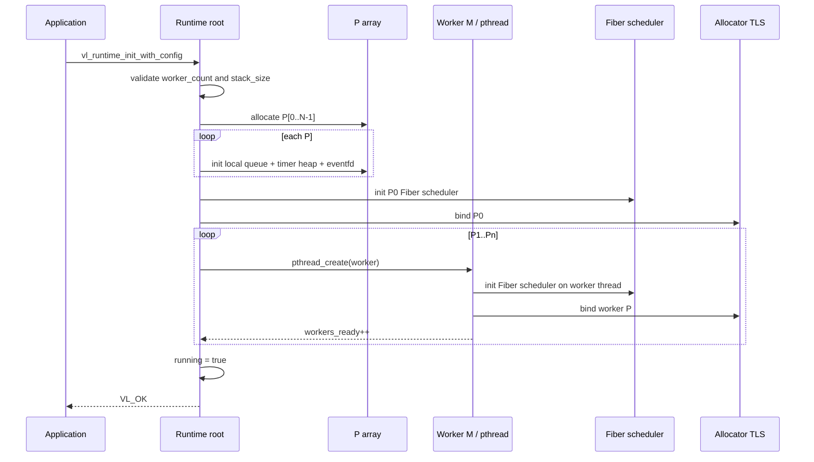
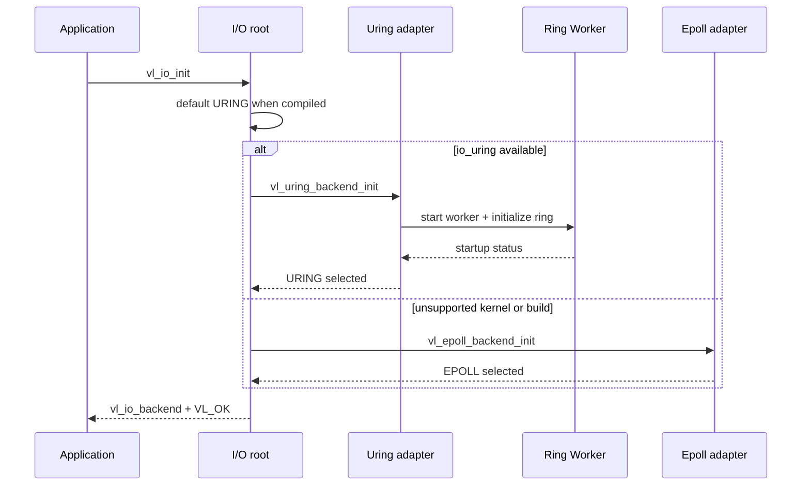
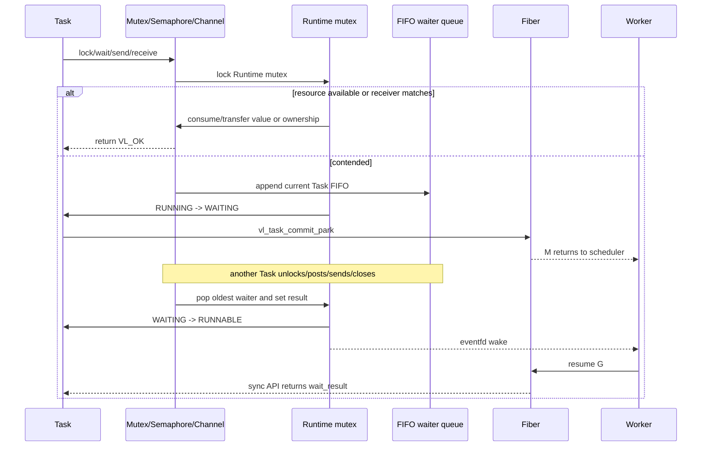
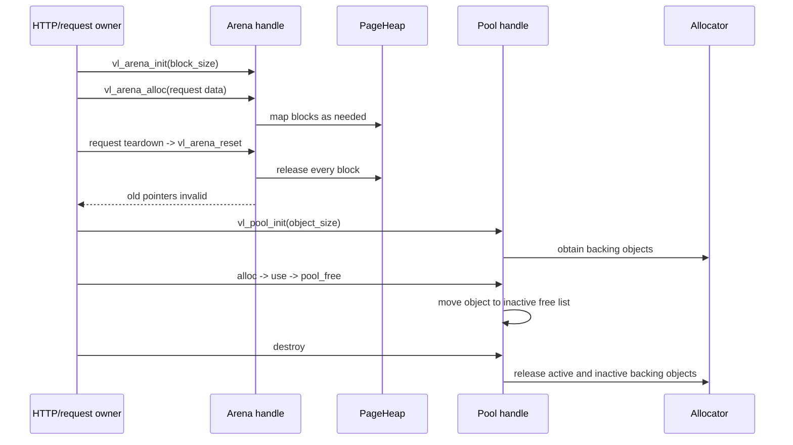
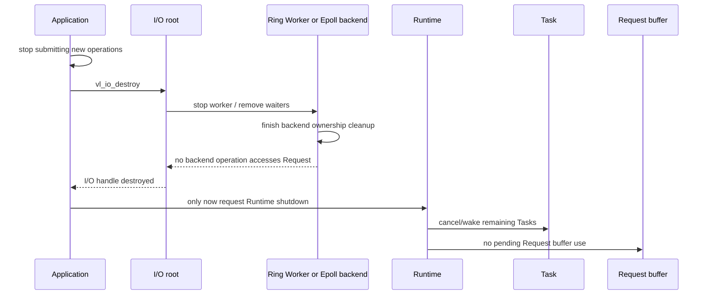
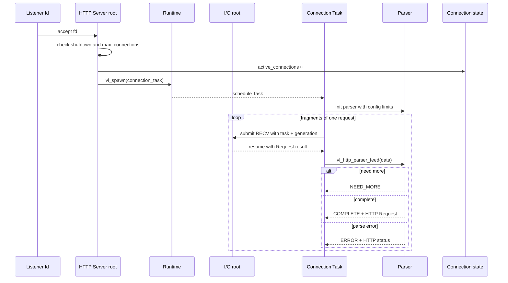

# Veloco 领域模型与业务流程

本文是当前工程的领域模型和业务流程总图。目标不是展示每一个 C 辅助函数，
而是列出所有具有身份、生命周期、所有权、不变量或跨上下文协作意义的领域
元素，并说明它们如何共同完成系统用例。

建议阅读顺序：先看整体模型图，再看元素清单，最后按业务流程从初始化读到
shutdown。设计方法和跨子域交互方法见 [DDD 设计教程](ddd-walkthrough.md)。
术语与边界见[统一语言](ubiquitous-language.md)和[限界上下文](bounded-contexts.md)。

## 1. 领域范围和建模原则

Veloco 的领域不是“调用 Linux API”，而是：

> 在 Linux 上，让可暂停的 Task 安全执行网络工作，并管理执行、I/O、内存
> 和协议资源的生命周期。

模型中的关系含义如下：

- `owns`：负责生命周期和释放；
- `borrows`：临时使用，不取得释放权；
- `references`：只保存身份关联；
- `notifies`：只传递“有结果/有工作”的通知；
- `translates`：把一个上下文的概念翻译成另一个上下文的协议对象。

Fiber、Timer、Sync 是 Runtime 上下文的子能力。Linux、pthread、epoll、
io_uring、mmap 和汇编是基础设施适配器，不是产品领域对象。

### 当前实现和设计目标的区别

本文优先描述当前源码中已经存在的对象和调用关系；设计规格中列出的目标
能力，如果还没有对应的实现路径，会明确标注。当前阅读时要特别注意：

- `src/http/http_connection.c` 当前每个 Connection Task 只读取并处理一个
  HTTP 请求，Task 结束时关闭 fd；`Keep-Alive` 当前只影响 Response header，
  还没有完整的多请求连接循环。
- listener 的 accept 循环目前由 `examples/http_server.c` 中的应用代码执行，
  `vl_http_server_listen_loopback` 只负责创建和监听 socket。
- task-bound I/O 目前要求在 Runtime 的 owner/P0 路径上 park；多 P 的调度
  已存在，但 I/O completion 的 Runtime 消费路径仍受这个约束。
- HTTP Connection 当前没有实际调用 Arena；Arena 是 Memory 已有的能力，
  request-lifetime 接入仍是后续对齐项。

这样画出的模型同时回答两个问题：领域设计应该是什么样，以及当前代码已经
走到了哪一步。不要把设计规格里的“Required first-release features”自动
当成已经完成的实现。

## 2. 整体领域模型图

```mermaid
flowchart TB
    APP["Application / examples/http_server.c"]

    subgraph HTTP["HTTP bounded context"]
        HS["HTTP Server root"]
        HC["Connection entity"]
        HP["Parser"]
        HRQ["HTTP Request value"]
        ROUTE["Router / Route entry"]
        HANDLER["HTTP handler callback"]
        RESP["Response value"]
        HCFG["HTTP Config / limits"]
        HSTAT["active connections / shutdown"]
    end

    subgraph RT["Runtime bounded context"]
        R["Runtime aggregate root"]
        G["Task / G entity"]
        F["Fiber entity"]
        P["P logical processor"]
        M["M worker thread"]
        GQ["Global runnable FIFO"]
        LQ["P-local Chase-Lev queue"]
        TIMER["Timer / deadline"]
        THEAP["P-local timer heap"]
        SYNC["Mutex / Semaphore / WaitGroup / Channel"]
        RTSTAT["Runtime / P stats"]
    end

    subgraph IO["Async I/O bounded context"]
        IOH["I/O handle root"]
        REQ["I/O Request entity"]
        COMP["I/O Completion value"]
        SOCK["Socket registry / fd slot"]
        GEN["Generation value"]
        BE["Backend policy"]
        EP["Epoll adapter / waiter"]
        UR["Uring adapter"]
        RW["Ring Worker"]
        OP["Uring operation"]
        CMD["Submit / Cancel command"]
        IOSTAT["I/O stats"]
    end

    subgraph MEM["Memory bounded context"]
        ALLOC["Allocator facade"]
        CLASS["SizeClass"]
        SPAN["Span entity"]
        CACHE["P-local cache"]
        REMOTE["Remote-free queue"]
        CENTRAL["Central free lists"]
        PAGE["PageHeap / mmap mapping"]
        ARENA["Arena entity"]
        POOL["Pool entity"]
        OBJ["Object allocation header"]
        MEMSTAT["Allocator stats"]
    end

    subgraph OS["Infrastructure adapters"]
        SOCKETS["Linux sockets / fd"]
        EPOLL["epoll"]
        URING["io_uring / SQE / CQE"]
        THREADS["pthread / eventfd / condvar"]
        MMAP["mmap / munmap"]
        ABI["x86_64 / arm64 Fiber ABI"]
    end

    APP -->|"configures / starts"| HS
    APP -->|"creates"| R
    APP -->|"creates"| IOH
    APP -->|"registers"| HANDLER

    HS -->|"governs lifecycle"| HC
    HS -->|"owns"| ROUTE
    HS -->|"uses"| HCFG
    HS -->|"tracks"| HSTAT
    HC -->|"owns flow"| HP
    HC -->|"produces"| HRQ
    HC -->|"selects"| ROUTE
    ROUTE -->|"invokes"| HANDLER
    HANDLER -->|"fills"| RESP

    R -->|"owns"| G
    R -->|"owns"| P
    P -->|"runs"| M
    P -->|"owns"| LQ
    R -->|"owns"| GQ
    G -->|"owns"| F
    G -->|"waits on"| TIMER
    P -->|"owns"| THEAP
    G -->|"waits in"| SYNC
    R -->|"publishes"| RTSTAT

    IOH -->|"owns"| BE
    IOH -->|"tracks"| REQ
    REQ -->|"references"| G
    REQ -->|"carries"| GEN
    REQ -->|"produces"| COMP
    IOH -->|"owns"| SOCK
    SOCK -->|"contains"| GEN
    BE -->|"selects"| EP
    BE -->|"selects"| UR
    EP -->|"borrows"| REQ
    UR -->|"owns"| RW
    RW -->|"consumes"| CMD
    CMD -->|"creates"| OP
    OP -->|"borrows"| REQ
    RW -->|"translates CQE"| COMP
    IOH -->|"publishes"| IOSTAT

    ALLOC -->|"selects"| CLASS
    CLASS -->|"groups"| SPAN
    ALLOC -->|"uses"| CACHE
    CACHE -->|"takes from"| SPAN
    REMOTE -->|"returns to owner P"| CACHE
    SPAN -->|"refills/drains"| CENTRAL
    CENTRAL -->|"acquires pages"| PAGE
    ARENA -->|"owns blocks"| PAGE
    POOL -->|"reuses objects"| ALLOC
    OBJ -->|"records owner"| SPAN
    ALLOC -->|"publishes"| MEMSTAT

    HC -->|"uses"| R
    HC -->|"uses"| IOH
    HC -->|"uses"| ALLOC
    R -->|"parks / wakes"| IOH
    R -->|"binds P"| ALLOC
    IOH -->|"notifies"| R

    IOH -->|"adapts to"| SOCKETS
    EP -->|"calls"| EPOLL
    RW -->|"calls"| URING
    P -->|"wakes through"| THREADS
    PAGE -->|"calls"| MMAP
    F -->|"uses"| ABI
```



两个最重要的边界是：

1. Runtime 拥有 Task 状态，但只通过 `Request.task` 让 I/O 关联 Task；I/O
   不拥有也不直接写 Task state。
2. Async I/O 拥有 operation/backend 生命周期，但通过 Completion 把结果交
   给 Runtime；Runtime 不认识 epoll、SQE、CQE 等适配器细节。

## 3. 领域元素总表

### 3.1 Runtime 上下文

| 元素 | DDD 角色 | 主要状态/数据 | Owner 和不变量 |
| --- | --- | --- | --- |
| `vl_runtime_t` / `vl_runtime_impl` | 聚合根 | mutex、P/M、Task 集合、running/shutdown | Runtime 控制运行资源和 Task 状态 |
| `vl_task_t` / Task/G | 实体 | state、Fiber、fn/arg、waiters、last P | 至多一个队列成员，至多一个 M 执行 |
| `vl_fiber_t` | 实体/执行组件 | ABI context、stack、Fiber state | 只能由 owner Fiber scheduler resume/destroy |
| `vl_p_t` | 实体/资源组件 | local queue、timers、current、eventfd | 一个 P 对应一个 M；Fiber 创建后绑定 P |
| M / worker pthread | 运行时实体 | thread、started、idle | 执行所属 P，不直接决定 Task 领域状态 |
| Global runnable FIFO | 内部集合 | `vl_task_queue_t` | Runtime mutex 保护，FIFO 候选任务 |
| Chase-Lev local queue | 内部集合 | owner push/pop、thief steal | owner 操作 bottom，其他 P steal top |
| `queued` | 一致性值 | 0/1 | 防止同一 Task 重复入队 |
| Join waiter list | 关联集合 | target -> waiter Tasks | target 完成时统一唤醒 |
| `vl_task_fn` | 应用入口回调 | `void (*)(void *)` | Fiber 调用一次，不由 I/O worker 调用 |
| Task mutex | Runtime 协作对象 | owner + FIFO waiters | 争用时 park Task，不阻塞 M |
| Semaphore | Runtime 协作对象 | permit + FIFO waiters | post 先唤醒最早 waiter |
| Wait group | Runtime 协作对象 | count + waiters | count 到零唤醒全部 waiter |
| Channel | Runtime 协作对象 | buffer/rendezvous/closed | close 唤醒 sender 和 receiver |
| Timer / `vl_timer_impl` | 实体 | armed、deadline、task、owner P | expire/cancel 只能产生一次 wake |
| Timer node/min-heap | 内部组件 | deadline、heap index、active | Runtime mutex 保护 heap mutation |
| Runtime/P stats | 值对象 | spawn、park、steal、switch 等 | 只读观察，不参与状态迁移 |

### 3.2 Memory 上下文

| 元素 | DDD 角色 | 主要状态/数据 | Owner 和不变量 |
| --- | --- | --- | --- |
| `vl_memory_global` / Allocator | 聚合根/门面 | initialized、central、spans、stats | Memory 管理显式分配全生命周期 |
| SizeClass | 值对象 | 42 个排序容量桶 | 请求映射到第一个可容纳 bucket |
| Span | 实体 | class、objects、active/free/cached | 一个 Span 只服务一个 SizeClass |
| Object header | 实体元数据 | magic、kind、state、owner P、Span | `vl_free` 据此恢复释放路径 |
| P-local Cache | 内部组件 | per-P/per-class free list | Cache 属于 P，不属于 M |
| Remote-free queue | 内部组件 | 待 owner P 处理的对象 | 跨 P free 不能直接操作他 P 的 cache |
| Central free list | 内部集合 | Span 供给/回收 | 中央锁保护，批量 refill/drain |
| PageHeap/mapping | 资源组件 | mapping base/size | mmap/munmap page range |
| Arena | 实体/资源句柄 | block list、reset | reset 后旧指针立即失效 |
| Pool | 实体/资源句柄 | fixed size、inactive objects | 对象回 Pool，不传给 `vl_free` |
| Allocation kind/state | 值对象 | SMALL/LARGE、ALLOCATED/FREE | 决定 header 和 debug 路径 |
| Debug canary/poison | 领域规则 | valid/damaged/freed | debug build 发现越界和 double-free |
| Allocator stats | 值对象 | active/cache/refill/mapped/cross-P | 验证账目和性能假设 |

Span 的关键账目：

```text
object_count = active_count + free_count
free_count   = central_free_count + cached_count
```

Fiber stack 不属于普通 valloc 对象。它需要 guard page、lazy mapping 和
架构上下文，是 Fiber/Runtime 的专用资源。

### 3.3 Async I/O 上下文

| 元素 | DDD 角色 | 主要状态/数据 | Owner 和不变量 |
| --- | --- | --- | --- |
| `vl_io_t` / `vl_io_impl` | 聚合根 | backend、owner thread、pending/completed | owner thread 控制 public I/O API |
| `vl_io_request_t` | 实体/共享协议对象 | op、fd、buffer、generation、task、result | 调用方保持有效；backend 只借用 |
| `vl_io_completion_t` | 结果值对象 | Request、result、events、Task、generation | 一次操作最多一个公开完成 |
| `vl_io_op_t` | 值对象 | ACCEPT/RECV/SEND/CONNECT/TIMEOUT/CANCEL | 决定后端操作翻译 |
| `vl_io_event_t` | 值对象 | READABLE/WRITABLE/EOF/ERROR | 屏蔽后端 readiness 差异 |
| Backend | 策略/端口 | EPOLL 或 URING | 只暴露统一 submit/cancel/poll |
| Socket slot/registry | 实体集合 | active、generation、pending claim | 防 fd close/reuse 误匹配 |
| Generation | 值对象 | fd 生命周期 token | Request generation 必须匹配 |
| Epoll waiter | 借用组件 | Request + readiness registration | 完成/取消后删除并释放 claim |
| Completion node | 内部队列节点 | queued/consumed | epoll completion FIFO |
| Ring Worker | 基础设施组件 | ring、thread、command/completion queue | 独占 io_uring 实例 |
| Uring operation | 内部实体 | active/resolved/consumed | 保持 Request 到原始 CQE 处理完成 |
| Uring command | 内部消息 | SUBMIT/CANCEL | owner thread 送到 Ring Worker |
| SQE/CQE | 内核适配值 | submitted/completed | 不越过 I/O 私有边界 |
| I/O stats | 值对象 | submissions/completions/cancellations | 观察 backend 行为 |

### 3.4 HTTP 上下文

| 元素 | DDD 角色 | 主要状态/数据 | Owner 和不变量 |
| --- | --- | --- | --- |
| `vl_http_server_t` | 聚合根 | config、routes、active、shutdown | 管理路由和连接准入 |
| Connection task | 实体 | server、io、fd、Parser/Response flow | 连接 Task 负责 flow 和 fd close |
| HTTP Config | 值对象 | size、connection、timeout limits | 初始化时归一化边界 |
| Header | 值对象 | bounded name/value | Parser 产生，Request 持有 |
| HTTP Request | 值对象 | method/path/version/header/body | Parser 产生，handler 只读 |
| Parser | 协议组件 | buffer、NEED_MORE/COMPLETE/ERROR | fragmented input 和 protocol bounds |
| Route entry/Router | 集合/服务 | method+path -> handler | Server 根管理 route table |
| HTTP handler | 应用端口回调 | Request -> Response | 应用填写业务响应 |
| Response | 值对象 | status/body/keep-alive/chunked | writer 编码为 HTTP/1.1 |
| active/shutdown rule | 聚合规则 | active count + shutdown flag | shutdown 后拒绝新连接 |

### 3.5 通用跨上下文元素

| 元素 | 角色 | 规则 |
| --- | --- | --- |
| `vl_status_t` | 通用结果值 | 错误码由产生它的上下文解释 |
| `vl_task_fn` | Runtime 应用入口 | 由 Fiber 调用，不是 I/O callback |
| `vl_http_handler_t` | HTTP 应用入口 | parse/route 完成后调用 |
| `vl_io_request_t.task` | 引用关联 | 只用于 completion 唤醒关联 |
| eventfd/condvar | 通知组件 | 只表示有工作/结果，不代替状态校验 |
| stats structures | 可观察性值 | 只读快照，验证不变量和 benchmark |

## 4. 业务流程索引

当前工程的业务流程分四类：

| 类别 | 流程 |
| --- | --- |
| 生命周期 | Runtime 初始化、I/O Backend 选择、HTTP 初始化、异常回滚、优雅关闭 |
| Runtime | spawn/调度、yield、join、Sync park/wake、Timer sleep/wake、idle/steal |
| 资源 | small/large allocation、cross-P free、Arena reset、Pool reuse |
| 网络产品 | epoll/ io_uring I/O、poll-style I/O、cancel/stale、HTTP 读解析路由写回 |

下面每个流程图只省略统计递增等重复动作，保留领域状态、所有权、线程、
锁、队列和通知点。

## 5. 生命周期流程

### 5.1 Runtime 初始化和 worker 启动



### 5.2 I/O handle 初始化和 Backend 选择



自动初始化在 unsupported 情况下回退 epoll；显式 URING 配置不静默回退。

### 5.3 HTTP Server 初始化、路由注册和连接准入

```mermaid
sequenceDiagram
    participant A as Application
    participant S as HTTP Server root
    participant C as Config
    participant RT as Runtime
    participant IO as I/O handle

    A->>S: vl_http_server_init(config)
    S->>C: apply defaults and clamp limits
    S->>S: routes empty; active=0; shutdown=false
    S-->>A: server handle
    A->>S: vl_http_route(method, path, handler)
    S->>S: append Route entry
    A->>IO: listen socket + track fd
    A->>RT: vl_runtime_run
    Note over S,RT: Accepted fd is checked against shutdown and max_connections
```

## 6. Runtime 流程

### 6.1 Spawn、调度、Fiber 执行和完成

```mermaid
sequenceDiagram
    participant Caller as Owner thread or current Task
    participant R as Runtime root
    participant Q as Global/Local queue
    participant M as Worker M
    participant G as Task/G
    participant F as Fiber

    Caller->>R: vl_spawn(fn, arg)
    R->>G: create Task; state NEW
    R->>R: RUNNABLE; add all_tasks/live_tasks
    R->>Q: enqueue once; queued=1
    R-->>M: eventfd wake
    M->>Q: local pop, global pull, or steal
    M->>G: queued=0; RUNNABLE -> RUNNING
    M->>F: create/resume Fiber on last_p
    F->>G: invoke vl_task_fn
    G-->>F: function returns
    F-->>M: Fiber DONE
    M->>R: RUNNING -> DONE; live_tasks--
    R->>R: wake join waiters
    M->>F: destroy Fiber on owning P
```

### 6.2 Yield 和可迁移性

```mermaid
sequenceDiagram
    participant G as Running Task
    participant R as Runtime mutex
    participant F as Fiber scheduler
    participant Q as Runnable queue
    participant M as Owner M/P

    G->>R: vl_yield
    R->>R: RUNNING -> RUNNABLE; task_switches++
    G->>F: yield to runtime root
    F-->>M: return from resume
    M->>R: observe state after Fiber return
    R->>Q: enqueue for same P/global policy
    Q-->>M: next eligible Task
    M->>F: resume same Task Fiber
```

未创建 Fiber 的 Task 可以被 steal；已有 stackful Fiber 的 Task 必须回到创建
它的 P。

### 6.3 Join 等待和目标完成

```mermaid
sequenceDiagram
    participant W as Waiting Task
    participant R as Runtime root
    participant T as Target Task
    participant F as W Fiber
    participant Q as Runnable queue

    W->>R: vl_join(T)
    R->>R: verify same Runtime and target not terminal
    R->>T: append W to T.waiters FIFO
    R->>W: RUNNING -> WAITING
    W->>F: yield Fiber
    Note over W,F: M executes other work
    T->>R: function returns
    R->>T: RUNNING -> DONE
    R->>W: remove waiter link; wake
    R->>Q: WAITING -> RUNNABLE; enqueue once
    Q-->>W: resume W Fiber
    W-->>W: vl_join returns VL_OK
```

### 6.4 Sync 对象 park/wake



### 6.5 Timer sleep、expire 和 cancel

```mermaid
sequenceDiagram
    participant G as Task
    participant T as Timer handle
    participant R as Runtime mutex
    participant H as Owner P timer heap
    participant M as Worker M
    participant F as Fiber

    G->>T: vl_timer_arm(delay_ns)
    T->>R: validate current Task and runtime
    R->>G: RUNNING -> SLEEPING
    R->>H: insert deadline node
    G->>F: yield
    M->>H: poll until heap root deadline
    alt deadline expires
        H->>R: remove node; timer_result=VL_OK
    else another Task cancels
        T->>R: remove node; timer_result=CANCELLED
    end
    R->>G: SLEEPING -> RUNNABLE
    R-->>M: eventfd wake
    M->>F: resume Fiber
    F-->>G: timer API returns result
```

## 7. Memory 流程

### 7.1 Small allocation：Cache -> Span -> PageHeap

```mermaid
sequenceDiagram
    participant G as Task on P
    participant A as Allocator root
    participant C as P-local Cache
    participant S as Span / central list
    participant P as PageHeap
    participant O as Object header

    G->>A: vl_malloc(size <= 32768)
    A->>A: map size to SizeClass
    A->>C: drain remote queue; pop cache
    alt cache has object
        C-->>A: free object
    else cache empty
        A->>S: take refill batch
        alt no suitable Span
            S->>P: mmap pages
            P-->>S: new Span
        end
        S-->>C: up to refill batch
        C-->>A: pop one object
    end
    A->>O: set magic, size, capacity, owner P, ALLOCATED
    A-->>G: aligned user pointer
```

### 7.2 Large allocation、free 和 cross-P free

```mermaid
sequenceDiagram
    participant A as Allocating P
    participant D as Allocator
    participant P as PageHeap
    participant B as Freeing P
    participant RQ as Owner P remote queue
    participant C as Owner P cache

    A->>D: vl_malloc(size > 32768)
    D->>P: mmap page-aligned large mapping
    D-->>A: header kind=LARGE + user pointer
    A->>B: pass pointer to another P
    B->>D: vl_free(pointer)
    D->>D: read header owner P
    alt small object and freeing P != owner P
        D->>RQ: append object to remote[owner_p][class]
        D->>D: cross_p_frees++
    else large object
        D->>P: remove list + munmap
    else same P small object
        D->>C: push cache; mark FREE
    end
    C->>RQ: owner P drains at safe point/refill
```

### 7.3 Arena reset 和 Pool reuse



## 8. Async I/O 流程

### 8.1 非 Task 绑定的 epoll I/O：提交后由调用方 poll

```mermaid
sequenceDiagram
    participant A as Owner application thread
    participant I as I/O root
    participant E as Epoll backend
    participant K as Linux fd
    participant C as Completion queue

    A->>I: Request.task=NULL; vl_io_submit
    I->>E: validate + fd generation + claim
    E->>K: epoll_ctl ADD readiness
    I-->>A: submit returns immediately
    A->>I: vl_io_poll(timeout, completion)
    I->>E: epoll_wait
    E->>K: one nonblocking operation
    K-->>E: result or EAGAIN
    alt EAGAIN
        E-->>I: WOULD_BLOCK; waiter remains pending
    else operation completed
        E->>C: queue one Completion
        E->>E: remove waiter + release fd claim
        C-->>I: return Completion
        I->>I: stale check + Request write-back
        I-->>A: vl_io_poll returns
    end
```

### 8.2 Task 绑定的 epoll I/O：park/wake/resume

```mermaid
sequenceDiagram
    participant G as HTTP Connection Task
    participant I as I/O root
    participant E as Epoll backend
    participant R as Runtime root
    participant F as Fiber/root scheduler
    participant K as Linux fd

    G->>I: vl_io_submit(Request.task=current Task)
    I->>R: vl_task_can_park_for_io
    I->>E: claim fd + register waiter
    I->>R: vl_task_park_for_io
    R->>G: RUNNING -> WAITING; io_waiting++
    G->>F: yield Fiber
    F-->>R: scheduler continues
    R->>I: P0 worker calls vl_io_poll(0)
    I->>E: poll readiness + execute one operation
    E->>K: recv/send/accept/connect
    K-->>E: result
    E-->>I: Completion(Request, Task, Generation)
    I->>I: stale check; write Request; completed=1
    I->>R: vl_task_complete_io
    R->>G: WAITING -> RUNNABLE; io_waiting--
    R-->>F: wake worker eventfd
    F->>G: resume Fiber
    G-->>I: vl_io_submit returns; read Request.result
```

### 8.3 Task 绑定的 io_uring I/O：command/SQE/CQE/Completion

```mermaid
sequenceDiagram
    participant G as Task on Runtime owner M
    participant I as I/O root
    participant W as Ring Worker
    participant CMD as Command queue
    participant K as io_uring kernel
    participant DONE as Completion queue
    participant R as Runtime

    G->>I: vl_io_submit(Task-bound Request)
    I->>I: validate + generation + fd claim
    I->>CMD: append SUBMIT operation under worker mutex
    I->>W: write eventfd
    I->>R: RUNNING -> WAITING
    G-->>R: yield Fiber
    W->>CMD: drain command
    W->>K: prepare SQE + io_uring_submit
    K-->>W: operation CQE
    W->>W: map cqe->res; resolve operation once
    W->>DONE: publish operation with Request/Task/Generation
    R->>I: P0 calls vl_io_poll
    I->>DONE: consume completion
    I->>I: stale check + Request write-back
    I->>R: vl_task_complete_io
    R->>G: WAITING -> RUNNABLE
    G-->>I: Fiber resumes; submit returns
```

Ring Worker 是 I/O 内部适配器，不是新的领域根；Runtime 仍是 Task state 的
唯一 owner。

### 8.4 I/O cancel、原始完成和 stale generation

```mermaid
sequenceDiagram
    participant A as I/O owner
    participant I as I/O root
    participant B as Backend
    participant R as Runtime
    participant G as Waiting Task
    participant S as Socket registry

    A->>I: vl_io_cancel(request)
    alt epoll
        I->>B: queue -ECANCELED Completion
        B->>B: delete waiter + release fd claim
    else io_uring
        I->>B: append CANCEL command
        B->>B: submit async-cancel SQE
        B-->>B: cancel CQE is internal
        B-->>I: original operation resolves once
    end
    A->>I: vl_io_poll to consume resulting Completion
    I->>S: compare Request generation with active fd generation
    alt fd closed/reused
        S-->>I: mismatch
        I->>I: result=-ESTALE; add ERROR
    else generation matches
        I->>I: preserve operation/cancel result
    end
    I->>I: write Request; completed=1
    I->>R: complete associated Task at most once
    R->>G: WAITING -> RUNNABLE or cancellation result
```

### 8.5 I/O handle 销毁和 pending operation 清理



### 8.6 Socket track、claim、close 和 fd reuse

```mermaid
sequenceDiagram
    participant A as Application or accept/connect helper
    participant S as Socket registry
    participant F as Linux fd
    participant I as I/O Request
    participant B as Backend

    A->>F: create/accept/connect fd
    A->>S: vl_socket_track(fd)
    S->>S: create slot; generation++; active=true
    A->>S: vl_socket_generation(fd)
    S-->>I: capture generation
    A->>B: submit Request(fd, generation)
    B->>S: claim(fd, generation)
    S-->>B: pending_generation set
    alt operation completes
        B->>S: release pending claim
        B-->>I: Completion with captured generation
    else close before completion
        A->>S: vl_socket_close(fd)
        S->>F: close(fd)
        S->>S: active=false; generation++
        B-->>I: old completion arrives
        I->>S: request_is_stale
        S-->>I: generation mismatch / inactive
        I-->>I: convert result to -ESTALE
    end
    A->>F: OS may reuse integer fd
    A->>S: vl_socket_track(reused fd)
    S->>S: new generation blocks old match
```

`fd` 是操作系统资源身份，`generation` 才是本上下文用来表达一次 fd
生命周期的值对象；单独比较 fd 整数是不够的。

## 9. HTTP 产品流程

### 9.1 接收连接、创建 Connection Task 和读取请求



### 9.2 路由、业务 handler 和 Response 写回

```mermaid
sequenceDiagram
    participant G as Connection Task
    participant S as HTTP Server
    participant Q as HTTP Request
    participant Router as Router
    participant H as Application handler
    participant Resp as Response
    participant IO as I/O root
    participant Fd as Connection fd

    G->>Q: obtain parsed request
    G->>Router: find(method, path)
    alt route exists
        Router-->>G: Route entry
        G->>Resp: init status=200; keep_alive from Request
        G->>H: handler(Request, Response, user_data)
        H->>Resp: set status/body/chunked
    else no route
        Router-->>G: NULL
        G->>Resp: build 404 error response
    end
    G->>IO: submit SEND header/body chunks
    IO->>Fd: partial/nonblocking send
    Fd-->>IO: bytes written
    IO-->>G: resume until all bytes sent
    G->>Fd: vl_socket_close after current connection task
    G->>S: active_connections--
    Note over G,Fd: Current code closes after one request; keep_alive affects the header only
```

### 9.3 HTTP 解析错误和有界错误响应

```mermaid
sequenceDiagram
    participant G as Connection Task
    participant P as Parser
    participant Resp as Error Response
    participant IO as I/O root
    participant Fd as Connection fd

    G->>P: feed fragmented request
    P->>P: check request-line/header/body limits
    alt malformed syntax
        P-->>G: BAD_REQUEST 400
    else invalid length
        P-->>G: LENGTH_REQUIRED 411 or BAD_REQUEST
    else body too large
        P-->>G: PAYLOAD_TOO_LARGE 413
    else headers too large
        P-->>G: HEADER_TOO_LARGE 431
    end
    G->>Resp: construct bounded error body
    G->>IO: task-bound SEND error response
    IO-->>G: send completion
    G->>Fd: close connection
```

## 10. Shutdown 和异常流程

### 10.1 HTTP graceful shutdown -> Runtime shutdown

```mermaid
sequenceDiagram
    participant A as Application/signal handler
    participant S as HTTP Server
    participant L as Listener
    participant RT as Runtime root
    participant G as Active Connection Tasks
    participant IO as I/O root
    participant W as Workers
    participant Mem as Memory

    A->>S: vl_http_server_request_shutdown
    S->>S: shutdown_requested=true
    A->>L: stop accept + close listener
    S-->>RT: new connection spawn rejected
    loop active connections remain
        RT->>G: allow request to finish or observe shutdown
        G->>IO: drain/cancel pending I/O
        IO-->>G: completion/cancel result
        G->>G: close fd + parser/resource teardown
        G->>S: active_connections--
    end
    A->>RT: vl_runtime_request_shutdown / run
    RT->>W: running=false; wake eventfds
    W-->>RT: executing Fibers returned
    RT->>G: cancel unrun Tasks; wake waiters
    A->>IO: vl_io_destroy after pending ownership ends
    A->>Mem: allocator/arena/pool teardown
    A->>RT: vl_runtime_shutdown
    RT->>RT: destroy Fibers, queues, P/M, Task handles
```

### 10.2 Worker idle、I/O/timer wake 和 deadlock 判定

```mermaid
sequenceDiagram
    participant M as Worker M/P
    participant R as Runtime
    participant Q as Local/global/steal queues
    participant IO as I/O handle
    participant T as Timer heap
    participant E as eventfd

    M->>Q: try local pop
    M->>Q: try global pull
    M->>Q: try steal
    alt work found
        Q-->>M: eligible Task
    else no work
        M->>R: mark idle
        M->>IO: P0 poll pending I/O
        M->>T: expire timers / compute timeout
        alt I/O or timer source exists
            M->>E: poll until completion/wakeup
        else all workers idle, queues empty, Tasks remain, no wake source
            R->>R: stop with invalid-state/deadlock result
        end
    end
```

没有可执行 Task 不一定是 deadlock；只要仍有 I/O 或 Timer 唤醒源，Runtime
仍有进展可能。只有所有队列和唤醒源都耗尽才报告无进展。

### 10.3 初始化失败和部分资源回滚

```mermaid
sequenceDiagram
    participant A as Application
    participant R as Runtime root
    participant Mem as Allocator
    participant P as P / queue / timer resources
    participant F as Fiber scheduler
    participant W as Started workers

    A->>R: vl_runtime_init_with_config
    R->>Mem: vl_allocator_init
    R->>P: allocate P array and init resources in order
    alt all resources initialize
        R-->>A: runtime handle ready
    else allocation, queue, eventfd, Fiber, or worker failure
        R->>W: stop and join already-started workers
        R->>F: destroy initialized Fiber scheduler
        R->>P: close eventfds; destroy queues and timer heaps
        R->>R: destroy mutex/condvar/impl
        R->>Mem: vl_allocator_shutdown
        R-->>A: error; no partially live Runtime
    end
```

部分初始化回滚是工厂式应用服务的一部分：资源创建顺序决定释放逆序。若只
在成功路径建模，初始化失败会成为一个未被领域模型覆盖的生命周期分支。

## 11. 设计复原和验收方法

要从本文重新设计出相近结果，按下面的顺序操作：

1. 从领域目标和六个失败场景开始，不看源码写出边界草图。
2. 将名词填入四个上下文，记录每个词的 owner、身份/值、创建者和销毁者。
3. 画 Runtime、I/O、Memory、HTTP 四个聚合根，禁止外部直接修改聚合内部状态。
4. 为 Task、Fiber、Request、Connection、Timer、Arena 写状态机和合法迁移。
5. 为跨上下文指针标注引用、借用、转移、共同拥有或通知。
6. 先设计 `Request`/`Completion` 协议，再设计 epoll/io_uring 适配器。
7. 为每个流程画成功、失败、取消、关闭和销毁时序图。
8. 按 `Fiber -> Task/FIFO -> park/wake -> Timer/Sync -> P/M -> Memory ->
   Async I/O -> HTTP` 的顺序实现，每次只增加一个主要复杂度。
9. 为每个不变量建立实现保护、错误返回和测试证据三列。

最终逐流程回答四个问题：

| 问题 | 示例 |
| --- | --- |
| 哪个对象被改变？ | Request 的 `completed`，Task 的 state |
| 谁能改变？ | I/O owner 写 Request；Runtime 写 Task state |
| 生命周期如何保证？ | Request/buffer 活到 Completion；Fiber 回 owner P 回收 |
| 哪个证据证明？ | `tests/test_io.c`、`test_uring.c`、`test_task.c` |

### 流程与测试证据索引

| 流程 | 主要测试 |
| --- | --- |
| Fiber、Task、Queue | `tests/test_fiber.c`、`tests/test_task.c`、`tests/test_queue.c` |
| Sync、Timer | `tests/test_sync.c`、`tests/test_timer.c` |
| Memory | `tests/test_memory.c` |
| epoll I/O | `tests/test_io.c` |
| io_uring I/O | `tests/test_uring.c` |
| HTTP Parser、Server | `tests/test_http_parser.c`、`tests/test_http_server.c` |

如果新增流程不能回答对象、owner、生命周期和证据四个问题，领域设计还没
有闭环。
