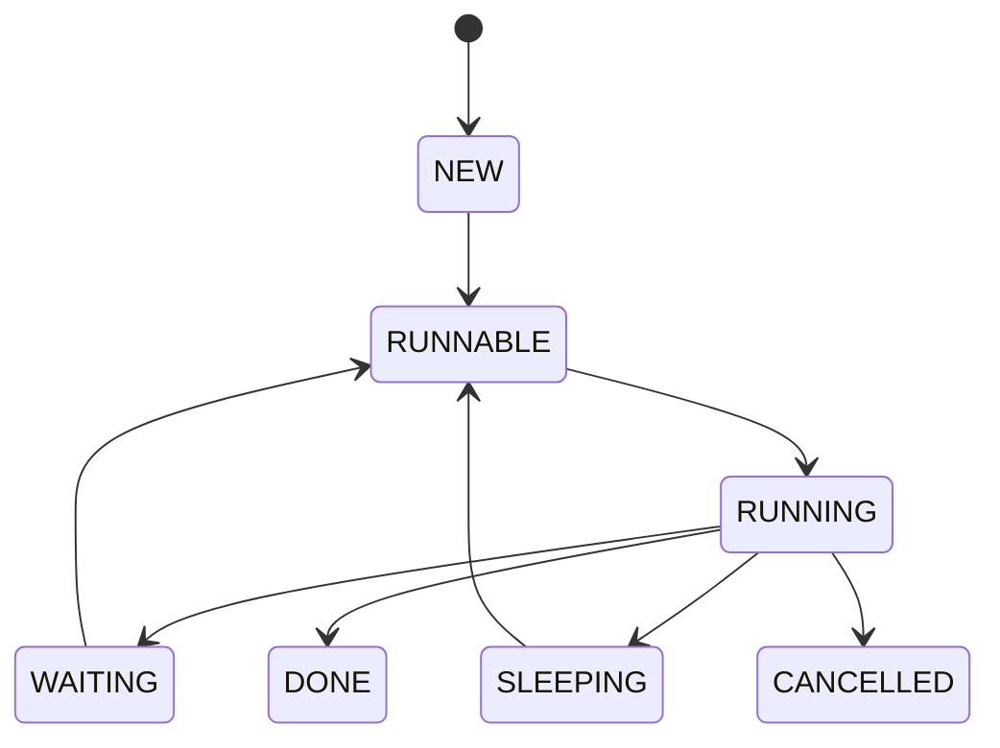

# Veloco Runtime and HTTP Server Implementation Plan

> **For agentic workers:** REQUIRED SUB-SKILL: Use superpowers:subagent-driven-development (recommended) or superpowers:executing-plans to implement this plan task-by-task. Steps use checkbox (`- [ ]`) syntax for tracking.

**Goal:** Build a Linux x86_64 and Linux arm64 C runtime plus HTTP/1.1 server that evolves the existing `ef` fiber/event-loop code into a G/P/M scheduler with a Go/tcmalloc-inspired allocator and an io_uring-first asynchronous I/O layer.

**Architecture:** Treat `ef/` as a black-box behavior and benchmark reference only. Build Veloco as a new layered implementation under `include/`, `src/`, `tests/`, `benchmarks/`, and `examples/`; do not copy its source, headers, assembly, or tests. Start with a single-thread Task runtime and allocator, then add fixed G/P/M scheduling, io_uring, and HTTP. Keep epoll behind the same backend interface as a fallback and comparison target.

**Tech Stack:** C11/GNU11, Linux x86_64 and Linux arm64, pthreads, C11 atomics, mmap/mprotect, epoll, eventfd, io_uring through system liburing, CMake presets, gcc/clang, ASan/UBSan/TSan, perf, wrk or ApacheBench, Docker, GitHub Actions, and an optional self-hosted Linux ARM64 runner.

---

## Execution Rules

- Preserve `ef/` until the baseline tests and benchmark have been recorded.
- Use `ef/` only as a black-box executable/reference target. Do not reuse
  its implementation, headers, assembly, utility code, or test cases.
- Write new tests from public behavior and new invariants; do not copy or
  translate tests from `ef/`.
- Use test-first changes for fiber, allocator, scheduler, I/O, and HTTP behavior.
- Keep public headers free of epoll and io_uring-specific types.
- Make every milestone buildable and runnable without requiring later milestones.
- Every implementation task must update its domain model, flow diagram,
  sequence diagram, or class/type diagram when the change affects that
  boundary.
- Do not add HTTP/2, TLS, GC, NUMA, or distributed features before the acceptance criteria in the design spec pass.
- The current workspace has no Git metadata. Use the commit steps when this project is placed in a Git repository; do not initialize or create commits as part of the first implementation pass without an explicit repository decision.

## File Map

### Build and public API

- Create: `CMakeLists.txt` - build targets, options, tests, benchmarks, and optional liburing detection.
- Create: `CMakePresets.json` - reproducible native and container build presets.
- Create: `.clang-format` - repository formatting rules.
- Create: `README.md` - project purpose, supported environment, setup, build, test, and run commands.
- Create: `include/veloco/common.h` - fixed-width types, error codes, branch hints, and visibility macros.
- Create: `include/veloco/fiber.h` - fiber and fiber scheduler API.
- Create: `include/veloco/task.h` - Task state, task function, spawn, yield, join, and cancellation hooks.
- Create: `include/veloco/runtime.h` - runtime configuration, lifecycle, and worker statistics.
- Create: `include/veloco/memory.h` - `vl_malloc`, `vl_free`, arenas, pools, and allocator statistics.
- Create: `include/veloco/io.h` - backend-neutral async accept/recv/send/connect/timeout API.
- Create: `include/veloco/sync.h` - Task-parking mutex, semaphore, wait group, and channel API.
- Create: `include/veloco/timer.h` - Task deadlines, timer handles, and timer statistics.
- Create: `include/veloco/http.h` - HTTP server, request, response, router, and middleware API.

### Runtime implementation

- Create: `src/common/error.c` - error string mapping and error construction.
- Create: `src/fiber/fiber.c` - mmap stack allocation, guard page, stack growth, and fiber lifecycle.
- Create: `src/fiber/fiber_x86_64.S` - System V x86_64 context save/restore and first-entry trampoline.
- Create: `src/fiber/fiber_aarch64.S` - AArch64 PCS context save/restore and first-entry trampoline.
- Create: `src/runtime/task.c` - Task lifecycle and state transitions.
- Create: `src/runtime/run_queue.c` - local queue, global queue, and stealing operations.
- Create: `src/runtime/scheduler.c` - single-thread scheduler first, then G/P/M coordination.
- Create: `src/runtime/worker.c` - pthread worker lifecycle and eventfd wakeup.
- Create: `src/runtime/context.c` - cancellation, deadline, parent-child context, and shutdown state.
- Create: `src/sync/task_mutex.c` - Task-aware mutex.
- Create: `src/sync/semaphore.c` - Task-aware semaphore.
- Create: `src/sync/wait_group.c` - Task-aware wait group.
- Create: `src/sync/channel.c` - bounded channel with sender and receiver wait queues.
- Create: `src/time/timer_heap.c` - per-P min-heap timer queue.

### Memory implementation

- Create: `src/memory/size_class.c` - size-class table and rounding.
- Create: `src/memory/span.c` - span metadata and object free-list management.
- Create: `src/memory/page_heap.c` - mmap-backed page acquisition and release.
- Create: `src/memory/valloc.c` - public allocator fast path and central refill/drain.
- Create: `src/memory/arena.c` - request-lifetime bump arena.
- Create: `src/memory/object_pool.c` - fixed-size object pool.
- Create: `src/memory/debug_allocator.c` - canaries, poison memory, and double-free checks.

### I/O implementation

- Create: `src/net/backend.c` - backend-neutral operation ownership and completion dispatch.
- Create: `src/net/epoll_backend.c` - readiness backend used for baseline and fallback.
- Create: `src/net/uring_backend.c` - liburing ring setup, SQE submission, and CQE collection.
- Create: `src/net/io_worker.c` - dedicated I/O worker for the first io_uring implementation.
- Create: `src/net/socket.c` - nonblocking socket creation, close, address helpers, and fd generation.

### HTTP, tests, benchmarks, and examples

- Create: `src/http/http_parser.c` - incremental HTTP/1.1 parser.
- Create: `src/http/http_connection.c` - connection Task and request lifecycle.
- Create: `src/http/http_router.c` - method/path route lookup.
- Create: `src/http/http_response.c` - response headers, fixed-length writes, and chunked writes.
- Create: `src/http/http_server.c` - listener setup, accept loop, limits, and graceful shutdown.
- Create: `tests/test.h` - dependency-free test macros and runner declarations.
- Create: `tests/test_main.c` - test registration and process exit status.
- Create: `tests/test_fiber.c` - context switch and stack tests.
- Create: `tests/test_memory.c` - size classes, spans, arenas, pools, and concurrency tests.
- Create: `tests/test_task.c` - lifecycle and scheduler state tests.
- Create: `tests/test_queue.c` - local queue and work-stealing stress tests.
- Create: `tests/test_timer.c` - ordering, cancellation, and deadline tests.
- Create: `tests/test_io.c` - backend completion and cancellation tests.
- Create: `tests/test_http_parser.c` - fragmented, malformed, and bounded requests.
- Create: `tests/test_http_server.c` - socket-level HTTP integration tests.
- Create: `benchmarks/bench_fiber.c` - context-switch benchmark.
- Create: `benchmarks/bench_alloc.c` - allocator comparison benchmark.
- Create: `benchmarks/bench_http.c` - in-process HTTP workload and runtime counters.
- Create: `examples/http_server.c` - runnable server example.
- Create: `docs/benchmarks/baseline.md` - measured baseline and machine details.
- Create: `docs/architecture/fiber.md` - ABI and stack design.
- Create: `docs/architecture/scheduler.md` - G/P/M and queue ownership.
- Create: `docs/architecture/allocator.md` - size classes, spans, caches, and arenas.
- Create: `docs/architecture/io.md` - readiness versus completion and request lifetime.
- Create: `docs/architecture/http.md` - parser and connection model.
- Create: `docs/domain/ubiquitous-language.md` - domain terms and invariants.
- Create: `docs/domain/bounded-contexts.md` - Runtime, Memory, Async I/O, and HTTP contexts.
- Create: `docs/diagrams/system-context.md` - system context and module relationship diagrams.
- Create: `docs/diagrams/task-lifecycle.md` - Task state and wakeup flow diagrams.
- Create: `docs/diagrams/io-completion.md` - SQE/CQE and cancellation sequence diagrams.
- Create: `docs/diagrams/allocator.md` - allocator type and ownership diagrams.

### Development and delivery

- Create: `docker/dev.Dockerfile` - pinned Linux x86_64 and Linux arm64 development image.
- Create: `docker/runtime.Dockerfile` - minimal image for the HTTP server.
- Create: `deploy/compose.yaml` - local server smoke deployment.
- Create: `scripts/bootstrap-dev.sh` - native dependency/setup verification.
- Create: `scripts/ci.sh` - one command for CI build, test, and artifact collection.
- Create: `.github/workflows/ci.yml` - build, tests, sanitizers, and io_uring smoke checks.
- Create: `.github/workflows/release.yml` - tagged binary and container artifact publishing.
- Create: `.dockerignore` - minimal container build context.

## Task 0: Define the Domain Model and Reproducible Environments

**Files:**
- Create: `README.md`
- Create: `CMakePresets.json`
- Create: `.clang-format`
- Create: `docker/dev.Dockerfile`
- Create: `docker/runtime.Dockerfile`
- Create: `deploy/compose.yaml`
- Create: `scripts/bootstrap-dev.sh`
- Create: `scripts/ci.sh`
- Create: `.github/workflows/ci.yml`
- Create: `.github/workflows/release.yml`
- Create: `.dockerignore`
- Create: `docs/domain/ubiquitous-language.md`
- Create: `docs/domain/bounded-contexts.md`
- Create: `docs/diagrams/system-context.md`
- Create: `docs/diagrams/task-lifecycle.md`
- Create: `docs/diagrams/io-completion.md`
- Create: `docs/diagrams/allocator.md`

- [x] **Step 1: Establish the vocabulary and bounded contexts**

Define these terms before implementation:

```text
Fiber       stackful execution context
Task/G      user-visible schedulable coroutine
P           logical processor with a local queue and allocator cache
M           pthread worker
I/O Request  operation whose completion wakes a Task
Span        page range divided into one size class
Arena       request-lifetime allocation region
Connection  HTTP socket and its owning connection Task
```

Document the boundaries:

```text
Runtime Context: Fiber, Task, Scheduler, Worker
Memory Context: SizeClass, Span, PageHeap, Cache, Arena
Async I/O Context: Request, Backend, SQE, CQE, Generation
HTTP Context: Connection, Parser, Router, Response
```

State that Runtime owns Task scheduling, Memory owns allocation
lifecycle, Async I/O owns kernel operation completion, and HTTP owns
protocol behavior. Add the first context map to
`docs/domain/bounded-contexts.md`.

- [x] **Step 2: Add the initial Mermaid diagrams**

`docs/diagrams/system-context.md` must show Application -> HTTP ->
Runtime -> Async I/O/Memory -> Linux.

`docs/diagrams/task-lifecycle.md` must show:



`docs/diagrams/io-completion.md` must show submit, Task parking, CQE
completion, generation validation, and wakeup.

`docs/diagrams/allocator.md` must show P-local cache -> central free
list -> page heap -> mmap and the cross-P remote-free path.

- [x] **Step 3: Create the reproducible local development image**

`docker/dev.Dockerfile` must install the compiler/toolchain, CMake,
Ninja, liburing development headers, gdb, perf, and sanitizer support.
Pin the base image tag and document both supported platforms:
`linux/amd64` and `linux/arm64`.

Run:

```bash
docker build --platform linux/amd64 -f docker/dev.Dockerfile -t veloco-dev .
docker run --rm -it --platform linux/amd64 -v "$PWD:/workspace" -w /workspace veloco-dev
docker build --platform linux/arm64 -f docker/dev.Dockerfile -t veloco-dev:arm64 .
docker run --rm -it --platform linux/arm64 -v "$PWD:/workspace" -w /workspace veloco-dev:arm64
```

Expected: the container can run the same CMake configure command used by
CI on both supported native architectures. Virtualized, cross-platform,
or emulated builds are correctness-only and must not be mixed with
native performance baselines.

- [x] **Step 4: Add CMake presets and setup scripts**

Define presets named `dev`, `epoll`, `uring`, `asan`, `ubsan`, and
`tsan`. `scripts/bootstrap-dev.sh` checks for Linux x86_64 or arm64,
CMake, compiler, pthread support, and liburing when the selected preset
needs io_uring. `scripts/ci.sh` accepts only a whitelisted preset,
builds, runs CTest, and writes logs to `build/artifacts/`.

Run:

```bash
cmake --list-presets
bash -n scripts/bootstrap-dev.sh
bash -n scripts/ci.sh
```

Expected: all six presets are listed, and both scripts pass shell
syntax validation. Full configure, build, and CTest verification moves
to Task 1, which creates the root `CMakeLists.txt`.

- [x] **Step 5: Add CI validation and artifact publishing**

`.github/workflows/ci.yml` must run:

```text
gcc + epoll
clang + epoll
gcc + io_uring
gcc + ASan/UBSan
clang + TSan for supported tests
container build + HTTP smoke test
optional native arm64 epoll + io_uring on a self-hosted ARM64 runner
```

Each job uploads build logs and sanitizer output. The workflow must fail
on compiler warnings, test failures, or an HTTP smoke failure.

`.github/workflows/release.yml` runs only for a version tag, builds
architecture-labeled Linux binaries and runtime images, uploads the
binary as a workflow artifact, and publishes images to a configurable
registry. No production deployment target is assumed before a registry
and host are chosen.

- [x] **Step 6: Verify the environment before source implementation**

Run:

```bash
./scripts/bootstrap-dev.sh
./scripts/bootstrap-dev.sh epoll
```

Expected: the script either passes or reports one concrete missing host
capability for x86_64 or arm64. Dockerfile syntax and compose validation
are checked if the local Docker CLI is available; otherwise the
container build is deferred to the first CI run. `scripts/ci.sh`
execution starts in Task 1 after the root `CMakeLists.txt` exists.

- [x] **Step 7: Commit the environment and domain baseline when Git is available**

```bash
git add README.md CMakePresets.json .clang-format docker deploy scripts .github docs/domain docs/diagrams .dockerignore
git commit -m "Define Veloco domain model and reproducible development environments"
```

## Task 1: Establish the Build and Baseline

**Files:**
- Create: `CMakeLists.txt`
- Create: `include/veloco/common.h`
- Create: `tests/test.h`
- Create: `tests/test_main.c`
- Create: `benchmarks/bench_fiber.c`
- Create: `docs/benchmarks/baseline.md`
- Modify: none under `ef/`

- [x] **Step 1: Add a dependency-free test harness**

Define the smallest usable test API:

```c
#define VL_TEST(name) static void name(void)
#define VL_ASSERT(expr) do { \
    if (!(expr)) vl_test_fail(__FILE__, __LINE__, #expr); \
} while (0)

void vl_test_fail(const char *file, int line, const char *expr);
int vl_test_run_all(void);
```

Register tests explicitly from `tests/test_main.c`, and return nonzero
when any assertion fails.

- [x] **Step 2: Add the initial CMake targets**

Create a `veloco_tests` target that builds the test harness and a
placeholder common test. Add options:

```cmake
option(VELOCO_ENABLE_URING "Build the io_uring backend" ON)
option(VELOCO_ENABLE_SANITIZERS "Enable ASan and UBSan" OFF)
```

Use `find_package(Threads REQUIRED)`. Detect liburing only when
`VELOCO_ENABLE_URING` is enabled; keep the epoll-only target buildable
when liburing is unavailable.

- [x] **Step 3: Build and run the empty harness**

Run:

```bash
cmake -S . -B build -DVELOCO_ENABLE_URING=OFF
cmake --build build --parallel
ctest --test-dir build --output-on-failure
```

Expected: configure succeeds, the test binary builds, and CTest reports
the initial test as passed.

- [x] **Step 4: Record the original `ef` baseline**

Run the existing example using its supported build target and record
behavior only. Do not copy any source, header, assembly, utility, or test
from `ef/` into Veloco. Derive new assertions from the documented
network behavior and independent runtime invariants.

Record:

- compiler and kernel version
- CPU model and worker count
- request count and concurrency
- requests per second
- latency percentiles if available
- RSS and CPU

Write the exact command and measured output summary to
`docs/benchmarks/baseline.md`.

Also update `docs/domain/ubiquitous-language.md` with any terminology
learned while observing the baseline. The baseline may document `ef`
behavior, but it must not become a Veloco implementation dependency.

- [x] **Step 5: Commit the build baseline when Git is available**

```bash
git add CMakeLists.txt include/veloco/common.h tests docs/benchmarks/baseline.md
git commit -m "Establish a reproducible Veloco build and ef baseline"
```

## Task 2: Rebuild Fiber Context Switching

**Files:**
- Create: `include/veloco/fiber.h`
- Create: `src/fiber/fiber.c`
- Create: `src/fiber/fiber_x86_64.S`
- Create: `src/fiber/fiber_aarch64.S`
- Create: `tests/test_fiber.c`
- Create: `docs/architecture/fiber.md`

- [x] **Step 1: Define the fiber API and state**

Use an opaque fiber with an explicit scheduler:

```c
typedef struct vl_fiber vl_fiber_t;
typedef struct vl_fiber_sched vl_fiber_sched_t;
typedef long (*vl_fiber_fn)(void *arg);

int vl_fiber_sched_init(vl_fiber_sched_t *sched);
int vl_fiber_create(vl_fiber_sched_t *sched, vl_fiber_t **out,
                    size_t stack_size, vl_fiber_fn fn, void *arg);
int vl_fiber_resume(vl_fiber_sched_t *sched, vl_fiber_t *fiber,
                    long send_value, long *return_value);
long vl_fiber_yield(vl_fiber_sched_t *sched, long send_value);
void vl_fiber_destroy(vl_fiber_t *fiber);
```

Document that all public calls are single-thread-affine until the
multi-thread scheduler is added.

- [x] **Step 2: Write failing fiber tests**

Add tests for two-way yield/resume, return value propagation, nested
fiber execution, and a fiber that grows beyond its initially mapped
page. The test must assert the exact event order:

```text
main -> fiber-a -> fiber-b -> fiber-a -> main
```

- [x] **Step 3: Implement the architecture-specific context layouts**

Save and restore the System V x86_64 callee-saved registers, stack
pointer, and return address in `src/fiber/fiber_x86_64.S`. Save and
restore the AArch64 PCS callee-saved registers, stack pointer, frame
pointer, and link register in `src/fiber/fiber_aarch64.S`. Use a shared
C trampoline that marks the fiber done, stores its result, and yields to
its parent when the user function returns. `docs/architecture/fiber.md`
must include stack alignment, register layout, and first-entry
trampoline diagrams for both ABIs.

- [x] **Step 4: Implement guarded lazy stack mapping**

Reserve the full stack with `mmap(PROT_NONE)`, map the top usable page,
keep one guard page, and expand lower pages with `mprotect` when the
fault address is inside the reserved range. Reject addresses outside
the reserved stack region.

- [x] **Step 5: Run fiber tests and sanitizer-compatible tests**

Run:

```bash
cmake --build build --target veloco_tests --parallel
ctest --test-dir build -R fiber --output-on-failure
cmake -S . -B build-asan -DVELOCO_ENABLE_URING=OFF -DVELOCO_ENABLE_SANITIZERS=ON
cmake --build build-asan --parallel
ctest --test-dir build-asan -R fiber --output-on-failure
```

Expected: all fiber tests pass. Stack growth must not change event order,
and the invalid-fault test must terminate through the documented error
path rather than silently corrupting memory.

Verification note: Docker arm64 and emulated amd64 epoll, ASan, and UBSan
passed; Docker arm64 TSan passed. Docker Desktop's emulated amd64 TSan process
failed before test startup with an unexpected-memory-mapping error, so it is
not treated as a fiber failure. The full native GitHub amd64 matrix, including
Clang TSan, passed in CI run 31811776734.

- [x] **Step 6: Record the context-switch benchmark**

Build `bench_fiber`, run one million yield/resume pairs, and record
elapsed time and switches per second in `docs/architecture/fiber.md`.

- [x] **Step 7: Update the fiber domain and diagrams**

Update `docs/architecture/fiber.md` with the final stack layout,
register contract, ownership rules, and measured result. Update
`docs/domain/ubiquitous-language.md` if Fiber or Task terminology changed.
The Task lifecycle diagram must show the exact fiber-to-Task boundary.

## Task 3: Implement the Single-Thread `valloc`

**Files:**
- Create: `include/veloco/memory.h`
- Create: `src/memory/size_class.c`
- Create: `src/memory/span.c`
- Create: `src/memory/page_heap.c`
- Create: `src/memory/valloc.c`
- Create: `src/memory/arena.c`
- Create: `src/memory/object_pool.c`
- Create: `src/memory/debug_allocator.c`
- Create: `tests/test_memory.c`
- Create: `benchmarks/bench_alloc.c`
- Create: `docs/architecture/allocator.md`

- [x] **Step 1: Define allocator APIs and statistics**

Use explicit ownership APIs:

```c
void *vl_malloc(size_t size);
void vl_free(void *ptr);
void *vl_calloc(size_t count, size_t size);
void *vl_realloc(void *ptr, size_t size);

typedef struct {
    size_t active_bytes;
    size_t active_objects;
    size_t cache_hits;
    size_t central_refills;
    size_t mapped_bytes;
    size_t cross_p_frees;
} vl_allocator_stats_t;

int vl_allocator_init(void);
void vl_allocator_shutdown(void);
void vl_allocator_get_stats(vl_allocator_stats_t *out);
```

- [x] **Step 2: Write failing size-class and alignment tests**

Test sizes from 1 byte through the largest small-object threshold,
assert that returned pointers are suitably aligned, and verify that
`vl_free(NULL)` is harmless.

- [x] **Step 3: Implement fixed size classes**

Store a sorted table of classes and round requests to the first class
that fits. Return a distinct large-allocation path above the configured
small-object threshold.

- [x] **Step 4: Write failing span and page-heap tests**

Allocate a span, split it into same-class objects, free every object,
and assert that the span reports zero active objects. Allocate and
release a large mapping and assert that mapped-byte statistics return to
the prior value.

- [x] **Step 5: Implement page heap and spans**

Use page-aligned `mmap` for page acquisition. Store span metadata outside
the user object area, maintain a free-object intrusive list, and keep
the size class in the span header so `vl_free` does not need a global
size lookup.

- [x] **Step 6: Add arena and fixed-object pool tests**

Verify that arena reset releases all blocks at once and that a pool
reuses objects without changing its object size. Add a test that an
arena cannot be used after reset in debug mode.

- [x] **Step 7: Add debug checks**

In debug builds, put a canary before and after the user payload, poison
freed memory, and detect double free through an object state marker.
Keep the checks behind `VELOCO_MEMORY_DEBUG` so the benchmark path is
not forced to pay for them.

- [x] **Step 8: Run allocator tests and benchmark against libc**

Run:

```bash
ctest --test-dir build -R memory --output-on-failure
cmake --build build --target bench_alloc --parallel
./build/benchmarks/bench_alloc --allocator libc --threads 1
./build/benchmarks/bench_alloc --allocator veloco --threads 1
```

Expected: no invalid access, all size classes pass, and the benchmark
prints allocation rate, active bytes, cache hits, refills, and mapped
bytes.

- [x] **Step 9: Update allocator model and diagrams**

Update `docs/architecture/allocator.md` with the actual size-class table,
span metadata, debug ownership rules, and benchmark result. Update
`docs/diagrams/allocator.md` so its arrows match the implemented refill,
drain, arena, and large-object paths.

Completion evidence (2026-08-15): allocator tests pass in Docker on arm64 and
amd64 with the `epoll`, `memory-debug`, ASan, and UBSan presets, and on arm64
with TSan. Clang static analysis reports no allocator findings, and Valgrind
reports zero errors and zero bytes in use after the memory test group. Docker
Desktop's emulated amd64 TSan process cannot start because its shadow-memory
mapping conflicts with the VM address layout; native amd64 TSan remains part
of GitHub CI. Serial single-thread benchmark results and their container-only
limitations are recorded in `docs/architecture/allocator.md`.

## Task 4: Add the Single-Thread Task Runtime

**Files:**
- Create: `include/veloco/task.h`
- Create: `include/veloco/runtime.h`
- Create: `src/runtime/task.c`
- Create: `src/runtime/scheduler.c`
- Create: `tests/test_task.c`
- Create: `tests/test_queue.c`

- [ ] **Step 1: Define Task states and public APIs**

```c
typedef enum {
    VL_TASK_NEW,
    VL_TASK_RUNNABLE,
    VL_TASK_RUNNING,
    VL_TASK_WAITING,
    VL_TASK_SLEEPING,
    VL_TASK_DONE,
    VL_TASK_CANCELLED
} vl_task_state_t;

typedef void (*vl_task_fn)(void *arg);

vl_task_t *vl_spawn(vl_runtime_t *rt, vl_task_fn fn, void *arg);
void vl_yield(void);
int vl_join(vl_task_t *task);
vl_task_state_t vl_task_state(const vl_task_t *task);
```

- [ ] **Step 2: Write state-machine tests**

Test NEW to RUNNABLE to RUNNING to DONE, a yielding Task that resumes,
and rejection of double completion. Assert that a Task waiting on a
runtime operation is not placed in the runnable queue.

- [ ] **Step 3: Implement a FIFO local queue**

Start with a single-owner intrusive queue. The queue must support push,
pop, and a test-only length query. Do not add work stealing until the
single-thread behavior is covered.

- [ ] **Step 4: Implement Task creation and destruction**

Allocate Task metadata through `vl_malloc`, create its fiber, enqueue it
as RUNNABLE, and release its fiber, wait metadata, and Task object exactly
once after DONE or CANCELLED.

- [ ] **Step 5: Implement the scheduler loop**

Run the next Task, return when it yields or completes, and continue until
the queue is empty and shutdown has been requested. Expose counters for
spawned, completed, cancelled, and currently runnable Tasks.

- [ ] **Step 6: Run single-thread runtime tests**

```bash
ctest --test-dir build -R 'task|queue' --output-on-failure
```

Expected: deterministic state transitions, no duplicate execution, and
clean shutdown with zero active Tasks.

- [ ] **Step 7: Update the runtime domain model**

Update `docs/domain/bounded-contexts.md`, `docs/architecture/scheduler.md`,
and `docs/diagrams/task-lifecycle.md` with the implemented Task states,
queue ownership, and scheduler invariants. Include one sequence diagram
for `spawn -> run -> yield -> resume -> done`.

## Task 5: Add Backend-Neutral I/O and Epoll Baseline

**Files:**
- Create: `include/veloco/io.h`
- Create: `src/net/backend.c`
- Create: `src/net/epoll_backend.c`
- Create: `src/net/socket.c`
- Create: `tests/test_io.c`

- [ ] **Step 1: Define operation and completion types**

```c
typedef enum {
    VL_IO_ACCEPT,
    VL_IO_RECV,
    VL_IO_SEND,
    VL_IO_CONNECT,
    VL_IO_TIMEOUT,
    VL_IO_CANCEL
} vl_io_op_t;

typedef struct {
    vl_io_op_t op;
    int fd;
    void *buf;
    size_t len;
    uint64_t generation;
    vl_task_t *task;
} vl_io_request_t;

int vl_io_submit(vl_io_request_t *req);
int vl_io_cancel(vl_io_request_t *req);
```

- [ ] **Step 2: Write loopback socket tests**

Create a nonblocking local listener and client. Verify partial send,
partial receive, EOF, close-before-wakeup, and fd generation changes.

- [ ] **Step 3: Implement epoll readiness adaptation**

Store one waiter per fd and translate readable/writable readiness into
Task wakeups. Keep the adapter private to `src/net/epoll_backend.c`.

- [ ] **Step 4: Run I/O tests with epoll**

```bash
cmake -S . -B build-epoll -DVELOCO_ENABLE_URING=OFF
cmake --build build-epoll --parallel
ctest --test-dir build-epoll -R io --output-on-failure
```

Expected: the same public I/O tests pass without exposing epoll types.

- [ ] **Step 5: Update the I/O context documentation**

Update `docs/architecture/io.md` to describe the readiness adapter and
the backend-neutral request ownership model. Add the epoll path to
`docs/diagrams/io-completion.md` as a comparison path; do not alter the
io_uring primary decision.

## Task 6: Implement the First io_uring Backend

**Files:**
- Create: `src/net/uring_backend.c`
- Create: `src/net/io_worker.c`
- Modify: `CMakeLists.txt`
- Modify: `tests/test_io.c`
- Create: `tests/test_uring.c`
- Create: `docs/architecture/io.md`

- [ ] **Step 1: Add optional liburing detection**

When `VELOCO_ENABLE_URING=ON`, locate the system liburing package and
link only the io_uring backend target. Emit a configure-time error that
names the missing package when the option is explicitly enabled.

- [ ] **Step 2: Write failing completion tests**

Cover accept, recv, send, connect, timeout, negative CQE results, and
completion after close. Each request test must assert that the same Task
and generation token are returned.

- [ ] **Step 3: Implement one ring owned by one I/O worker**

Initialize one ring, batch SQE preparation, submit operations, wait for
CQEs, translate `cqe->res` into the backend-neutral result, and dispatch
the completion to the Task's P queue. Keep request memory alive until
the CQE is consumed.

- [ ] **Step 4: Implement cancellation and stale-completion checks**

Associate every request with a generation token. On cancellation, mark
the Task cancelled, submit an async cancel request when possible, and
ignore a late completion after ownership has been resolved.

- [ ] **Step 5: Run io_uring tests**

```bash
cmake -S . -B build-uring -DVELOCO_ENABLE_URING=ON
cmake --build build-uring --parallel
ctest --test-dir build-uring -R uring --output-on-failure
```

Expected: all completion tests pass on a kernel with the required
io_uring support. The epoll-only build remains available when liburing
is absent.

- [ ] **Step 6: Update the io_uring sequence diagram**

Update `docs/architecture/io.md` with the actual liburing calls,
completion error mapping, cancellation ownership, and kernel capability
assumptions. Update `docs/diagrams/io-completion.md` with the final SQE,
CQE, generation-token, and Task-wakeup sequence.

## Task 7: Add G/P/M Scheduling and P-Local Allocation

**Files:**
- Create: `src/runtime/run_queue.c`
- Create: `src/runtime/worker.c`
- Create: `src/runtime/context.c`
- Create: `src/sync/task_mutex.c`
- Create: `src/sync/semaphore.c`
- Create: `src/sync/wait_group.c`
- Create: `src/sync/channel.c`
- Create: `src/time/timer_heap.c`
- Modify: `src/runtime/scheduler.c`
- Modify: `src/memory/valloc.c`
- Modify: `tests/test_queue.c`
- Modify: `tests/test_task.c`
- Modify: `tests/test_memory.c`
- Create: `tests/test_sync.c`
- Create: `tests/test_timer.c`

- [ ] **Step 1: Write queue race and stealing tests**

Use multiple producer/consumer workers to assert that every task token is
executed exactly once. Include an empty-queue steal, a single-item race,
and a batch steal.

- [ ] **Step 2: Implement P-local queues and global overflow**

Add owner push/pop, thief steal, batch transfer, and a mutex-protected
global queue. Use explicit C11 atomic memory orders and document why each
order is required.

- [ ] **Step 3: Add fixed M workers**

Create pthread workers, assign one P at a time, run local tasks, steal
when idle, and sleep on an eventfd-backed wake path. Expose worker count
and per-P statistics.

- [ ] **Step 4: Add Task-aware synchronization**

Each primitive keeps a FIFO waiter list. When contention occurs, move the
current Task to WAITING and yield. Unlock, post, or send moves a waiter
back to RUNNABLE without blocking an M.

- [ ] **Step 5: Add per-P timer heaps**

Implement insert, cancel, peek, and expire. A sleeping Task stores a timer
handle and is made RUNNABLE exactly once when the deadline or cancellation
wins.

- [ ] **Step 6: Add P-local allocator caches**

Give each P a cache per small-object class. Refill and drain in batches,
and enqueue cross-P frees into the owning P's remote-free queue.

- [ ] **Step 7: Run multi-thread stress tests**

```bash
cmake --build build-uring --parallel
ctest --test-dir build-uring -R 'queue|task|memory|sync|timer' --output-on-failure
```

Expected: no lost wakeups, duplicate Task execution, allocator corruption,
or timer double-fire across a long stress run.

- [ ] **Step 8: Update scheduler and synchronization diagrams**

Update `docs/architecture/scheduler.md` with the final G/P/M ownership
rules, atomic memory orders, eventfd wake path, and measured stealing
statistics. Add mutex, channel, semaphore, and timer wait paths to
`docs/diagrams/task-lifecycle.md`.

## Task 8: Integrate HTTP/1.1

**Files:**
- Create: `include/veloco/http.h`
- Create: `src/http/http_parser.c`
- Create: `src/http/http_connection.c`
- Create: `src/http/http_router.c`
- Create: `src/http/http_response.c`
- Create: `src/http/http_server.c`
- Create: `examples/http_server.c`
- Create: `tests/test_http_parser.c`
- Create: `tests/test_http_server.c`

- [ ] **Step 1: Define request and response limits**

Expose fixed configuration fields for maximum request line, header bytes,
body bytes, connection count, read timeout, and write timeout. Reject
over-limit input with a deterministic HTTP status.

- [ ] **Step 2: Write parser tests before implementation**

Feed the parser one byte at a time, in fragmented buffers, and as a
complete request. Test malformed methods, invalid headers, duplicate
Content-Length, body length limits, and connection tokens.

- [ ] **Step 3: Implement the incremental parser**

Use an explicit finite-state machine with bounded input accounting.
Return NEED_MORE, COMPLETE, or ERROR; never scan beyond the supplied
buffer.

- [ ] **Step 4: Implement router and response writer**

Support method/path route lookup, fixed-length responses, and chunked
responses. The response writer must handle partial async sends and keep
the send buffer alive until completion.

- [ ] **Step 5: Implement connection Tasks**

Accept a connection, allocate its request state from a P-local cache,
read and parse requests asynchronously, invoke middleware/router, write
the response, and either reuse the connection or close it.

- [ ] **Step 6: Add graceful shutdown**

Stop accepting, stop spawning new connection Tasks, close idle
connections, cancel timed-out active I/O, and wait for active Tasks before
releasing arenas and runtime state.

- [ ] **Step 7: Run HTTP integration tests**

```bash
cmake --build build-uring --target veloco_http_example --parallel
ctest --test-dir build-uring -R http --output-on-failure
```

Expected: malformed requests receive bounded errors, valid Keep-Alive
requests work, partial writes are complete, and shutdown does not leak
connections or request arenas.

- [ ] **Step 8: Update the HTTP domain model**

Update `docs/domain/bounded-contexts.md` with the final HTTP boundary and
`docs/architecture/http.md` with parser states, connection ownership,
arena lifetime, backpressure, and shutdown behavior. Update
`docs/diagrams/system-context.md` with the actual request flow.

## Task 9: Benchmark, Instrument, and Harden

**Files:**
- Create: `benchmarks/bench_alloc.c`
- Create: `benchmarks/bench_http.c`
- Create: `docs/benchmarks/veloco.md`
- Create: `docs/architecture/scheduler.md`
- Create: `docs/architecture/allocator.md`
- Create: `docs/architecture/io.md`
- Modify: `CMakeLists.txt`

- [ ] **Step 1: Add runtime counters**

Expose counters for task switches, task steals, runnable depth,
allocator cache hits, central refills, mmap calls, I/O submissions,
completions, cancellations, and active connections.

- [ ] **Step 2: Add repeatable benchmark commands**

Run the same HTTP workload for:

```text
original ef + epoll
Veloco single-thread + epoll
Veloco single-thread + io_uring
Veloco multi-thread + io_uring + valloc
```

Record machine, kernel, compiler, worker count, request count,
concurrency, payload size, QPS, percentiles, CPU, RSS, and counters.

- [ ] **Step 3: Run dynamic analysis**

```bash
cmake -S . -B build-asan -DVELOCO_ENABLE_URING=ON -DVELOCO_ENABLE_SANITIZERS=ON
cmake --build build-asan --parallel
ctest --test-dir build-asan --output-on-failure
```

Run a separate TSan build for scheduler, queue, allocator, and sync
tests. Document any tests excluded because of assembly instrumentation.

- [ ] **Step 4: Run long-duration and fault tests**

Exercise client disconnects, server shutdown during active writes,
cancellation during connect, repeated fd reuse, allocator pressure, and
worker wake/sleep cycles. Run until at least one million short requests
complete or the configured duration reaches thirty minutes.

- [ ] **Step 5: Publish the evidence**

Update `docs/benchmarks/veloco.md` with raw command lines, summarized
results, graphs or tables, and known gaps. Update architecture docs with
the final measured behavior rather than predicted performance.

- [ ] **Step 6: Final verification**

Run:

```bash
cmake --build build --parallel
ctest --test-dir build --output-on-failure
cmake --build build-asan --parallel
ctest --test-dir build-asan --output-on-failure
```

Expected: clean build, passing tests, no known sanitizer errors, and
benchmark artifacts that identify the exact configuration used.

## Plan Self-Review

### Spec coverage

- Fiber ABI, stack protection, and growth: Task 2.
- Task state machine and cooperative runtime: Task 4.
- G/P/M, local queues, work stealing, and eventfd: Task 7.
- Go/TCMalloc-inspired allocator, arenas, pools, and statistics: Task 3
  and Task 7.
- io_uring primary path and epoll comparison/fallback: Tasks 5 and 6.
- Cancellation, deadlines, timers, synchronization, and shutdown: Task 7
  and Task 8.
- HTTP/1.1 parser, Keep-Alive, chunked responses, routing, limits, and
  graceful shutdown: Task 8.
- Benchmarks, sanitizers, stress, fault injection, and documentation:
  Task 9.
- Independent new implementation and independently written tests:
  execution rules, Task 1, and every feature task.
- Domain vocabulary, bounded contexts, state diagrams, flow diagrams, and
  sequence diagrams: Task 0 plus the documentation step in each feature
  task.
- Linux development container, CMake presets, native setup checks,
  GitHub Actions CI, container smoke deployment, and tagged artifact
  publishing: Task 0.

### Consistency checks

- All public APIs are backend-neutral.
- The single-thread allocator exists before P-local caches are added.
- The single-ring io_uring backend exists before P-sharded rings are
  considered.
- Request and I/O buffers remain owned until completion.
- Fiber stacks remain outside the normal allocator.
- `ef/` is never a source or test dependency; it is used only for black-box
  baseline behavior and comparative benchmarking.
- Local correctness is reproducible in the Linux development container,
  while performance claims are made only from native Linux x86_64 and
  native Linux arm64 runs, recorded separately.
- CI validates epoll, io_uring, sanitizers, optional native arm64, and
  the container smoke path before a tagged release can publish artifacts.
- No deferred feature is required by the first-release acceptance
  criteria.

### Known verification gap

Task 0 intentionally creates environment and documentation scaffolding
before source implementation. Full configure/build/CTest verification
starts in Task 1 when `CMakeLists.txt` and the first test target are
introduced.
